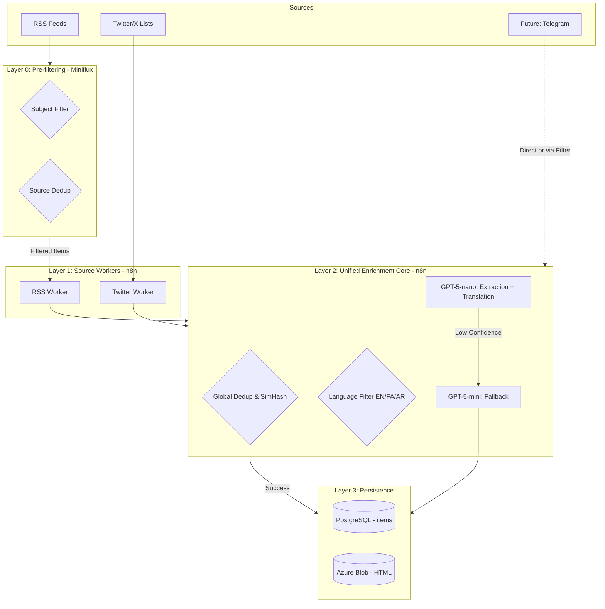

<div dir="rtl" style="text-align: right">

# Requirements Document

---
doc_type: requirements
version: 2.6
last_updated: 2026-02-04
owner: تیم نورا نِرُال
status: approved
language: fa
english_version: docs/en/02-requirements.md
traceability: [Ref: 01-discovery-and-planning.md]
adr_compliance: [ADR-0001, ADR-0002, ADR-0003, ADR-0004]
***

# مشخصات الزامات نرم‌افزار (SRS) - پلتفرم نورا

## کنترل نسخه

| فیلد | مقدار |
| :-- | :-- |
| **نسخه** | 2.6 (نهایی - همگام‌سازی‌شده با ADRها) |
| **تاریخ** | ۴ فوریه ۲۰۲۶ |
| **مالک** | تیم نورا نِرُال |
| **وضعیت** | تأیید شده برای پیاده‌سازی |
| **زبان** | فارسی (FA) |
| **تطابق با ADR** | ADR-0001 (SQL Migrations), ADR-0002 (Cost Optimization), ADR-0003 (Batch Processing), ADR-0004 (Translation Strategy) |

### تاریخچه تغییرات

| نسخه | تاریخ | مشارکت‌کنندگان | تغییرات |
| :-- | :-- | :-- | :-- |
| ۱.۰ | ۴ فوریه ۲۰۲۶ | تیم محصول | نسخه اولیه با User Stories کلی |
| ۲.۴ | ۳ فوریه ۲۰۲۶ | محصول، UX، مهندسی | نسخه انگلیسی کامل SRS با تمام الزامات تفصیلی |
| ۲.۵ | ۴ فوریه ۲۰۲۶ | تیم نورا | نسخه فارسی یکپارچه: ادغام تمام الزامات عملکردی، فرمول‌ها، معیارها و سناریوهای تست |
| **۲.۶** | **۴ فوریه ۲۰۲۶** | **تیم نورا** | **همگام‌سازی با ADRهای مصوب: تغییر به GPT-5-nano، Dual Storage، Batch Processing، Pre-filtering، حذف ارجاعات خارجی** |

***

## ۱. الزامات کارکردی (Functional Requirements)
---
doc_type: requirements
version: 2.7
last_updated: 2026-02-04
owner: تیم نورا نِرُال
status: approved
language: fa
adr_compliance: [ADR-0001, ADR-0002, ADR-0003, ADR-0004]
***

# ماژول ۱: لایه دریافت داده (Data Ingestion Layer)

این لایه وظیفه دریافت هوشمند، پیش‌فیلتر، حذف تکراری‌ها و غنی‌سازی اولیه داده‌ها از منابع مختلف را بر عهده دارد. طراحی این ماژول بر پایه یک «خط لوله یکپارچه» (Unified Pipeline) است که ضمن کاهش هزینه‌های عملیاتی، پایداری سیستم در نسخه Community پلتفرم n8n را تضمین می‌کند.

## دیاگرام جریان دریافت و پردازش یکپارچه



***

## الزامات کارکردی (Functional Requirements)

### REQ-ING-001: پیش-فیلتر لایه صفر (Zero-Cost Filtering)

**هدف:** حذف اخبار نامرتبط قبل از ورود به زیرساخت پردازشی جهت بهینه‌سازی منابع و بودجه.

**معیارهای پذیرش:**
- **فیلتر موضوعی (Subject Filter):** تمام فیدهای RSS باید از موتور قوانین Miniflux عبور کنند. اخبار ورزشی، سلبریتی، تبلیغات و سرگرمی بر اساس Regex کلمات کلیدی حذف می‌شوند.
- **حذف تکراری در منبع:** Miniflux موظف است از ارسال لینک‌هایی که قبلاً در یک فید خاص پردازش شده‌اند جلوگیری کند.
- **فیلتر زبانی اولیه:** حذف متونی که حاوی الفبای غیرمجاز (مثل چینی یا سیریلیک) هستند در سطح لایه صفر.
- **توسعه‌پذیری:** برای منابعی که مستقیماً به n8n وصل می‌شوند (مثل تلگرام)، یک نود فیلتر مشابه در بدو ورود تعبیه شود.

***

### REQ-ING-002: دریافت داده از توییتر/X (MVP)

**هدف:** پایش لحظه‌ای اکانت‌های کلیدی و لیست‌های منتخب با هزینه بهینه.

**معیارهای پذیرش:**
- **حساب اختصاصی:** سیستم از یک اکانت رسمی نورا (مثل @NuraWatch) برای مدیریت لیست‌های هدف استفاده می‌کند.
- **استفاده از twitterapi.io:** در فاز MVP، دریافت داده‌ها از طریق `twitterapi.io` بر اساس `list_id` انجام می‌شود تا نیاز به OAuth پیچیده نباشد.
- **زمان‌بندی:** فراخوانی لیست‌ها هر ۵ دقیقه برای منابع با اولویت بالا و ۱۵ دقیقه برای منابع عادی.
- **ذخیره رسانه:** تصاویر و ویدیوهای توییت‌ها باید در Azure Blob Storage (مسیر `media/{id}/`) ذخیره شوند.

***

### REQ-ING-003: حذف تکراری‌های کلی و تشخیص بازنشر (Global Dedup)

**هدف:** جلوگیری از پردازش چندباره یک خبر که از منابع مختلف دریافت شده است.

**معیارهای پذیرش:**
- **Exact Duplicate:** بررسی `url_hash` (SHA-256) برای وب و `tweet_id` برای توییتر در کل جدول `items`.
- **Near-Duplicate (SimHash):** محاسبه امضای محتوایی برای متن اصلی. اگر شباهت با اخبار ۲۴ ساعت گذشته ≥۹۵٪ باشد، آیتم به عنوان `REPRINT` علامت‌گذاری شده و به خبر اصلی لینک می‌شود.
- **تقدم اجرا:** منطق Deduplication باید **قبل از** هرگونه فراخوانی LLM اجرا شود تا هزینه API بیهوده صرف نشود.

***

### REQ-ING-004: فیلتر زبانی و تشخیص نهایی (Language Guard)

**هدف:** اطمینان از اینکه فقط زبان‌های پشتیبانی شده (فارسی، انگلیسی، عربی) وارد مرحله استخراج و ترجمه می‌شوند.

**معیارهای پذیرش:**
- **تشخیص رایگان:** استفاده از کتابخانه `langdetect` در n8n بلافاصله بعد از مرحله Dedup.
- **توقف پردازش:** اگر زبان شناسایی شده جزو EN/FA/AR نباشد، پردازش متوقف شده و وضعیت آیتم `LANGUAGE_MISMATCH` ثبت می‌شود.
- **دقت:** در صورت ابهام در تشخیص زبان توسط کتابخانه، تصمیم‌گیری نهایی به مرحله AI واگذار می‌شود.

***

### REQ-ING-005: موتور غنی‌سازی یکپارچه (Unified Enrichment Core)

**هدف:** استخراج متادیتا و ترجمه همزمان در یک مرحله برای کاهش Latency و هزینه توکن.

**معیارهای پذیرش:**
- **تک-فراخوانی هوشمند (Consolidated Call):** ارسال متن به مدل **`gpt-5-nano`** برای انجام همزمان:
    1. استخراج متادیتا (عنوان تمیز، متن بدنه، نویسنده، تاریخ انتشار، موجودیت‌ها).
    2. ترجمه به انگلیسی (در صورت فارسی یا عربی بودن متن).
    3. ارائه امتیاز اعتماد داخلی (Confidence Score).
- **سیاست فالبک (Fallback):** اگر خروجی نانو مبهم باشد یا `confidence_score < 0.7` باشد، درخواست به طور خودکار به **`gpt-5-mini`** ارسال می‌شود.
- **Dual Storage:** ذخیره همزمان متن اصلی و متن ترجمه شده در رکورد دیتابیس.

***

### REQ-ING-006: ذخیره‌سازی آرشیوی و دیتابیس (Persistence)

**هدف:** ایجاد یک نسخه پایدار و ضدسانسور از محتوا.

**معیارهای پذیرش:**
- **آرشیو HTML:** ذخیره نسخه خام HTML مقالات وب در Azure Blob Storage برای جلوگیری از اثرات حذف خبر در منبع اصلی.
- **استانداردسازی DB:** درج داده‌ها در جدول `items` با وضعیت `PENDING_ANALYSIS` جهت شروع فرآیند Trust Scoring.
- **مدیریت منابع:** در نسخه Community n8n، پردازش باید به صورت دسته‌ای (Batching) انجام شود تا حافظه RAM سرور دچار اختلال نشود.
### ۱.۲ ماژول: لایه استدلال هوش مصنوعی (AI Reasoning Layer)

#### REQ-AI-001: محاسبه امتیاز اعتماد (Trust Score Calculation)

**داستان کاربر:**
به‌عنوان **تحلیلگر**، می‌خواهم هر آیتم خبری یک Trust Score (۱۵-۹۵) داشته باشد تا بدون خواندن مقاله کامل بتوانم سریعاً اعتبار را ارزیابی کنم.

**معیارهای پذیرش:**

۱. **فرمول محاسبه امتیاز اعتماد (قطعی - Deterministic):**

```text
امتیاز نهایی = پایه + منشأ + تأیید_متقابل + شفافیت + تعدیل‌کننده‌ها

محدوده نهایی: CLAMP(امتیاز_محاسبه‌شده، 15، 95)
```

۲. **اجزای فرمول:**


| جزء | محدوده امتیاز | توضیح |
| :-- | :-- | :-- |
| **پایه (Base)** | ۰-۴۵ | بر اساس `source_profiles.base_score`، طبقه‌بندی رسانه (NGO: 40-45، Wire: 35-40، Regime: 15-25) |
| **منشأ (Provenance)** | ۰-۲۰ | اعتبار URL (+5)، timestamp معتبر (+3)، نام نویسنده (+4)، dateline (+3)، رسانه پیوست‌شده (+5) |
| **تأیید متقابل (Corroboration)** | ۰-۲۰ | ≥3 منبع مستقل (+20)، 2 منبع (+15)، 1 منبع (+10)، هیچ (+0) |
| **شفافیت (Transparency)** | ۰-۱۵ | افشای سردبیری (+7)، سیاست اصلاح خطا (+5)، لینک اسناد اولیه (+3) |
| **تعدیل‌کننده‌ها (Modifiers)** | -۱۵ تا +۱۰ | پرچم‌های قرمز: منبع ناشناس (-5)، عدم تأیید ادعاهای عددی (-10)؛ پرچم‌های سبز: اسناد رسمی (+5)، عکس‌های تأییدشده (+5) |

۳. **الگوریتم تأیید متقابل (Corroboration):**
    - جستجوی برداری (vector search) در پایگاه داده با استفاده از pgvector
    - شباهت کسینوسی ≥۰.۸۰ با embeddings آیتم‌های موجود
    - فقط منابعی که `source_class` متفاوت دارند (مثلاً NGO نمی‌تواند NGO دیگر را تأیید کند)
    - منابع پروکسی رژیم (ProxyScore ≥70) نمی‌توانند منابع رژیم دیگر را تأیید کنند
۴. امتیاز نهایی بین ۱۵ و ۹۵ محدود شود (بدون استثنا)
۵. **تأخیر محاسبه (دو حالت):**
    - **Real-time (آیتم‌های جدید):** ≤۶۰ ثانیه از زمان دریافت
    - **Batch (historical/bulk analysis):** ≤۲۴ ساعت، استفاده از الگوی Store-and-Forward
۶. **الگوی Batch Processing:**
    - **Accumulate:** آیتم‌های pending در جدول `trust_score_queue` با وضعیت `PENDING`
    - **Dispatch:** n8n هر ساعت batch job را trigger می‌کند، فایل `.jsonl` به OpenAI Batch API ارسال می‌شود
    - **Reconcile:** poller هر ۱۵ دقیقه وضعیت batch را چک می‌کند، نتایج را در `trust_signals` می‌نویسد
۷. نتیجه در جدول `trust_signals` ذخیره شود با فیلدهای:
    - `final_score` (INT)
    - `trust_level` (ENUM: HIGH، MEDIUM، LOW)
    - `breakdown_json` (JSONB با امتیازهای تفکیک‌شده هر جزء)
    - `explanation` (TEXT، خلاصه قابل‌فهم برای انسان به زبان ساده)
    - `processing_mode` (ENUM: REALTIME، BATCH)

**تبدیل امتیاز به سطح اعتماد:**


| محدوده امتیاز | سطح اعتماد (trust_level) | رنگ نشان UI |
| :-- | :-- | :-- |
| ۷۰-۹۵ | بالا (HIGH) | سبز |
| ۴۰-۶۹ | متوسط (MEDIUM) | زرد/عنبری |
| ۱۵-۳۹ | پایین (LOW) | قرمز |

**مثال محاسبه:**

```text
آیتم: گزارش HRANA درباره اعتراضات زاهدان
- پایه: 40 (NGO_WATCHDOG)
- منشأ: 18 (URL معتبر +5، نویسنده +4، dateline +3، عکس +5، تاریخ +1)
- تأیید متقابل: 15 (2 منبع مستقل: BBC Persian + Iran Human Rights)
- شفافیت: 12 (افشای سردبیری +7، سیاست اصلاح +5)
- تعدیل: -5 (نقل‌قول از "ساکنان ناشناس")
────────────
امتیاز نهایی = 40 + 18 + 15 + 12 - 5 = 80 → سطح: HIGH → رنگ: سبز
حالت پردازش: REALTIME (آیتم جدید از RSS)
```

**تطابق با ADR:**

- ADR-0002: استفاده از GPT-5-nano برای استخراج اولیه
- ADR-0003: Batch processing برای historical analysis با SLA 24 ساعت

***

#### REQ-AI-002: خوشه‌بندی روایت‌ها (Narrative Clustering)

**داستان کاربر:**
به‌عنوان **کاربر**، می‌خواهم مقالات مرتبط درباره یک رویداد مشابه گروه‌بندی شوند تا تیترهای تکراری نبینم و بتوانم توسعه داستان را دنبال کنم.

**معیارهای پذیرش:**

۱. **روش خوشه‌بندی:**
    - استفاده از **pgvector** برای شباهت معنایی
    - فاصله کسینوسی (cosine distance) روی embeddings با ۱۵۳۶ بُعد
    - مدل embedding: OpenAI `text-embedding-3-small`
۲. **پنجره زمانی خوشه‌بندی:**
    - پیش‌فرض: ۱۴ روز
    - قابل تنظیم بر اساس نوع موضوع:
        - رویدادهای اعتراضی: ۲۱ روز
        - اخبار سیاسی: ۱۴ روز
        - موضوعات فرهنگی: ۷ روز
۳. **شرایط تطابق (Match Conditions):**

دو آیتم به یک روایت تعلق دارند اگر:

```text
(شباهت_کسینوسی ≥ 0.85)
یا
(شباهت_کسینوسی ≥ 0.75 و همپوشانی_موجودیت ≥ 2)
```

    - **همپوشانی موجودیت:** تعداد موجودیت‌های مشترک از نوع PERSON، ORG، یا EVENT
    - آیتم‌هایی با `MainEventID` یکسان **همیشه** ادغام می‌شوند (حتی با موضع‌گیری‌های مخالف)
۴. **تولید عنوان روایت:**
    - وقتی روایت جدیدی ایجاد می‌شود، **GPT-5-nano** (یا GPT-4o-mini برای موارد پیچیده) عنوان خلاصه تولید می‌کند
    - فرمت عنوان: `[رویداد اصلی]: [توسعه کلیدی]`
    - مثال: «اعتراضات زاهدان: شمار کشته‌شدگان به ۹۶ رسید»
۵. **زمان‌بندی:**
    - خوشه‌بندی دسته‌ای هر ۱۵ دقیقه اجرا می‌شود
    - همگام با workflow دریافت داده

**الزامات عملکردی:**
- جستجوی برداری: ≤۲۰۰ms برای هر query
- استفاده از ایندکس HNSW روی `items.embedding` با پارامترهای:
    - `m = 16` (تعداد اتصالات هر نود)
    - `ef_construction = 64` (دقت ساخت ایندکس)
- تأخیر خوشه‌بندی: ≤۵ ثانیه برای هر آیتم جدید

**مثال:**

```text
آیتم جدید: "BBC: تعداد کشته‌شدگان اعتراضات زاهدان به 96 نفر رسید"
Embedding: [0.21, -0.15, 0.88, ...]

جستجو در آیتم‌های 14 روز گذشته:
1. "HRANA: 92 کشته در زاهدان تأیید شد" → شباهت: 0.91 ✅
2. "Iran International: زاهدان دوباره خونین شد" → شباهت: 0.78، موجودیت مشترک: 3 (زاهدان، اعتراضات، IRGC) ✅
3. "Tasnim: آرامش کامل در زاهدان" → شباهت: 0.72، موجودیت: 1 ❌

→ آیتم به Narrative موجود "اعتراضات زاهدان" اضافه می‌شود
```


***

#### REQ-AI-003: تشخیص منابع پروکسی (Proxy Detection)

**داستان کاربر:**
به‌عنوان **افسر اعتماد و ایمنی**، می‌خواهم سیستم رسانه‌های وابسته به دولت که خود را مستقل جا می‌زنند شناسایی کند تا نتوانند از طریق تأیید جعلی trust score را به‌طور مصنوعی افزایش دهند.

**معیارهای پذیرش:**
۱. **فرمول محاسبه ProxyScore (۰-۱۰۰):**

```text
ProxyScore = (0.3 × ContentOverlap) + (0.3 × NarrativeAlign) + (0.2 × AmplificationNet) + (0.2 × TechOverlap)
```

۲. **محاسبه اجزا:**


| جزء | توضیح | روش محاسبه |
| :-- | :-- | :-- |
| **ContentOverlap** (۰-۱۰۰) | همپوشانی محتوایی با منابع رژیم | درصد مقالاتی که شباهت کسینوسی ≥۰.۹۰ با منابع شناخته‌شده رژیم دارند |
| **NarrativeAlign** (۰-۱۰۰) | همسویی روایتی | درصد روایت‌هایی که منبع **هیچ‌وقت** با چارچوب‌بندی رژیم مخالفت نمی‌کند |
| **AmplificationNet** (۰-۱۰۰) | تقویت شبکه اجتماعی | نسبت بازنشر/لایک از ۷۵۰۰ اکانت ربات شناسایی‌شده رژیم به کل |
| **TechOverlap** (۰-۱۰۰) | همپوشانی زیرساخت فنی | اشتراک میزبانی (IP، ASN، Registrar) با سایت‌های رژیم |

۳. **زمان‌بندی:**
    - کار دسته‌ای **هفتگی** (هر یکشنبه ساعت ۰۲:۰۰ UTC)
    - ProxyScore برای **تمام منابع** محاسبه می‌شود
۴. **الگوی Batch Processing:**
    - **Accumulate:** منابع در جدول `proxy_detection_queue` با وضعیت `PENDING`
    - **Dispatch:** n8n هفتگی batch job را trigger می‌کند
    - **Reconcile:** نتایج در `source_profiles.proxy_score` به‌روز می‌شوند
۵. **اقدامات بر اساس آستانه:**


| ProxyScore | برچسب | اقدام خودکار | نیاز به ممیزی انسانی |
| :-- | :-- | :-- | :-- |
| ۷۰-۱۰۰ | **پروکسی دولتی** | طبقه‌بندی مجدد به `source_class = REGIME_MEDIA` یا جریمه -۱۰ به base_score | خیر (اما لاگ می‌شود) |
| ۴۰-۶۹ | **منطقه خاکستری** | پرچم هشدار «احتمال وابستگی به دولت»، منبع **نمی‌تواند** منابع رژیم را تأیید کند | **بله** (قبل از تغییر دائمی) |
| ۰-۳۹ | **مستقل** | بدون اقدام | خیر |

۶. **محدودیت حیاتی:**
    - منابعی که به‌عنوان «پروکسی دولتی» (ProxyScore ≥70) پرچم خورده‌اند **نمی‌توانند** منابع رژیم دیگر را در محاسبه Corroboration تأیید کنند
    - این محدودیت در سطح Query پایگاه داده اعمال می‌شود (JOIN condition)
۷. **ثبت تغییرات:**
    - همه طبقه‌بندی‌های مجدد در جدول `audit_log` ثبت می‌شوند
    - فیلدهای لازم: `source_id`, `old_class`, `new_class`, `proxy_score`, `reason`, `approved_by`, `timestamp`

**مثال:**

```text
منبع: "Iran Observer" (ادعای مستقل بودن)

ContentOverlap: 87% (93 از 107 مقاله شباهت >0.90 با منابع شناخته‌شده رژیم)
NarrativeAlign: 94% (در 47 از 50 روایت، موضع منطبق با IRIB)
AmplificationNet: 68% (51% بازنشرها از 7500 اکانت ربات)
TechOverlap: 45% (IP مشترک با زیرمجموعه Tasnim)

ProxyScore = 0.3×87 + 0.3×94 + 0.2×68 + 0.2×45
           = 26.1 + 28.2 + 13.6 + 9.0
           = 76.9 → برچسب: پروکسی دولتی

→ اقدام: source_class = REGIME_MEDIA
→ لاگ در audit_log: {"reason": "Proxy detection algorithm", "approved_by": "system_auto"}
```

**تطابق با ADR:**

- ADR-0003: استفاده از Batch API برای کاهش هزینه، SLA هفتگی

***

#### REQ-AI-004: مدیریت بیانیه‌های رسمی (Statement of Record Handling)

**داستان کاربر:**
به‌عنوان **Fact-Checker**، می‌خواهم سیستم بین بیانیه نظر یک VIP و ادعاهای واقعی تمایز بگذارد تا شخصیت‌های سیاسی نتوانند ادعاهای تأییدنشده را به‌طور مصنوعی تقویت کنند.

**معیارهای پذیرش:**
۱. **تشخیص منبع VIP (Very Important Person):**
    - زمانی که `source_class = KEY_FIGURE` (مثال‌ها: Donald Trump، Masoud Pezeshkian، Reza Pahlavi)
    - یا `is_verified_account = TRUE` و `follower_count > 100000`
۲. **دسته‌بندی محتوای VIP:**


| نوع محتوا | تشخیص | پردازش |
| :-- | :-- | :-- |
| **بیانیه رسمی** | الگوهای زبانی: «من خواهم...»، «ما برنامه داریم...»، «من محکوم می‌کنم...»، «دولت من...» | `is_official_statement = TRUE`، امتیاز اعتماد = امتیاز اصالت (Authenticity Score) |
| **ادعای واقعی** | الگوهای عددی: «X نفر کشته شدند»، «Y تومان...»، «آن‌ها به ما حمله کردند» | `is_official_statement = FALSE`، نیاز به تأیید متقابل از منابع مستقل |

۳. **محاسبه امتیاز اصالت (Authenticity Score):**
    - کانال رسمی تأییدشده (Official Twitter، کانال Telegram دولتی): +20
    - اکانت Verified: +10
    - ویدیو/صوت تأیید هویت: +5
    - بدون تأیید: +0
۴. **قانون اصلی:**
> **وضعیت VIP امتیاز حقیقت (Truth Score) ادعاهای واقعی را افزایش نمی‌دهد**
    - فقط تأیید متقابل از منابع مستقل (NGO، Wire Services، تحقیقات مستقل) امتیاز را افزایش می‌دهد
    - اگر ادعای عددی تأیید نشود، امتیاز در محدوده LOW/MEDIUM باقی می‌ماند (≤50)
۵. **پرچم‌گذاری:**
    - ادعاهای تأییدنشده با برچسب `UNVERIFIED_CLAIM` علامت‌گذاری می‌شوند
    - نمایش هشدار در UI: «این ادعا توسط منابع مستقل تأیید نشده است»

**مثال کامل:**

```text
توییت Trump: "I convinced the Iranian regime to cancel 800 executions"

تحلیل:
├─ بخش 1: "I convinced..." → بیانیه نظر شخصی
│  └─ is_official_statement = TRUE
│  └─ امتیاز اصالت = 30 (کانال رسمی +20، Verified +10)
│
└─ بخش 2: "800 executions cancelled" → ادعای عددی واقعی
   ├─ is_official_statement = FALSE
   ├─ جستجوی تأیید متقابل:
   │  ├─ Iran Human Rights (NGO): هیچ تأییدی ندارد ❌
   │  ├─ Amnesty International: هیچ گزارشی از لغو گسترده ❌
   │  └─ Reuters/AP: هیچ خبری ❌
   │
   └─ محاسبه امتیاز:
      ├─ پایه: 25 (KEY_FIGURE، اما نه رسانه حرفه‌ای)
      ├─ منشأ: 10 (اکانت رسمی، timestamp معتبر)
      ├─ تأیید متقابل: 0 (هیچ منبع مستقلی تأیید نکرد)
      ├─ شفافیت: 0 (بدون لینک به منبع)
      ├─ تعدیل: -10 (ادعای عددی بدون سند)
      └─ امتیاز نهایی = 25 → LOW (قرمز)
      
→ نمایش در UI:
  Trust Score: 25 (پایین)
  هشدار: "این ادعا درباره '800 اعدام' توسط سازمان‌های حقوق بشری تأیید نشده است"
  وضعیت بیانیه: "بیانیه رسمی دونالد ترامپ" (با نشان Verified)
```


***

### ۱.۳ ماژول: لایه API محصول (Product API Layer)

#### REQ-API-001: نقطه پایانی خوراک عمومی (Public Feed Endpoint)

**داستان کاربر:**
به‌عنوان **توسعه‌دهنده فرانت‌اند**، می‌خواهم یک endpoint feed که روایت‌ها را با آیتم‌های تودرتو برمی‌گرداند تا بتوانم آخرین اخبار را در صفحه اصلی نمایش دهم.

**مشخصات فنی:**

1. **Endpoint:** `GET /api/v1/feed`
2. **پارامترهای Query:**


| پارامتر | نوع | پیش‌فرض | محدوده | توضیح |
| :-- | :-- | :-- | :-- | :-- |
| `limit` | INT | 20 | 1-100 | تعداد روایت‌های برگشتی |
| `offset` | INT | 0 | ≥0 | برای صفحه‌بندی (pagination) |
| `language` | ENUM | EN | EN, FA, AR | فیلتر بر اساس زبان اصلی |
| `min_trust_score` | INT | 40 | 15-95 | حداقل امتیاز اعتماد |
| `source_class` | STRING | (همه) | REGIME_MEDIA, NGO_WATCHDOG, INTL_WIRE, ... | فیلتر بر اساس کلاس منبع (اختیاری) |

3. **طرح پاسخ (Response Schema):**
```json
{
  "narratives": [
    {
      "narrative_id": "uuid",
      "title": "اعتراضات زاهدان: شمار کشته‌شدگان به ۹۶ رسید",
      "title_en": "Zahedan Protests: Death Toll Reaches 96",
      "summary": "تولیدشده توسط AI: اعتراضات در زاهدان پس از نماز جمعه آذرماه آغاز شد...",
      "summary_en": "AI-generated: Protests in Zahedan began after Friday prayers...",
      "created_at": "2026-02-03T10:00:00Z",
      "last_updated": "2026-02-03T11:00:00Z",
      "item_count": 12,
      "avg_trust_score": 72,
      "trust_distribution": {
        "high": 7,
        "medium": 4,
        "low": 1
      },
      "top_items": [
        {
          "item_id": "uuid",
          "title": "HRANA گزارش می‌دهد: ۹۶ کشته در اعتراضات زاهدان",
          "title_en": "HRANA reports: 96 killed in Zahedan protests",
          "source_name": "خبرگزاری فعالان حقوق بشر (HRANA)",
          "source_name_en": "Human Rights Activists News Agency",
          "source_logo_url": "https://cdn.nura.ai/logos/hrana.png",
          "publish_date": "2026-02-03T09:30:00Z",
          "trust_score": 85,
          "trust_level": "HIGH",
          "url": "https://www.en-hrana.org/zahedan-96-killed",
          "language": "FA"
        }
      ]
    }
  ],
  "pagination": {
    "total": 150,
    "limit": 20,
    "offset": 0,
    "has_next": true,
    "has_previous": false
  },
  "meta": {
    "generated_at": "2026-02-03T11:05:23Z",
    "cache_ttl": 120,
    "api_version": "v1.0"
  }
}
```

4. **الزامات عملکردی:**
    - زمان پاسخ: ≤۵۰۰ms (P95)
    - کشینگ: Redis cache با TTL دو دقیقه
    - صفحه‌بندی: پشتیبانی از offset/limit برای لود تدریجی
5. **کدهای خطا:**


| کد HTTP | توضیح |
| :-- | :-- |
| 200 | موفقیت |
| 400 | پارامترهای نامعتبر (مثلاً limit>100) |
| 429 | تعداد درخواست‌های بیش از حد (rate limit) |
| 500 | خطای سرور داخلی |


***

#### REQ-API-002: نقطه پایانی جزئیات آیتم (Item Detail Endpoint)

**داستان کاربر:**
به‌عنوان **کاربر**، می‌خواهم روی یک آیتم خبری کلیک کنم و مقاله کامل را با تفکیک trust score ببینم تا بفهمم چرا امتیاز بالا یا پایین است.

**مشخصات فنی:**

1. **Endpoint:** `GET /api/v1/items/{item_id}`
2. **پارامترهای مسیر:**
    - `item_id` (UUID): شناسه منحصربه‌فرد آیتم
3. **طرح پاسخ (Response Schema):**
```json
{
  "item_id": "e7b3c4d5-6f8a-4b2c-9d1e-3a5f7c8b9e0d",
  "title": "HRANA گزارش می‌دهد: ۹۶ کشته در اعتراضات زاهدان",
  "title_en": "HRANA reports: 96 killed in Zahedan protests",
  "body_text": "خبرگزاری فعالان حقوق بشر ایران (HRANA) امروز گزارش داد که شمار کشته‌شدگان اعتراضات زاهدان به ۹۶ نفر رسیده است...",
  "body_en": "The Human Rights Activists News Agency (HRANA) reported today that the death toll from the Zahedan protests has reached 96...",
  "language": "FA",
  "translation_quality": {
    "method": "GPT-5-nano",
    "confidence": 0.92,
    "human_verified": false
  },
  "source": {
    "source_id": "uuid",
    "name": "خبرگزاری فعالان حقوق بشر",
    "name_en": "Human Rights Activists News Agency (HRANA)",
    "logo_url": "https://cdn.nura.ai/logos/hrana.png",
    "source_class": "NGO_WATCHDOG",
    "base_score": 90,
    "website": "https://www.en-hrana.org"
  },
  "metadata": {
    "author": "گروه گزارشگری HRANA",
    "author_en": "HRANA Reporting Team",
    "publish_date": "2026-02-03T09:30:00Z",
    "url": "https://www.en-hrana.org/zahedan-96-killed",
    "raw_html_url": "https://blob.nura.ai/raw/hrana/2026-02-03/abc123.html",
    "entities": [
      {"type": "PERSON", "name": "مهسا امینی", "name_en": "Mahsa Amini", "confidence": 0.95},
      {"type": "EVENT", "name": "اعتراضات زاهدان", "name_en": "Zahedan Protests", "confidence": 0.98},
      {"type": "LOCATION", "name": "زاهدان", "name_en": "Zahedan", "coordinates": [60.86, 29.49]}
    ],
    "media_attachments": [
      {
        "type": "image",
        "url": "https://cdn.nura.ai/media/item123/photo1.jpg",
        "caption": "تصویر اعتراضات زاهدان",
        "caption_en": "Image of Zahedan protests",
        "verified": true
      }
    ]
  },
  "trust_signal": {
    "final_score": 85,
    "trust_level": "HIGH",
    "processing_mode": "REALTIME",
    "badges": ["VERIFIED_SOURCE", "CORROBORATED", "PRIMARY_DOCUMENTS"],
    "breakdown": {
      "base": 40,
      "provenance": 20,
      "corroboration": 18,
      "transparency": 12,
      "modifiers": -5
    },
    "breakdown_details": {
      "base": {
        "score": 40,
        "reason": "منبع NGO با سابقه قوی (base_score=90 از جدول source_profiles)",
        "reason_en": "NGO source with strong track record (base_score=90 from source_profiles)"
      },
      "provenance": {
        "score": 20,
        "components": {
          "url_validity": 5,
          "timestamp": 3,
          "author_byline": 4,
          "dateline": 3,
          "media_attached": 5
        }
      },
      "corroboration": {
        "score": 18,
        "sources": [
          {"name": "BBC Persian", "similarity": 0.88, "trust_level": "HIGH"},
          {"name": "Iran Human Rights", "similarity": 0.91, "trust_level": "HIGH"}
        ],
        "count": 2
      },
      "transparency": {
        "score": 12,
        "editorial_disclosure": true,
        "corrections_policy_url": "https://www.en-hrana.org/corrections"
      },
      "modifiers": {
        "score": -5,
        "red_flags": [
          {"type": "ANONYMOUS_SOURCE", "penalty": -5, "description": "نقل‌قول از 'ساکنان محلی' بدون نام"}
        ],
        "green_flags": []
      }
    },
    "explanation": "این گزارش امتیاز اعتماد بالایی دارد زیرا: (
<span style="display:none">[^1][^10][^2][^3][^4][^5][^6][^7][^8][^9]</span>

<div align="center">⁂</div>

[^1]: srs-nura-v2.4.md
[^2]: Iran Propaganda Archive Jan2026
[^3]: 01-discovery-and-planning.md
[^4]: 02-requirements.md
[^5]: 03-architecture-overview.md
[^6]: 04-ai-engineering.md
[^7]: NN-ADR-0002-cost-optimization.md
[^8]: NN-ADR-0001-sql-first-migrations.md
[^9]: NN-ADR-0004-translation-strategy.md
[^10]: NN-ADR-0003-batch-processing.md)"
    }
  }
}
```

</div>

