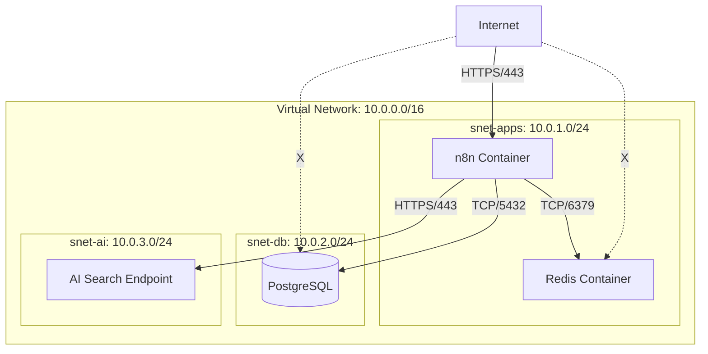

# Infrastructure Overview v1.0 - NURA Platform

## Document Control

| Field | Value |
|-------|-------|
| **Document Type** | Infrastructure Specification |
| **Version** | 1.0 |
| **Status** | ✅ APPROVED |
| **Last Updated** | Tuesday, February 3, 2026, 10:59 PM NZDT |
| **Owner** | Sina (DevOps Lead) |
| **Reviewers** | Amir (Architect) |

---

## 1. Executive Summary

This document provides a technical deep-dive into the **NURA Platform Infrastructure**. It details the 17 resources deployed in the `irdecode-prod-rg` resource group, network topology, security controls, and scaling policies.

**Key Characteristics:**
*   **Platform:** Azure Cloud (East US Region)
*   **Compute Model:** Serverless Containers (Azure Container Apps)
*   **Database:** Managed PostgreSQL (Flexible Server)
*   **Cost Strategy:** Burstable compute, aggressive caching, spot-like behavior.
*   **Infrastructure as Code (IaC):** Terraform managed.

---

## 2. Resource Inventory (The "Big 17")

The following resources constitute the production environment.

| ID | Resource Name | Type | SKU / Config | Monthly Cost (Est) |
|----|---------------|------|--------------|-------------------|
| **R01** | `irdecode-prod-rg` | Resource Group | - | $0.00 |
| **R02** | `irdecode-prod-vnet` | Virtual Network | 10.0.0.0/16 | $0.00 |
| **R03** | `irdecode-container-env` | ACA Environment | Consumption | Included |
| **R04** | `irdecode-prod-n8n` | Container App | 0.25 vCPU, 0.5Gi | ~$0.90 |
| **R05** | `irdecode-prod-redis` | Container App | 0.125 vCPU, 0.25Gi | ~$0.45 |
| **R06** | `irdecode-prod-psql` | PostgreSQL Flex | B2s (2vCore, 4GB) | ~$35.00 |
| **R07** | `nura-search` | AI Search | Basic | $75.00 |
| **R08** | `irdecode-prod-kv` | Key Vault | Standard | $0.00 |
| **R09** | `irdecode-logs` | Log Analytics | Pay-as-you-go | <$1.00 |
| **R10** | `irdecode-storage` | Storage Account | LRS Hot/Cool | ~$1.20 |
| **R11** | `irdecode-prod-openai` | Azure OpenAI | S0 (Standard) | Usage-based |
| **R12** | `snet-apps` | Subnet | 10.0.1.0/24 | $0.00 |
| **R13** | `snet-db` | Subnet | 10.0.2.0/24 | $0.00 |
| **R14** | `snet-ai` | Subnet | 10.0.3.0/24 | $0.00 |
| **R15** | `snet-gw` | Subnet | 10.0.4.0/27 | $0.00 |
| **R16** | `nsg-prod` | Security Group | Default Rules | $0.00 |
| **R17** | `rt-prod` | Route Table | Local | $0.00 |

---

## 3. Network Topology

### 3.1 Virtual Network (`irdecode-prod-vnet`)

The network is designed for **Zero Trust**. No database or cache ports are exposed to the public internet.



### 3.2 Network Security Group (NSG) Rules

Applied to `snet-apps`:

| Priority | Name | Port | Protocol | Source | Destination | Action |
|----------|------|------|----------|--------|-------------|--------|
| 100 | `AllowHTTPSInbound` | 443 | TCP | Any | Any | Allow |
| 110 | `AllowDBOutbound` | 5432 | TCP | VirtualNetwork | VirtualNetwork | Allow |
| 120 | `AllowRedisOutbound` | 6379 | TCP | VirtualNetwork | VirtualNetwork | Allow |
| 65000 | `DenyAllInbound` | * | * | * | * | Deny |

---

## 4. Compute Configuration

### 4.1 Orchestrator: `irdecode-prod-n8n`

*   **Image:** `n8nio/n8n:latest`
*   **Resources:**
    *   CPU: 0.25 vCPU
    *   Memory: 0.5 GiB
*   **Scaling Rule (KEDA):**
    *   Min Replicas: 1
    *   Max Replicas: 2
    *   Trigger: CPU Utilization > 70%
*   **Environment Variables:**
    *   `DB_TYPE`: `postgresdb`
    *   `N8N_ENCRYPTION_KEY`: (Secret Ref)
    *   `EXECUTIONS_PROCESS`: `main` (No worker mode for MVP)

### 4.2 State Store: `irdecode-prod-redis`

*   **Image:** `redis:7-alpine`
*   **Resources:**
    *   CPU: 0.125 vCPU
    *   Memory: 0.25 GiB
*   **Configuration:**
    *   `maxmemory`: `200mb`
    *   `maxmemory-policy`: `allkeys-lru`
    *   Append Only File (AOF): Disabled (Ephemeral cache only)

---

## 5. Storage Strategy

### 5.1 Database (PostgreSQL)
*   **Version:** PostgreSQL 16
*   **Extensions:** `vector`, `uuid-ossp`, `pg_cron`
*   **Tier:** Burstable B2s
*   **Storage:** 128 GiB Premium SSD (LRS)
*   **Backup:** 7 Days Retention (Geo-Redundant)

### 5.2 Blob Storage (`irdecode-storage`)
*   **Container:** `raw-html-archive`
*   **Lifecycle Policy:**
    *   Day 0-30: Hot Tier
    *   Day 31-90: Cool Tier
    *   Day 90+: Delete
*   **Access:** Managed Identity (No access keys)

---

## 6. Security & Identity

### 6.1 Managed Identities
We use **User-Assigned Managed Identities** to eliminate connection strings in code.

*   **Identity:** `id-n8n-prod`
*   **Assigned To:** `irdecode-prod-n8n`
*   **Permissions:**
    *   `Key Vault Secrets User` on `irdecode-prod-kv`
    *   `Storage Blob Data Contributor` on `irdecode-storage`
    *   `Cognitive Services OpenAI User` on `irdecode-prod-openai`

### 6.2 Key Vault Secrets
| Secret Name | Description | Rotation Policy |
|-------------|-------------|-----------------|
| `pg-conn-string` | Full JDBC URL | 90 Days |
| `n8n-auth-user` | Basic Auth User | Manual |
| `n8n-auth-pass` | Basic Auth Pass | Manual |
| `twitter-bearer`| API Token | 6 Months |

---

## 7. Monitoring & Alerts

### 7.1 Log Analytics (KQL)
All logs are shipped to `irdecode-logs`.

**Query: Failed Workflow Executions**
```kql
ContainerAppConsoleLogs_CL
| where ContainerAppName_s == 'irdecode-prod-n8n'
| where Log_s contains "ERROR" or Log_s contains "Workflow failed"
| project TimeGenerated, Log_s
```

### 7.2 Action Groups
*   **Group:** `ag-ops-team`
*   **Receiver:** Slack Webhook (Channel: `#alerts-infra`)
*   **Triggers:**
    1.  PostgreSQL CPU > 95% (Avg 5m)
    2.  n8n Restart Loop (>3 restarts in 1h)
    3.  AI Search Storage > 80%

---

## 8. Deployment Pipeline (GitOps)

While the MVP infrastructure was deployed via Terraform locally, the roadmap moves to GitHub Actions.

1.  **Commit** to `main` branch.
2.  **GitHub Action** triggers.
3.  **Terraform Plan** runs against state file (in Azure Storage).
4.  **Manual Approval** required for Infrastructure changes.
5.  **Terraform Apply** executes.
6.  **n8n Import** script updates workflows via API.

---
