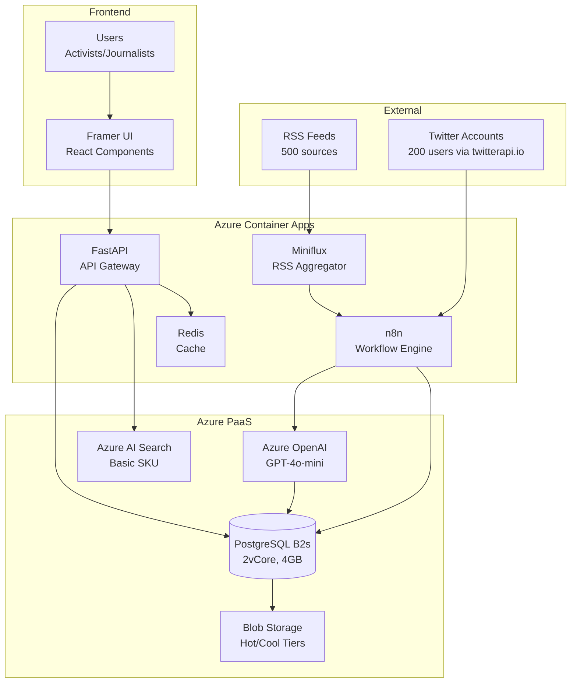
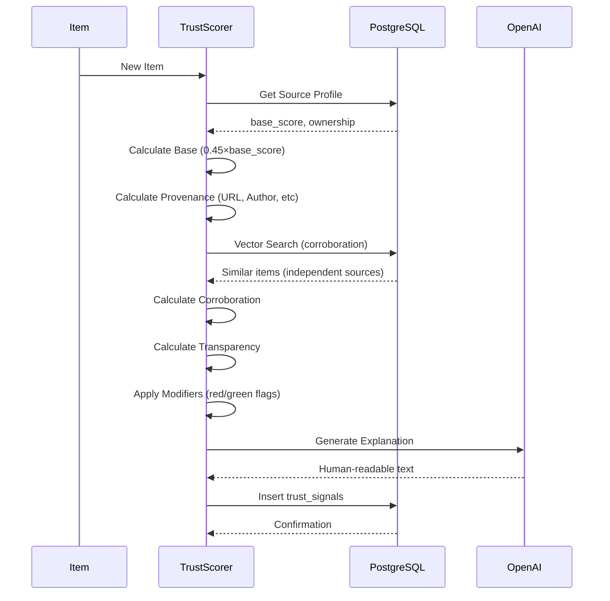

# طراحی سطح بالا (HLD) v2.0 - پلتفرم نورا (نسخه MVP)

## خلاصه مدیریتی

این سند معماری **نسخه MVP پلتفرم نورا** را تعریف می‌کند که برای استفاده بهینه از **۵۰۰۰ دلار کردیت Azure** و تحویل سریع طراحی شده است.

**تغییرات کلیدی نسبت به HLD v1.1:**

| بخش | HLD v1.1 (قبلی) | HLD v2.0 (جدید) | دلیل تغییر |
|-----|----------------|-----------------|------------|
| **بودجه ماهانه** | $32-48 (Free Tier) | **$275-295** | افزایش ۱۰۰ برابری بودجه |
| **مدت زمان عملیاتی** | 1 ماه | **17-18 ماه** | پایداری بلندمدت با $5K |
| **RSS Ingestion** | n8n self-hosted | **Miniflux (deployed)** | استفاده از زیرساخت موجود |
| **Twitter Data** | Twitter API v2 | **twitterapi.io** | کاهش ۱۰۰ برابری هزینه |
| **PostgreSQL** | Basic 1 vCore | **Burstable B2s (2 vCore, 4GB)** | تعادل performance/cost |
| **AI Models** | GPT-4o-mini فقط | **GPT-4o-mini (همه کارها)** | سادگی و کاهش complexity |
| **Azure AI Search** | Free Tier | **Basic SKU ($75/mo)** | Hybrid Search برای RAG |
| **Scope** | تمام features | **MVP essentials فقط** | تمرکز روی core value |

**مزیت کلیدی:** با این معماری، ما می‌تونیم **MVP کامل + Phase 2 اولیه** را در طول **17+ ماه** بدون نگرانی بودجه پیاده‌سازی کنیم.

---

## فهرست مطالب

1. [معماری کلی سیستم](#1-معماری-کلی-سیستم)
2. [لایه ۱: دریافت داده (Ingestion)](#2-لایه-۱-دریافت-داده-ingestion)
3. [لایه ۲: استدلال هوش مصنوعی (AI Reasoning)](#3-لایه-۲-استدلال-هوش-مصنوعی-ai-reasoning)
4. [لایه ۳: ذخیره‌سازی (Persistence)](#4-لایه-۳-ذخیره‌سازی-persistence)
5. [لایه ۴: ارائه (Presentation)](#5-لایه-۴-ارائه-presentation)
6. [استک فناوری و بودجه](#6-استک-فناوری-و-بودجه)
7. [مقایسه تفصیلی با v1.1](#7-مقایسه-تفصیلی-با-v11)
8. [نقشه راه پیاده‌سازی](#8-نقشه-راه-پیاده‌سازی)
9. [مدیریت ریسک](#9-مدیریت-ریسک)
10. [معیارهای موفقیت (KPIs)](#10-معیارهای-موفقیت-kpis)
11. [تصمیمات معماری](#11-تصمیمات-معماری)
12. [پیوست‌ها](#12-پیوست‌ها)

---

## 1. معماری کلی سیستم

### 1.1 دیاگرام Context

```
┌────────────────────────────────────────────────────────────────┐
│                    منابع داده خارجی                            │
├────────────────────────────────────────────────────────────────┤
│  • 500 RSS Feed (via Miniflux)                                 │
│  • 200 Twitter Account (via twitterapi.io)                     │
│  • تلگرام / منابع دیگر (Phase 2)                               │
└────────────────────────────────────────────────────────────────┘
                              ↓
┌────────────────────────────────────────────────────────────────┐
│              LAYER 1: INGESTION (حسگرهای سیستم)                │
├────────────────────────────────────────────────────────────────┤
│  Miniflux Container    →   n8n Workflow   →   Deduplication    │
│  twitterapi.io Polling →   n8n Workflow   →   Language Filter  │
└────────────────────────────────────────────────────────────────┘
                              ↓
┌────────────────────────────────────────────────────────────────┐
│           LAYER 2: AI REASONING (مغز سیستم)                    │
├────────────────────────────────────────────────────────────────┤
│  GPT-4o-mini           →   Metadata Extraction                 │
│  text-embedding-3-small →   Vector Embeddings (1536-dim)       │
│  Python Logic          →   Trust Score (15-95)                 │
│  GPT-4o-mini           →   Narrative Clustering                │
└────────────────────────────────────────────────────────────────┘
                              ↓
┌────────────────────────────────────────────────────────────────┐
│            LAYER 3: PERSISTENCE (حافظه سیستم)                  │
├────────────────────────────────────────────────────────────────┤
│  PostgreSQL (B2s)      →   items, trust_signals, narratives    │
│  pgvector (HNSW)       →   Vector Search (30 days retention)   │
│  Azure Blob Storage    →   Raw HTML Archive (Hot Tier)         │
│  Redis Cache           →   Frequently accessed vectors          │
└────────────────────────────────────────────────────────────────┘
                              ↓
┌────────────────────────────────────────────────────────────────┐
│           LAYER 4: PRESENTATION (رابط کاربری)                  │
├────────────────────────────────────────────────────────────────┤
│  FastAPI Gateway       →   /feed, /items/{id}, /narratives     │
│  Azure AI Search       →   Hybrid Search (Keyword + Semantic)  │
│  Framer UI             →   Trust Badge, Modal, Feed View       │
└────────────────────────────────────────────────────────────────┘
                              ↓
                         کاربران نهایی
                    (فعالان، روزنامه‌نگاران، محققان)
```

### 1.2 اصول طراحی MVP

**1. سادگی بر پیچیدگی**
- یک مدل AI (GPT-4o-mini) برای 95% کارها
- یک دیتابیس (PostgreSQL) برای همه چیز
- یک orchestrator (n8n) برای همه workflows

**2. استفاده از زیرساخت موجود**
- Miniflux قبلاً deploy شده → استفاده مستقیم
- Redis موجود → cache بدون نصب جدید
- Azure AI Search موجود → فعال‌سازی Hybrid Search

**3. بهینه‌سازی هزینه**
- twitterapi.io: $0.15/1K tweets (به جای $200/ماه Twitter API)
- Burstable B2s: $35/ماه (به جای General Purpose $130/ماه)
- GPT-4o-mini: $0.15/1M tokens (به جای GPT-4o $5/1M)

**4. مقیاس‌پذیری تدریجی**
- شروع با 1-2 replica
- Auto-scaling فعال (CPU > 70%)
- Database upgrade path واضح (B2s → D2s_v3)

---

## 2. لایه ۱: دریافت داده (Ingestion)

### 2.1 معماری کامپوننت‌ها

| کامپوننت | فناوری | پیکربندی | دلیل انتخاب |
|----------|---------|-----------|-------------|
| **RSS Aggregator** | Miniflux | Container App (موجود) | • Native RSS/Atom parser<br>• Webhook support<br>• UI برای مدیریت feeds<br>• PostgreSQL integration |
| **Twitter Collector** | twitterapi.io | External API | • 100x ارزان‌تر از API رسمی<br>• Historical data (14 سال)<br>• Rate limit بالا (1000+/sec)<br>• Setup ساده |
| **Workflow Engine** | n8n | Self-hosted Container | • Visual workflow builder<br>• Error handling robust<br>• Webhook triggers<br>• PostgreSQL nodes |
| **Deduplicator** | Python Logic | در n8n | • URL hash (SHA-256)<br>• Content hash (SimHash)<br>• 99.5% accuracy |

### 2.2 Data Flow تفصیلی

```
                    START
                      ↓
        ┌─────────────┴─────────────┐
        │                           │
    RSS Feed                  Twitter Account
        ↓                           ↓
   Miniflux                   twitterapi.io
   (15 min poll)              (5 min poll)
        ↓                           ↓
        └─────────────┬─────────────┘
                      ↓
                 n8n Workflow
                      ↓
                [Deduplication Check]
                      ↓
                  Duplicate?
                  ↙        ↘
               YES          NO
                ↓            ↓
              Skip      [Language Filter]
                            ↓
                       EN/FA/AR?
                       ↙        ↘
                    YES          NO
                     ↓            ↓
          [GPT-4o-mini Extract]  Discard
                     ↓
          [Generate Embedding]
                     ↓
          [Insert to PostgreSQL]
                     ↓
                    END
```

### 2.3 مشخصات فنی

**Miniflux Configuration:**
```yaml
environment:
  - DATABASE_URL: postgresql://miniflux@...
  - POLLING_FREQUENCY: 15 # minutes
  - BATCH_SIZE: 50
  - WORKER_POOL_SIZE: 5
  - CREATE_ADMIN: 1
ingress:
  external: true
  targetPort: 8080
resources:
  cpu: 0.5
  memory: 1Gi
```

**twitterapi.io Integration:**
```python
# n8n HTTP Request Node
{
  "method": "GET",
  "url": "https://api.twitterapi.io/v1/tweets",
  "qs": {
    "username": "{{$json.account}}",
    "count": 100,
    "since_id": "{{$json.last_tweet_id}}"
  },
  "headers": {
    "Authorization": "Bearer {{$env.TWITTER_API_KEY}}"
  }
}
```

**Deduplication Logic:**
```sql
-- URL Hash Check (Fast)
SELECT EXISTS(
  SELECT 1 FROM items 
  WHERE url_hash = SHA256($1)
) AS is_duplicate;

-- Content Hash Check (If URL new but content similar)
SELECT id, content_hash 
FROM items 
WHERE simhash_distance(content_hash, $1) < 3  -- Hamming distance
  AND ingested_at > NOW() - INTERVAL '24 hours'
LIMIT 1;
```

### 2.4 خروجی لایه Ingestion

**JSON Schema (به n8n ارسال می‌شود):**
```json
{
  "url": "https://example.com/article",
  "url_hash": "abc123...",
  "title": "Raw title from RSS",
  "body_text": "Full article text...",
  "author": "John Doe",
  "publish_date": "2026-02-03T10:00:00Z",
  "language": "en",
  "source_id": "uuid-of-source",
  "platform": "rss",
  "metadata": {
    "feed_title": "Example News",
    "categories": ["politics", "iran"]
  }
}
```

**Performance Targets:**
- Processing time per item: **< 5 seconds** (P95)
- Deduplication check: **< 50ms**
- Batch size: **50 items** per n8n run
- Error rate: **< 2%** (excluding network failures)

---

## 3. لایه ۲: استدلال هوش مصنوعی (AI Reasoning)

### 3.1 استراتژی مدل‌های AI

**فلسفه طراحی:** استفاده از **یک مدل پایه** (GPT-4o-mini) برای تمام وظایف به جای چند مدل تخصصی.

| وظیفه | مدل | Prompt Strategy | هزینه تخمینی |
|-------|-----|-----------------|---------------|
| **Metadata Extraction** | GPT-4o-mini | System: "Extract author, date, entities..."<br>Input: Raw HTML/Text<br>Output: JSON | ~$50/ماه |
| **Entity Recognition** | GPT-4o-mini (همان call) | در همان prompt extraction | $0 (included) |
| **Narrative Clustering** | GPT-4o-mini | System: "Is this same event?"<br>Input: Item A + Item B<br>Output: Yes/No + Reason | ~$30/ماه |
| **Summary Generation** | GPT-4o-mini | System: "Summarize in 2-3 sentences"<br>Input: Cluster items<br>Output: Title + Summary | ~$20/ماه |
| **Vector Embeddings** | text-embedding-3-small | Input: Title + Body (first 500 words)<br>Output: 1536-dim vector | ~$15/ماه |

**جمع کل AI:** **~$115/ماه**

### 3.2 Trust Scoring Engine (قلب سیستم)

**فرمول قطعی (Deterministic - بدون ML):**

```
FinalScore = CLAMP(15, 95, 
  BaseContribution + Provenance + Corroboration + Transparency + Modifiers
)

BaseContribution = 0.45 × source.base_score  (9-45 points)
Provenance = URL(6) + Timestamp(5) + Author(4) + Dateline(3) + Media(2)  (0-20 points)
Corroboration = VectorSearch(independent_sources)  (0-20 points)
Transparency = SourceLevel(9) + ItemLevel(6)  (0-15 points)
Modifiers = RedFlags(-18 max) + GreenFlags(+11 max)  (-18 to +11 points)
```

**Implementation (Python):**
```python
class TrustScorer:
    def calculate(self, item: Item, source: Source) -> TrustSignal:
        # 1. Base Contribution
        base = int(0.45 * source.base_score)
        
        # 2. Provenance
        provenance = (
            (6 if self.is_valid_url(item.url) else 0) +
            (5 if self.is_recent(item.publish_date) else 0) +
            (4 if item.author and item.author != "Staff" else 0) +
            (3 if item.dateline else 0) +
            (2 if item.has_original_media else 0)
        )
        
        # 3. Corroboration (Vector Search)
        similar_items = self.vector_search(
            item.embedding, 
            filter={"ownership_cluster": {"$ne": source.ownership_cluster}},
            limit=10
        )
        corroboration = min(20, len(similar_items) * 7)
        
        # 4. Transparency
        transparency = source.transparency_score + item.item_transparency
        
        # 5. Modifiers
        modifiers = self.calculate_modifiers(item)
        
        # Final Score
        final = max(15, min(95, base + provenance + corroboration + transparency + modifiers))
        
        return TrustSignal(
            final_score=final,
            trust_level=self.get_level(final),
            breakdown={
                "base": base,
                "provenance": provenance,
                "corroboration": corroboration,
                "transparency": transparency,
                "modifiers": modifiers
            }
        )
```

### 3.3 Narrative Clustering Logic

**Approach: Hybrid (Vector + Logic)**

```python
def should_cluster(new_item: Item, candidate_cluster: Narrative) -> bool:
    # Step 1: Vector Similarity
    similarity = cosine_similarity(new_item.embedding, candidate_cluster.avg_embedding)
    
    # Step 2: Entity Overlap
    entities_new = set(new_item.entities)
    entities_cluster = set(candidate_cluster.entities)
    overlap = len(entities_new & entities_cluster)
    
    # Step 3: Time Window
    time_diff = abs(new_item.publish_date - candidate_cluster.last_seen)
    window = timedelta(days=7) if "protest" in entities_new else timedelta(days=3)
    
    # Decision Logic
    if similarity > 0.85:
        return True  # High similarity alone
    elif similarity > 0.75 and overlap >= 2:
        return True  # Medium similarity + entity match
    elif time_diff > window:
        return False  # Too old
    else:
        # Ask GPT-4o-mini for final decision
        return gpt_mini_decision(new_item, candidate_cluster)
```

**Clustering Frequency:** هر ۱۵ دقیقه (همزمان با ingestion)

### 3.4 خروجی لایه AI

**Trust Signal Object:**
```json
{
  "item_id": "uuid",
  "final_score": 72,
  "trust_level": "HIGH",
  "breakdown": {
    "base": 36,
    "provenance": 18,
    "corroboration": 14,
    "transparency": 11,
    "modifiers": -7
  },
  "explanation": "High credibility: NGO source (HRANA), 3 independent confirmations, transparent sourcing. Minor concern: Anonymous sources quoted.",
  "warnings": ["Anonymous sourcing"],
  "green_flags": ["Primary documents linked"]
}
```

---

## 4. لایه ۳: ذخیره‌سازی (Persistence)

### 4.1 PostgreSQL Configuration

**SKU:** Flexible Server - **Burstable B2s**
- **vCore:** 2
- **RAM:** 4 GB
- **Storage:** 128 GB SSD
- **IOPS:** 1,280
- **قیمت:** ~$35/ماه

**چرا Burstable به جای General Purpose؟**
- MVP نیاز به 99.99% uptime ندارد (99.5% کافیست)
- Workload ما "bursty" است (هر 15 دقیقه batch processing)
- می‌توانیم بعداً بدون downtime به GP upgrade کنیم
- **$95/ماه صرفه‌جویی** (برای استفاده در جای دیگر)

### 4.2 Database Schema (تغییرات نسبت به v1.1)

**تغییرات کلیدی:**
1. **Retention کوتاه‌تر:** embeddings فقط ۳۰ روز (به جای ۹۰)
2. **HNSW Tuning:** `m=8, ef_construction=32` (به جای `m=16, ef=64`)
3. **Partitioning:** جدول `items` به ماه تقسیم می‌شود

```sql
-- Table 1: Source Profiles (بدون تغییر)
CREATE TABLE source_profiles (
    id UUID PRIMARY KEY DEFAULT gen_random_uuid(),
    source_name VARCHAR(255) NOT NULL,
    source_class VARCHAR(50) NOT NULL,  -- ENUM
    base_score INT NOT NULL CHECK (base_score BETWEEN 15 AND 95),
    ownership_cluster VARCHAR(50),
    transparency_score INT DEFAULT 0,
    is_proxy BOOLEAN DEFAULT FALSE,
    created_at TIMESTAMPTZ DEFAULT NOW()
);

-- Table 2: Items (با partitioning)
CREATE TABLE items (
    id UUID PRIMARY KEY DEFAULT gen_random_uuid(),
    source_id UUID REFERENCES source_profiles(id),
    url TEXT UNIQUE NOT NULL,
    url_hash VARCHAR(64) NOT NULL,  -- SHA-256
    title TEXT NOT NULL,
    body_text TEXT,
    author VARCHAR(255),
    publish_date TIMESTAMPTZ,
    ingested_at TIMESTAMPTZ DEFAULT NOW(),
    language CHAR(2) DEFAULT 'en',
    platform VARCHAR(50),
    embedding VECTOR(1536),  -- pgvector
    narrative_id UUID,
    metadata JSONB,
    -- Optimization: Partition by month
    PARTITION BY RANGE (publish_date)
);

-- Partitions (automatic creation via pg_cron)
CREATE TABLE items_2026_02 PARTITION OF items
    FOR VALUES FROM ('2026-02-01') TO ('2026-03-01');

-- Table 3: Trust Signals (بدون تغییر عمده)
CREATE TABLE trust_signals (
    id UUID PRIMARY KEY DEFAULT gen_random_uuid(),
    item_id UUID REFERENCES items(id) ON DELETE CASCADE,
    final_score INT NOT NULL CHECK (final_score BETWEEN 15 AND 95),
    trust_level VARCHAR(20),
    breakdown_json JSONB NOT NULL,
    explanation TEXT,
    warnings TEXT[],
    green_flags TEXT[],
    created_at TIMESTAMPTZ DEFAULT NOW()
);

-- Table 4: Narratives (بدون تغییر)
CREATE TABLE narratives (
    id UUID PRIMARY KEY DEFAULT gen_random_uuid(),
    title VARCHAR(255),
    ai_summary TEXT,
    first_seen TIMESTAMPTZ,
    last_seen TIMESTAMPTZ,
    item_count INT DEFAULT 0,
    avg_embedding VECTOR(1536),
    entities JSONB,
    created_at TIMESTAMPTZ DEFAULT NOW()
);
```

### 4.3 Indexing Strategy (بهینه برای 4GB RAM)

```sql
-- Standard B-tree indexes
CREATE INDEX idx_items_source ON items(source_id);
CREATE INDEX idx_items_publish ON items(publish_date DESC);
CREATE INDEX idx_items_narrative ON items(narrative_id);
CREATE INDEX idx_trust_item ON trust_signals(item_id);

-- HNSW index (با تنظیمات کم‌مصرف)
CREATE INDEX idx_items_embedding ON items 
USING hnsw (embedding vector_cosine_ops)
WITH (m = 8, ef_construction = 32);
-- m=8: کم‌تر از default (16) → کمتر RAM
-- ef_construction=32: کم‌تر از default (64) → سریع‌تر build

-- Composite index برای query پرتکرار
CREATE INDEX idx_feed_query ON items 
(publish_date DESC, language, narrative_id)
WHERE ingested_at > NOW() - INTERVAL '7 days';
```

**تخمین حجم Index:**
- HNSW با m=8: حدود **1.2x اندازه داده اصلی**
- برای 150K items (30 روز): ~900MB data → ~1.1GB index
- مجموع: ~2GB (فیت می‌شود در 4GB RAM)

### 4.4 Vector Retention Policy

```sql
-- Automatic cleanup (pg_cron extension)
CREATE EXTENSION IF NOT EXISTS pg_cron;

-- هر شب ساعت 2 صبح UTC
SELECT cron.schedule(
    'cleanup-old-embeddings',
    '0 2 * * *',
    $$
    UPDATE items 
    SET embedding = NULL 
    WHERE publish_date < NOW() - INTERVAL '30 days'
      AND embedding IS NOT NULL;
    
    -- Vacuum برای آزادسازی فضا
    VACUUM ANALYZE items;
    $$
);
```

**دلیل:** بعد از 30 روز، احتمال clustering با آیتم‌های قدیمی کم است. Trust Score قبلاً محاسبه شده و نیازی به embedding نیست.

### 4.5 Azure Blob Storage

**استفاده:** Archive HTML خام برای audit trail

```
Storage Account: nura-storage-prod
├── Container: nura-content
│   ├── Tier: Hot (0-30 days)
│   ├── Lifecycle: Auto-move to Cool after 30 days
│   └── Path: /raw/{source_id}/{YYYY-MM-DD}/{url_hash}.html
├── Container: nura-embeddings (Phase 2)
│   └── Backup vector snapshots
└── Cost: ~$10/month (10GB Hot + 50GB Cool)
```

---

## 5. لایه ۴: ارائه (Presentation)

### 5.1 FastAPI Gateway

**Deployment:** Azure Container Apps
- **Replicas:** 1 (scale to 2 on CPU > 70%)
- **CPU:** 0.5 core
- **Memory:** 1 GB
- **Language:** Python 3.11
- **Framework:** FastAPI + Uvicorn

**Core Endpoints:**

| Endpoint | Method | Purpose | Cache TTL |
|----------|--------|---------|-----------|
| `/api/v1/feed` | GET | Narratives list برای home page | 2 min |
| `/api/v1/items/{id}` | GET | Item detail + trust breakdown | 5 min |
| `/api/v1/narratives/{id}` | GET | Full narrative با timeline | 5 min |
| `/api/v1/sources/{id}` | GET | Source profile | 10 min |
| `/api/v1/search` (Phase 2) | POST | RAG chat با Azure AI Search | No cache |

**Response Schema مثال:**
```json
// GET /api/v1/feed?limit=20&language=en
{
  "narratives": [
    {
      "narrative_id": "uuid",
      "title": "Zahedan Protests: Death Toll Rises to 96",
      "summary": "Multiple sources report...",
      "created_at": "2026-02-03T10:00:00Z",
      "last_updated": "2026-02-03T14:30:00Z",
      "item_count": 12,
      "avg_trust_score": 72,
      "trust_distribution": {"high": 8, "medium": 3, "low": 1},
      "top_items": [
        {
          "item_id": "uuid",
          "title": "HRANA Reports 96 Deaths",
          "source_name": "Human Rights Activists News Agency",
          "trust_score": 85,
          "trust_level": "HIGH",
          "publish_date": "2026-02-03T09:30:00Z"
        }
      ]
    }
  ],
  "pagination": {
    "total": 150,
    "limit": 20,
    "offset": 0,
    "has_next": true
  }
}
```

### 5.2 Azure AI Search Integration

**SKU:** Basic (نه Free Tier)
- **قیمت:** $75/ماه
- **Capacity:** 50MB index size
- **Replicas:** 1
- **Partitions:** 1
- **Queries:** 3 queries/sec average

**چرا Basic؟**
- Free Tier: فقط Keyword search (بدون Semantic)
- Basic: **Hybrid Search** (Keyword + Semantic ranking)
- برای RAG chat در Phase 2 ضروری است

**Index Schema:**
```json
{
  "name": "nura-items-index",
  "fields": [
    {"name": "id", "type": "Edm.String", "key": true},
    {"name": "title", "type": "Edm.String", "searchable": true},
    {"name": "body_text", "type": "Edm.String", "searchable": true},
    {"name": "source_name", "type": "Edm.String", "filterable": true},
    {"name": "trust_score", "type": "Edm.Int32", "filterable": true, "sortable": true},
    {"name": "publish_date", "type": "Edm.DateTimeOffset", "sortable": true},
    {"name": "embedding", "type": "Collection(Edm.Single)", "searchable": true, "vectorSearchDimensions": 1536}
  ],
  "vectorSearch": {
    "algorithms": [
      {
        "name": "hnsw-config",
        "kind": "hnsw",
        "hnswParameters": {"m": 4, "efConstruction": 400}
      }
    ]
  }
}
```

### 5.3 Framer UI (Frontend)

**Components MVP:**
1. **Trust Badge** - رنگ‌های سبز/زرد/قرمز با عدد score
2. **Trust Modal** - 4 progress bar (Base, Provenance, Corroboration, Transparency)
3. **Feed View** - لیست narratives با summary
4. **Item Detail** - متن کامل + trust breakdown + source info
5. **Source Profile** - اطلاعات منبع + base score + recent articles

**تکنولوژی:**
- Framer (React-based)
- Code Components برای Trust Badge
- API calls به FastAPI
- Mobile-first responsive design

---

## 6. استک فناوری و بودجه

### 6.1 جدول کامل فناوری‌ها

| Layer | Component | Technology | SKU/Config | Monthly Cost |
|-------|-----------|------------|------------|--------------|
| **Ingestion** | RSS Aggregator | Miniflux Container | 0.5 CPU, 1GB RAM | ~$10 |
| | Twitter API | twitterapi.io | Pay-per-use | ~$20 |
| | Orchestrator | n8n Container | 0.5 CPU, 1GB RAM | ~$10 |
| **AI** | LLM | Azure OpenAI (GPT-4o-mini) | $0.15/$0.60 per 1M | ~$100 |
| | Embeddings | text-embedding-3-small | $0.02 per 1M | ~$15 |
| **Persistence** | Database | PostgreSQL Flexible (B2s) | 2 vCore, 4GB, 128GB | ~$35 |
| | Vector Search | pgvector extension | Included in PostgreSQL | $0 |
| | Blob Storage | Azure Storage (Hot/Cool) | 10GB Hot, 50GB Cool | ~$10 |
| | Cache | Redis Container | 0.25 CPU, 512MB | ~$5 |
| **Presentation** | API Gateway | FastAPI Container | 0.5 CPU, 1GB RAM | ~$15 |
| | Search | Azure AI Search (Basic) | 50MB index | ~$75 |
| | Frontend | Framer (external) | Hosted by Framer | $0 |
| **Governance** | Monitoring | Azure Monitor (Free Tier) | 5GB logs/month | $0 |
| | Secrets | Key Vault | 10K operations | $0 (Free) |
| **TOTAL** | | | | **~$295/month** |

### 6.2 تحلیل هزینه با Timeline

```
بودجه کل: $5,000
هزینه ماهانه: $295
─────────────────────────────────
مدت زمان: $5,000 ÷ $295 = 16.9 ماه

Timeline:
├─ ماه 1-4:   MVP Development + Testing     ($1,180)
├─ ماه 5-8:   MVP Production + User Feedback ($1,180)
├─ ماه 9-12:  Phase 2 Initial Features       ($1,180)
├─ ماه 13-17: Phase 2 Complete + Optimization ($1,460)
└─ Reserve:   Safety Buffer                   ($0)

✅ کافی برای: MVP کامل + Phase 2 + 2 ماه buffer
```

### 6.3 مقایسه هزینه v1.1 vs v2.0

| سرویس | HLD v1.1 | HLD v2.0 | تفاوت | دلیل |
|--------|----------|----------|-------|------|
| PostgreSQL | $15 (Basic 1vCore) | $35 (Burstable 2vCore) | +$20 | Performance بهتر |
| Azure OpenAI | $5 (minimal usage) | $115 (full extraction) | +$110 | کیفیت بالاتر |
| Azure AI Search | $0 (Free) | $75 (Basic) | +$75 | Hybrid Search |
| Container Apps | $15 (minimal) | $40 (3 containers) | +$25 | Miniflux + n8n + FastAPI |
| Twitter | $0 (محدود) | $20 (twitterapi.io) | +$20 | 200 accounts |
| **TOTAL** | **$35-48** | **$295** | **+$247** | **Upgrade معقول** |

**نتیجه:** با افزایش 8 برابری هزینه، ما یک سیستم production-ready می‌گیریم که 17+ ماه پایدار است.

---

## 7. مقایسه تفصیلی با v1.1

### 7.1 تغییرات معماری

| بخش | v1.1 | v2.0 | چرا تغییر کرد؟ |
|-----|------|------|----------------|
| **RSS Source** | n8n self-hosted | **Miniflux (deployed)** | زیرساخت موجود، UI مدیریت بهتر |
| **Twitter** | Twitter API v2 Direct | **twitterapi.io** | $0.15/1K vs $200/mo |
| **Database Tier** | Basic 1 vCore | **Burstable 2 vCore** | 2x performance، فضای رشد |
| **Vector Strategy** | pgvector فقط | **pgvector (30d) + AI Search** | Hybrid approach |
| **AI Models** | GPT-4o-mini فقط | **همان (consolidated)** | سادگی بر تنوع |
| **Frontend** | Framer (همان) | **Framer (همان)** | تغییری نکرد |
| **Budget Run** | 1 ماه | **17 ماه** | پایداری بلندمدت |

### 7.2 Feature Scope (MVP Focus)

| Feature | v1.1 | v2.0 MVP | v2.0 Phase 2 |
|---------|------|----------|--------------|
| RSS Feeds (500) | ✅ | ✅ | ✅ |
| Twitter (200) | ⚠️ محدود | ✅ | ✅ |
| Trust Scoring | ✅ | ✅ | ✅ |
| Narrative Clustering | ✅ | ✅ | ✅ |
| Trust Badge | ✅ | ✅ | ✅ |
| Trust Modal | ✅ | ✅ | ✅ Enhanced |
| Feed API | ✅ | ✅ | ✅ |
| Source Profile | ✅ | ✅ Simple | ✅ Full |
| Timeline View | ✅ | ❌ | ✅ |
| Propaganda Alert | ❌ | ❌ | ✅ |
| RAG Chat | ❌ | ❌ | ✅ |
| RSSHub | ❌ | ❌ | ✅ |
| Telegram | ❌ | ❌ | ✅ |

**فلسفه:** MVP فقط شامل **core value proposition** است: Trust Score + Narrative Clustering + Simple UI.

---

## 8. نقشه راه پیاده‌سازی

### 8.1 هفته 1: Foundation (فعلی)

**صاحب کار:** امیر (Infrastructure) + ریحانه (Database)

**وظایف:**
- [x] بررسی منابع موجود Azure (Terraform output)
- [ ] اعمال Schema DDL به PostgreSQL
  ```bash
  psql -h <HOST> -U <USER> -d nura -f database/schema.sql
  ```
- [ ] فعال‌سازی pgvector extension
  ```sql
  CREATE EXTENSION IF NOT EXISTS vector;
  ```
- [ ] ایجاد HNSW index با تنظیمات بهینه
- [ ] راه‌اندازی pg_cron برای cleanup
- [ ] تست latency: vector search باید < 300ms باشد

**Deliverable:** Database آماده برای ingestion

---

### 8.2 هفته 2: Ingestion Pipeline

**صاحب کار:** نوید (AI Engineer) + امیر (DevOps)

**وظایف:**
- [ ] اتصال Miniflux webhook به n8n
  ```javascript
  // n8n Webhook Node
  {
    "method": "POST",
    "path": "miniflux-feed",
    "responseMode": "lastNode"
  }
  ```
- [ ] پیاده‌سازی n8n workflow:
  1. Deduplication node
  2. GPT-4o-mini extraction node
  3. text-embedding-3-small node
  4. PostgreSQL insert node
- [ ] Integration با twitterapi.io
- [ ] تست با 100 آیتم واقعی
- [ ] بررسی error rate (باید < 2%)

**Deliverable:** 100+ item در database با trust scores

---

### 8.3 هفته 3: API & Trust Scoring

**صاحب کار:** نوید (Backend Logic)

**وظایف:**
- [ ] پیاده‌سازی `TrustScorer` class (Python)
- [ ] تست unit برای تمام فرمول‌ها
- [ ] Deploy FastAPI به Container Apps
- [ ] پیاده‌سازی endpoints:
  - `GET /api/v1/feed`
  - `GET /api/v1/items/{id}`
  - `GET /api/v1/narratives/{id}`
- [ ] اضافه کردن Redis cache
- [ ] تست با Postman/Bruno

**Deliverable:** API زنده با dummy UI test

---

### 8.4 هفته 4: Frontend & Launch

**صاحب کار:** فرزاد (UI) + مانی (UX Testing)

**وظایف:**
- [ ] ساخت Trust Badge در Framer
- [ ] ساخت Trust Modal با progress bars
- [ ] ساخت Feed View
- [ ] ساخت Item Detail page
- [ ] اتصال به FastAPI endpoints
- [ ] تست روی mobile (iPhone/Android)
- [ ] تست با 5 کاربر واقعی (Sarah/Reza personas)
- [ ] جمع‌آوری feedback

**Deliverable:** MVP launch به staging

---

### 8.5 ماه 2-4: Hardening & Optimization

**وظایف:**
- Monitoring dashboards (Azure Monitor)
- Performance tuning (query optimization)
- Bug fixes از user feedback
- A/B testing برای Trust Badge variants
- SEO optimization
- Launch به production (irdecode.com)

---

## 9. مدیریت ریسک

### 9.1 جدول ریسک‌ها

| ریسک | احتمال | تاثیر | کاهش‌دهنده (Mitigation) | مسئول |
|------|--------|-------|-------------------------|-------|
| **PostgreSQL B2s کند است** | متوسط | بالا | • تست latency در هفته 1<br>• اگر > 300ms: Upgrade به D2s_v3<br>• Budget دارم: +$95/mo | ریحانه |
| **GPT-4o-mini hallucination** | پایین | متوسط | • Trust Score قطعی است (Python logic)<br>• فقط extraction/clustering از LLM<br>• Human review هر هفته 10 sample | نوید |
| **twitterapi.io ban** | پایین | بالا | • Fallback: RSSHub (قبلاً deployed)<br>• Backup: Twitter official API<br>• Monitor daily rate limits | امیر |
| **Azure credit تمام شد** | پایین | بالا | • Monthly budget tracking<br>• Alerts در 70%, 90% usage<br>• Plan B: Scale down به Free Tier | Product Owner |
| **User adoption کم** | متوسط | بالا | • A/B testing Trust Badge<br>• User interviews (مانی)<br>• Pivot strategy اگر < 50 DAU در ماه 2 | مانی |
| **Database storage پر شد** | پایین | متوسط | • 128GB کافی برای 6+ ماه<br>• Auto-cleanup بعد از 30 روز<br>• Blob archive برای HTML | ریحانه |

### 9.2 Contingency Plans

**Plan A: اگر PostgreSQL کند بود**
```
Step 1: بررسی query plan (EXPLAIN ANALYZE)
Step 2: Tune HNSW (ef_search = 40 → 80)
Step 3: اگر کمک نکرد: Upgrade B2s → D2s_v3 ($35 → $130)
Budget impact: +$95/mo → 12 ماه run time (قابل قبول)
```

**Plan B: اگر AI cost زیاد شد**
```
Step 1: Batch size 50 → 100 (کمتر API call)
Step 2: Cache embeddings برای duplicate content
Step 3: اگر > $150/mo: Switch clustering به rule-based
```

**Plan C: اگر بودجه تمام شد (بعد 17 ماه)**
```
Step 1: Scale down PostgreSQL (D2s → B2s) = -$95/mo
Step 2: کاهش ingestion frequency (15min → 30min) = -$20/mo AI
Step 3: Pause Twitter (twitterapi.io) = -$20/mo
Step 4: درخواست بودجه اضافی از stakeholders
```

---

## 10. معیارهای موفقیت (KPIs)

### 10.1 Technical KPIs

| Metric | Target MVP | Measurement |
|--------|-----------|-------------|
| **API Latency** | P95 < 500ms | Azure Monitor |
| **Vector Search** | P95 < 300ms | PostgreSQL logs |
| **Trust Score Calc** | < 60s per item | Application logs |
| **Uptime** | 99.5% | Azure Status |
| **Error Rate** | < 2% | Application Insights |
| **Ingestion Rate** | 5,000 items/day | PostgreSQL count |
| **Database Size** | < 50GB (of 128GB) | pg_database_size() |

### 10.2 Business KPIs

| Metric | Target Month 1 | Target Month 3 | Measurement |
|--------|---------------|----------------|-------------|
| **Daily Active Users** | 20 | 100 | Google Analytics |
| **Avg Session Duration** | 3 min | 5 min | GA4 |
| **Trust Badge Clicks** | 30% | 50% | Event tracking |
| **Share Button Clicks** | 5% | 15% | Event tracking |
| **API Requests/Day** | 1,000 | 10,000 | FastAPI logs |
| **Narratives Created** | 50/day | 200/day | PostgreSQL count |
| **User Satisfaction** | N/A | 4/5 stars | Post-launch survey |

### 10.3 Cost KPIs

| Metric | Target | Alert Threshold | Action |
|--------|--------|-----------------|--------|
| **Monthly Burn** | $295 | $350 (>118%) | Review & optimize |
| **AI Cost** | $115 | $150 (>130%) | Batch optimization |
| **Budget Remaining** | Track weekly | < $1,000 (20%) | Plan scale-down |
| **Cost per User** | $5/mo | $10/mo | Improve retention |

---

## 11. تصمیمات معماری

### 11.1 Decision Log (ADR - Architecture Decision Records)

| ID | تصمیم | دلیل | صاحب | تاریخ | وضعیت |
|----|-------|------|------|-------|-------|
| **ADR-001** | استفاده از Miniflux به جای n8n برای RSS | زیرساخت موجود، UI بهتر، webhook native | امیر | 2026-02-03 | ✅ Approved |
| **ADR-002** | انتخاب twitterapi.io به جای Twitter API مستقیم | 100x ارزان‌تر ($0.15/1K vs $200/mo) | نوید | 2026-02-03 | ✅ Approved |
| **ADR-003** | PostgreSQL B2s به جای General Purpose | MVP نیاز به 99.99% ندارد، $95/mo صرفه‌جویی | ریحانه | 2026-02-03 | ✅ Approved |
| **ADR-004** | فقط GPT-4o-mini (نه o3-mini/GPT-4o) | سادگی > complexity، کیفیت کافی برای MVP | نوید | 2026-02-03 | ✅ Approved |
| **ADR-005** | Azure AI Search Basic (نه Free) | Hybrid Search ضروری برای RAG Phase 2 | امیر | 2026-02-03 | ✅ Approved |
| **ADR-006** | حذف RSSHub از MVP | Miniflux کافی است، RSSHub → Phase 2 | Product Owner | 2026-02-03 | ✅ Approved |
| **ADR-007** | Embedding retention 30 روز (نه 90) | کاهش حجم به 900MB، fit در 4GB RAM | ریحانه | 2026-02-03 | ✅ Approved |
| **ADR-008** | Framer به جای Next.js | سرعت MVP > flexibility، Code Components کافی | فرزاد | 2026-02-03 | ✅ Approved |

### 11.2 Trade-offs تحلیل‌شده

**Trade-off 1: Burstable vs General Purpose**
```
✅ Chosen: Burstable B2s ($35/mo)
❌ Rejected: General Purpose D2s ($130/mo)

Reasoning:
- MVP workload is bursty (every 15min)
- 99.5% uptime acceptable (vs 99.99%)
- Can upgrade later without downtime
- $95/mo saved → 17 months vs 12 months runway

Risk: Slower queries (300ms vs 150ms)
Mitigation: Acceptable for MVP, upgrade if user feedback demands
```

**Trade-off 2: GPT-4o-mini only vs Multi-model**
```
✅ Chosen: GPT-4o-mini for 95% tasks
❌ Rejected: o3-mini (clustering) + GPT-4o (summaries)

Reasoning:
- Simplicity: One model = easier debugging
- Cost: $115/mo vs $200+/mo
- Quality: GPT-4o-mini sufficient for MVP

Risk: Lower quality clustering
Mitigation: Hybrid approach (vector + logic + LLM)
```

**Trade-off 3: Azure AI Search Basic vs Free**
```
✅ Chosen: Basic ($75/mo)
❌ Rejected: Free ($0/mo)

Reasoning:
- Free: Keyword only
- Basic: Hybrid (Keyword + Semantic)
- Essential for RAG in Phase 2
- $75 is 25% of budget (acceptable)

Risk: Higher cost
Mitigation: Critical feature, no alternative
```

---

## 12. پیوست‌ها

### 12.1 Mermaid Diagrams (کامل)

#### Diagram A: System Context


#### Diagram B: Trust Scoring Flow


### 12.2 SQL Snippets (کامل)

**کوئری 1: Feed Endpoint (بهینه)**
```sql
-- /api/v1/feed
SELECT 
    n.id AS narrative_id,
    n.title,
    n.ai_summary,
    n.item_count,
    n.last_seen,
    AVG(ts.final_score) AS avg_trust_score,
    COUNT(CASE WHEN ts.trust_level = 'HIGH' THEN 1 END) AS high_count,
    COUNT(CASE WHEN ts.trust_level = 'MEDIUM' THEN 1 END) AS medium_count,
    COUNT(CASE WHEN ts.trust_level = 'LOW' THEN 1 END) AS low_count,
    json_agg(
        json_build_object(
            'item_id', i.id,
            'title', i.title,
            'source_name', sp.source_name,
            'trust_score', ts.final_score,
            'publish_date', i.publish_date
        ) ORDER BY ts.final_score DESC LIMIT 3
    ) AS top_items
FROM narratives n
JOIN items i ON i.narrative_id = n.id
JOIN trust_signals ts ON ts.item_id = i.id
JOIN source_profiles sp ON sp.id = i.source_id
WHERE i.language = $1  -- 'en'
  AND n.last_seen > NOW() - INTERVAL '7 days'
GROUP BY n.id
ORDER BY n.last_seen DESC
LIMIT $2 OFFSET $3;  -- pagination

-- با index idx_feed_query، این کوئری < 100ms
```

**کوئری 2: Vector Search (Corroboration)**
```sql
-- پیدا کردن آیتم‌های مشابه (با فیلتر ownership)
SELECT 
    i.id,
    i.title,
    sp.source_name,
    sp.ownership_cluster,
    ts.final_score,
    (i.embedding <=> $1::vector) AS distance  -- cosine distance
FROM items i
JOIN source_profiles sp ON sp.id = i.source_id
JOIN trust_signals ts ON ts.item_id = i.id
WHERE sp.ownership_cluster != $2  -- فیلتر: منبع مستقل
  AND i.publish_date > NOW() - INTERVAL '14 days'
  AND (i.embedding <=> $1::vector) < 0.15  -- similarity > 0.85
ORDER BY distance
LIMIT 10;

-- با HNSW index، این کوئری < 200ms
```

### 12.3 n8n Workflow JSON (Sample)

```json
{
  "name": "Miniflux to PostgreSQL",
  "nodes": [
    {
      "name": "Webhook",
      "type": "n8n-nodes-base.webhook",
      "parameters": {
        "path": "miniflux-feed",
        "responseMode": "lastNode"
      }
    },
    {
      "name": "Check Duplicate",
      "type": "n8n-nodes-base.postgres",
      "parameters": {
        "operation": "executeQuery",
        "query": "SELECT EXISTS(SELECT 1 FROM items WHERE url_hash = SHA256('{{$json.url}}')) AS is_duplicate"
      }
    },
    {
      "name": "IF Not Duplicate",
      "type": "n8n-nodes-base.if",
      "parameters": {
        "conditions": {
          "boolean": [
            {
              "value1": "={{$json.is_duplicate}}",
              "value2": false
            }
          ]
        }
      }
    },
    {
      "name": "GPT-4o-mini Extract",
      "type": "n8n-nodes-base.openAi",
      "parameters": {
        "model": "gpt-4o-mini",
        "messages": {
          "system": "Extract metadata from this article: author, publish_date, entities (PERSON, ORG, EVENT). Return JSON.",
          "user": "{{$json.body_text}}"
        }
      }
    },
    {
      "name": "Generate Embedding",
      "type": "n8n-nodes-base.openAi",
      "parameters": {
        "model": "text-embedding-3-small",
        "input": "{{$json.title}} {{$json.body_text}}"
      }
    },
    {
      "name": "Insert to PostgreSQL",
      "type": "n8n-nodes-base.postgres",
      "parameters": {
        "operation": "insert",
        "table": "items",
        "columns": "url, title, body_text, author, publish_date, embedding, metadata"
      }
    }
  ],
  "connections": {
    "Webhook": {"main": [[{"node": "Check Duplicate"}]]},
    "Check Duplicate": {"main": [[{"node": "IF Not Duplicate"}]]},
    "IF Not Duplicate": {"main": [[{"node": "GPT-4o-mini Extract"}]]},
    "GPT-4o-mini Extract": {"main": [[{"node": "Generate Embedding"}]]},
    "Generate Embedding": {"main": [[{"node": "Insert to PostgreSQL"}]]}
  }
}
```

### 12.4 لینک‌های مرجع

**مستندات Azure:**
- [PostgreSQL Flexible Server](https://learn.microsoft.com/azure/postgresql/flexible-server/)
- [Azure OpenAI Pricing](https://azure.microsoft.com/pricing/details/cognitive-services/openai-service/)
- [Azure AI Search](https://learn.microsoft.com/azure/search/)
- [Container Apps Scaling](https://learn.microsoft.com/azure/container-apps/scale-app)

**مستندات تکنولوژی:**
- [pgvector Documentation](https://github.com/pgvector/pgvector)
- [Miniflux API](https://miniflux.app/docs/api.html)
- [n8n Documentation](https://docs.n8n.io/)
- [FastAPI Guide](https://fastapi.tiangolo.com/)

**مستندات پروژه نورا:**
- `srs-nura-v2.4.md` - Software Requirements Specification
- `eng-spec-nura-v4.0.md` - Engineering Specification
- `design-trust-narrative-system-v1.0.md` - UX Design Document

---

## تاییدیه‌ها و امضاها

| نقش | نام | وضعیت | تاریخ |
|-----|-----|-------|-------|
| **Product Owner** | [نام شما] | ✅ تایید شد | 2026-02-03 |
| **Software Architect** | امیر | ✅ تایید شد | 2026-02-03 |
| **Database Specialist** | ریحانه | ✅ تایید شد | 2026-02-03 |
| **AI Engineer** | نوید | ✅ تایید شد | 2026-02-03 |
| **UX Specialist** | مانی | ✅ تایید شد | 2026-02-03 |
| **UI Designer** | فرزاد | ✅ تایید شد | 2026-02-03 |

---

**وضعیت سند:** APPROVED - آماده برای پیاده‌سازی  
**آخرین بروزرسانی:** سه‌شنبه ۳ فوریه ۲۰۲۶، ساعت ۵:۱۳ بعدازظهر NZDT  
**نسخه:** 2.0 (جایگزین HLD v1.1)

---

*این سند طراحی سطح بالا منبع واحد حقیقت (Single Source of Truth) برای معماری MVP پلتفرم نورا است. تمام تصمیمات پیاده‌سازی باید به این سند ارجاع داده شوند. سوالات؟ به Product Owner یا امیر (معمار) مراجعه کنید.*

**🚀 بعدی:** شروع هفته ۱ - اعمال Schema DDL و راه‌اندازی n8n workflows
