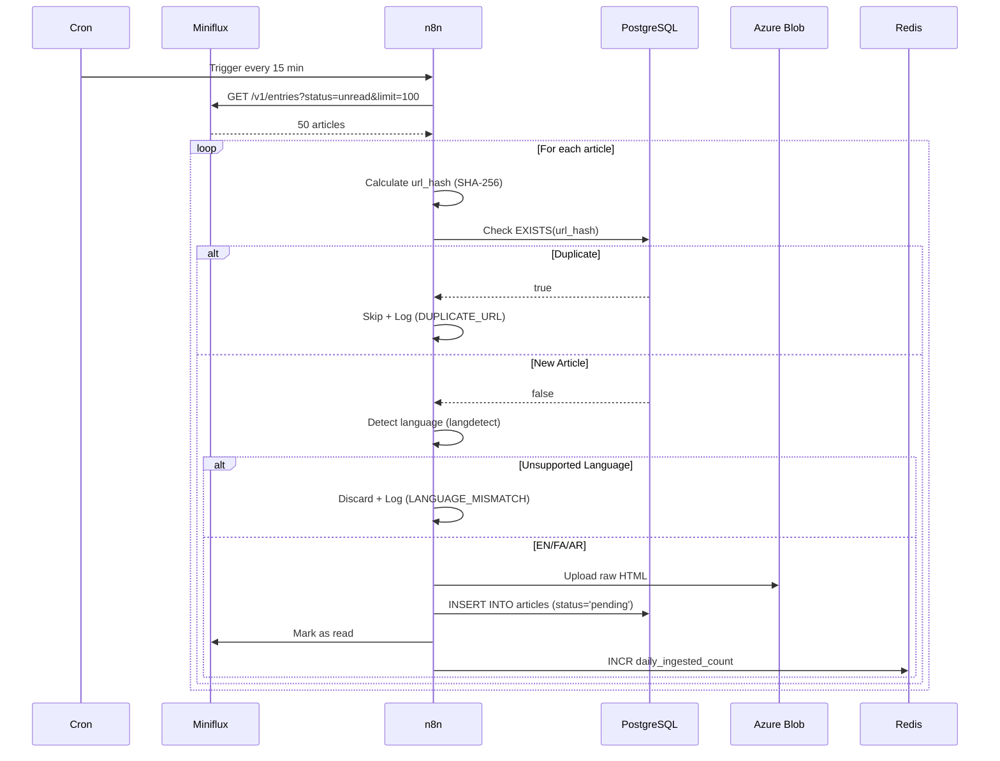
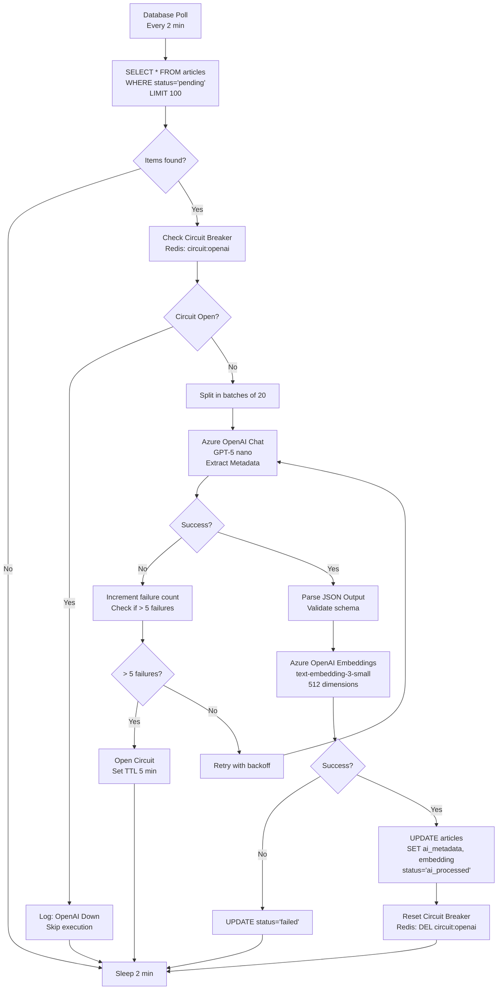

# n8n Workflows Master Plan - Nura Intelligence Platform

## Document Control

| Field | Value |
|-------|-------|
| **Version** | 1.0 (MVP Master Plan) |
| **Date** | February 3, 2026 |
| **Author** | Saman (n8n Automation Lead) |
| **Contributors** | Amir (Architecture), Navid (AI), Reyhaneh (DB) |
| **Status** | ✅ APPROVED for Implementation |
| **n8n Version** | 2.4.6 Community Edition (Self-Hosted) |

---

## 1. Executive Summary

این سند **Master Plan** کامل برای پیاده‌سازی 6 workflow اصلی n8n در پلتفرم Nura است. این طرح بر اساس:
- ✅ n8n 2.4.6 Community Edition (رایگان، Unlimited)
- ✅ Azure OpenAI Native Nodes (با GPT-5 nano support)
- ✅ PostgreSQL pgvector Native Integration
- ✅ Queue Mode Architecture (High Availability)
- ✅ Best Practices از production environments

**هدف:** ساخت یک سیستم automation که:
- **سریع:** < 5s per article processing
- **قابل اعتماد:** 99.5% uptime، auto-retry، circuit breaker
- **مقیاس‌پذیر:** از 5K به 50K articles/day
- **ارزان:** $26-50/month OpenAI API (با GPT-5 nano)

---

## 2. Technology Stack Confirmed

### 2.1 n8n Configuration

| Component | Version/Config | Status |
|-----------|----------------|--------|
| **n8n Edition** | Community Edition 2.4.6 | ✅ Confirmed |
| **Execution Mode** | Queue Mode (Redis) | ✅ Required |
| **Workers** | 1 Main + 2 Workers | ✅ Planned |
| **Database** | PostgreSQL 16 | ✅ Shared with Nura DB |
| **Queue** | Redis 7 | ✅ New instance |
| **Hosting** | Azure Container Apps | ✅ Docker Compose |

### 2.2 AI Models (Azure OpenAI)

| Model | Use Case | Latency | Cost/1M tokens | Priority |
|-------|----------|---------|----------------|----------|
| **GPT-5 nano** | Metadata extraction, Title generation | < 500ms | $0.08 | ⭐ Primary |
| **GPT-5 mini** | Trust Score explanation (Phase 2) | < 1s | $0.20 | Secondary |
| **text-embedding-3-small** | Vector embeddings (512 dims) | < 300ms | $0.02 | ⭐ Primary |

### 2.3 Native Nodes Available

| Node Type | n8n Package | Purpose |
|-----------|-------------|---------|
| **Azure OpenAI Chat** | @n8n/n8n-nodes-langchain.lmChatAzureOpenAi | GPT-5 nano chat |
| **Azure OpenAI Embeddings** | @n8n/n8n-nodes-langchain.embeddingsAzureOpenAi | text-embedding-3-small |
| **Postgres Vector Store** | @n8n/n8n-nodes-langchain.vectorStorePGVector | pgvector integration |
| **PostgreSQL** | @n8n/n8n-nodes-base.postgres | Database operations |
| **HTTP Request** | @n8n/n8n-nodes-base.httpRequest | External APIs (Twitter, Miniflux) |
| **Code** | @n8n/n8n-nodes-base.code | Custom JavaScript/Python |

---

## 3. Workflow Architecture Overview

### 3.1 System Diagram

```mermaid
graph TB
    subgraph "External Sources"
        RSS[RSS Feeds<br/>500 sources<br/>Miniflux]
        Twitter[Twitter API<br/>200 accounts<br/>twitterapi.io]
    end

    subgraph "n8n Workflows (Queue Mode)"
        WF01[WF-01: RSS Ingestion<br/>Every 15 min<br/>Deduplication]
        WF02[WF-02: Twitter Collection<br/>Every 5 min<br/>Rate limit aware]
        WF03[WF-03: Article Processing<br/>Every 2 min<br/>GPT-5 nano + Embeddings]
        WF04[WF-04: Narrative Clustering<br/>Every 15 min<br/>Vector Search + GPT]
        WF05[WF-05: AI Search Sync<br/>Every 15 min<br/>Delta sync]
        WF06[WF-06: Daily Cleanup<br/>2 AM daily<br/>Archival]
        WFError[WF-ERROR-HANDLER<br/>Central error logging]
    end

    subgraph "Storage Layer"
        PG[(PostgreSQL B2s<br/>Source of Truth<br/>articles, trust_signals)]
        Redis[(Redis 7<br/>Queue + Cache)]
        Blob[Azure Blob<br/>Raw HTML Archive]
        AISearch[Azure AI Search<br/>Read Cache]
    end

    subgraph "AI Services"
        OpenAI[Azure OpenAI<br/>GPT-5 nano<br/>text-embedding-3-small]
    end

    RSS -->|Webhook| WF01
    Twitter -->|Polling| WF02
    WF01 -->|Insert| PG
    WF02 -->|Insert| PG
    WF01 -->|Archive| Blob

    PG -->|status=pending| WF03
    WF03 -->|Metadata| OpenAI
    WF03 -->|Embeddings| OpenAI
    WF03 -->|Update| PG

    PG -->|status=ai_processed| WF04
    WF04 -->|Vector Search| PG
    WF04 -->|Generate Title| OpenAI
    WF04 -->|Update| PG

    PG -->|Delta| WF05
    WF05 -->|Sync| AISearch

    PG -->|Cleanup| WF06
    Blob -->|Cool tier| WF06

    WF01 -.Error.-> WFError
    WF02 -.Error.-> WFError
    WF03 -.Error.-> WFError
    WF04 -.Error.-> WFError
    WF05 -.Error.-> WFError

    WF01 -->|Queue| Redis
    WF02 -->|Queue| Redis
    WF03 -->|Queue| Redis
    WF04 -->|Queue| Redis
    WF05 -->|Queue| Redis

    style WF03 fill:#FFD93D,color:#000
    style PG fill:#4CAF50,color:#fff
    style OpenAI fill:#FF6B6B,color:#fff
    style Redis fill:#6BCB77,color:#fffgraph TB
    subgraph "External Sources"
        RSS[RSS Feeds<br/>500 sources<br/>Miniflux]
        Twitter[Twitter API<br/>200 accounts<br/>twitterapi.io]
    end

    subgraph "n8n Workflows (Queue Mode)"
        WF01[WF-01: RSS Ingestion<br/>Every 15 min<br/>Deduplication]
        WF02[WF-02: Twitter Collection<br/>Every 5 min<br/>Rate limit aware]
        WF03[WF-03: Article Processing<br/>Every 2 min<br/>GPT-5 nano + Embeddings]
        WF04[WF-04: Narrative Clustering<br/>Every 15 min<br/>Vector Search + GPT]
        WF05[WF-05: AI Search Sync<br/>Every 15 min<br/>Delta sync]
        WF06[WF-06: Daily Cleanup<br/>2 AM daily<br/>Archival]
        WFError[WF-ERROR-HANDLER<br/>Central error logging]
    end

    subgraph "Storage Layer"
        PG[(PostgreSQL B2s<br/>Source of Truth<br/>articles, trust_signals)]
        Redis[(Redis 7<br/>Queue + Cache)]
        Blob[Azure Blob<br/>Raw HTML Archive]
        AISearch[Azure AI Search<br/>Read Cache]
    end

    subgraph "AI Services"
        OpenAI[Azure OpenAI<br/>GPT-5 nano<br/>text-embedding-3-small]
    end

    RSS -->|Webhook| WF01
    Twitter -->|Polling| WF02
    WF01 -->|Insert| PG
    WF02 -->|Insert| PG
    WF01 -->|Archive| Blob

    PG -->|status=pending| WF03
    WF03 -->|Metadata| OpenAI
    WF03 -->|Embeddings| OpenAI
    WF03 -->|Update| PG

    PG -->|status=ai_processed| WF04
    WF04 -->|Vector Search| PG
    WF04 -->|Generate Title| OpenAI
    WF04 -->|Update| PG

    PG -->|Delta| WF05
    WF05 -->|Sync| AISearch

    PG -->|Cleanup| WF06
    Blob -->|Cool tier| WF06

    WF01 -.Error.-> WFError
    WF02 -.Error.-> WFError
    WF03 -.Error.-> WFError
    WF04 -.Error.-> WFError
    WF05 -.Error.-> WFError

    WF01 -->|Queue| Redis
    WF02 -->|Queue| Redis
    WF03 -->|Queue| Redis
    WF04 -->|Queue| Redis
    WF05 -->|Queue| Redis

    style WF03 fill:#FFD93D,color:#000
    style PG fill:#4CAF50,color:#fff
    style OpenAI fill:#FF6B6B,color:#fff
    style Redis fill:#6BCB77,color:#fff
```


---

## 4. Complete Workflow Specifications

### WF-01: RSS Feed Ingestion

**Purpose:** دریافت اخبار از Miniflux و ذخیره در PostgreSQL با deduplication

**Trigger:** Cron \`*/15 * * * *\` (هر 15 دقیقه)

**Expected Volume:** 50-100 articles per execution

**Nodes:**



**Node Configuration:**

```yaml
Node 1: Cron Trigger
  Type: @n8n/n8n-nodes-base.cron
  Parameters:
    cronExpression: "*/15 * * * *"
    triggerTimes: "everyXMinutes"

Node 2: HTTP Request (Miniflux API)
  Type: @n8n/n8n-nodes-base.httpRequest
  Parameters:
    method: GET
    url: "{{ $env.MINIFLUX_URL }}/v1/entries"
    authentication: "headerAuth"
    headerParameters:
      - name: "X-Auth-Token"
        value: "={{ $credentials.minifluxToken }}"
    queryParameters:
      status: "unread"
      limit: 100
      order: "published_at"
      direction: "desc"
  Settings:
    continueOnFail: false
    retryOnFail: true
    maxTries: 3
    waitBetweenTries: 2000

Node 3: Loop Over Items
  Type: @n8n/n8n-nodes-base.splitInBatches
  Parameters:
    batchSize: 1
    options:
      reset: false

Node 4: Calculate URL Hash
  Type: @n8n/n8n-nodes-base.code
  Parameters:
    language: javascript
    code: |
      const crypto = require('crypto');
      const url = $json.url;

      // Clean URL (remove UTM params, trailing slash)
      const cleanUrl = url.split('?')[0].replace(/\/$/, '');

      // Calculate SHA-256 hash
      const urlHash = crypto.createHash('sha256')
        .update(cleanUrl)
        .digest('hex');

      return {
        ...items[0].json,
        url_hash: urlHash,
        clean_url: cleanUrl
      };

Node 5: Check Duplicate (PostgreSQL)
  Type: @n8n/n8n-nodes-base.postgres
  Parameters:
    operation: "executeQuery"
    query: |
      SELECT EXISTS(
        SELECT 1 FROM articles WHERE url_hash = $1
      ) AS is_duplicate;
    parameters: "={{ [$json.url_hash] }}"
  Credentials: postgres-azure-main

Node 6: IF Node (Duplicate Check)
  Type: @n8n/n8n-nodes-base.if
  Parameters:
    conditions:
      boolean:
        - value1: "={{ $json.is_duplicate }}"
          operation: "equal"
          value2: false

Node 7a: Skip (If Duplicate)
  Type: @n8n/n8n-nodes-base.code
  Parameters:
    code: |
      console.log(\`Skipping duplicate: \${$json.url_hash}\`);
      return { status: 'skipped', reason: 'DUPLICATE_URL' };

Node 7b: Language Detection (If Not Duplicate)
  Type: @n8n/n8n-nodes-base.code
  Parameters:
    language: python
    code: |
      from langdetect import detect

      text = item['title'] + ' ' + item['content'][:500]
      try:
          lang = detect(text)
          is_supported = lang in ['en', 'fa', 'ar']
      except:
          lang = 'unknown'
          is_supported = False

      return {
          **item,
          'detected_language': lang,
          'is_supported': is_supported
      }

Node 8: IF Node (Language Check)
  Type: @n8n/n8n-nodes-base.if
  Parameters:
    conditions:
      boolean:
        - value1: "={{ $json.is_supported }}"
          operation: "equal"
          value2: true

Node 9a: Discard (Unsupported Language)
  Type: @n8n/n8n-nodes-base.code
  Parameters:
    code: |
      console.log(\`Discarding: language=\${$json.detected_language}\`);
      return { status: 'discarded', reason: 'LANGUAGE_MISMATCH' };

Node 9b: Upload to Blob Storage
  Type: @n8n/n8n-nodes-base.httpRequest
  Parameters:
    method: PUT
    url: "={{ $env.AZURE_BLOB_URL }}/raw-html/{{ $json.source_id }}/{{ $now.format('YYYY-MM-DD') }}/{{ $json.url_hash }}.html"
    authentication: "headerAuth"
    sendBody: true
    body: "={{ $json.html }}"

Node 10: Insert Article (PostgreSQL)
  Type: @n8n/n8n-nodes-base.postgres
  Parameters:
    operation: "insert"
    table: "articles"
    columns: |
      url_hash,
      source_id,
      title,
      content,
      published_at,
      original_url,
      language,
      processing_status,
      created_at
    values: |
      '{{ $json.url_hash }}',
      {{ $json.source_id }},
      '{{ $json.title }}',
      '{{ $json.content }}',
      '{{ $json.published_at }}',
      '{{ $json.url }}',
      '{{ $json.detected_language }}',
      'pending',
      NOW()
    returnFields: "id"

Node 11: Mark as Read (Miniflux)
  Type: @n8n/n8n-nodes-base.httpRequest
  Parameters:
    method: PUT
    url: "={{ $env.MINIFLUX_URL }}/v1/entries/{{ $json.miniflux_id }}/bookmark"

Node 12: Increment Counter (Redis)
  Type: @n8n/n8n-nodes-base.redis
  Parameters:
    operation: "incr"
    key: "stats:daily_ingested_count:{{ $now.format('YYYY-MM-DD') }}"
```

**Error Handling:**
- Built-in retry: 3 attempts با 2-second delay
- On total failure: Trigger WF-ERROR-HANDLER
- Dead Letter Queue: Store در Redis \`dlq:wf01:failed\`

**Performance Targets:**
- Execution time: < 60 seconds (P95)
- Success rate: > 98%
- Deduplication accuracy: 100%

---

### WF-02: Twitter Data Collection

**Purpose:** دریافت توییت‌ها از Twitter API با rate limit handling

**Trigger:** Cron \`*/5 * * * *\` (هر 5 دقیقه)

**Expected Volume:** 20-50 tweets per execution

**Node Configuration:**

```yaml
Node 1: Cron Trigger
  cronExpression: "*/5 * * * *"

Node 2: Get Active Accounts (PostgreSQL)
  Query: |
    SELECT id, twitter_handle, priority, last_tweet_id 
    FROM twitter_accounts 
    WHERE active = true 
    ORDER BY priority DESC, last_checked_at ASC 
    LIMIT 10

Node 3: Loop Over Accounts
  Type: splitInBatches
  batchSize: 1

Node 4: HTTP Request (twitterapi.io)
  Type: httpRequest
  url: "https://api.twitterapi.io/v1/tweets/search"
  queryParameters:
    q: "from:{{ $json.twitter_handle }}"
    since_id: "={{ $json.last_tweet_id }}"
    count: 50
  continueOnFail: true

Node 5: IF Node (Check HTTP Status)
  Conditions:
    - If status == 429: Go to "Wait 60s"
    - If status == 200: Go to "Process Tweets"
    - Else: Go to "Log Error"

Node 6a: Wait 60 seconds (Rate Limit)
  Type: wait
  amount: 60
  unit: seconds

Node 6b: Process Tweets
  Type: code
  code: |
    const tweets = $json.data || [];
    return tweets.map(tweet => ({
      tweet_id: tweet.id,
      account_id: $item(0).$json.id,
      text: tweet.full_text,
      author: tweet.user.screen_name,
      created_at: tweet.created_at,
      retweet_count: tweet.retweet_count,
      like_count: tweet.favorite_count,
      media_urls: tweet.entities.media?.map(m => m.media_url) || []
    }));

Node 7: Check Duplicate
  Query: |
    SELECT EXISTS(
      SELECT 1 FROM articles WHERE tweet_id = $1
    ) AS is_duplicate
  parameters: "={{ [$json.tweet_id] }}"

Node 8: Download Media (If New)
  Type: httpRequest
  Loop over media_urls

Node 9: Insert Tweet as Article
  Query: |
    INSERT INTO articles (
      tweet_id, source_id, title, content, published_at,
      platform, processing_status
    ) VALUES (
      $1, $2, 'Tweet by @' || $3, $4, $5,
      'twitter', 'pending'
    ) RETURNING id

Node 10: Update Last Tweet ID (Redis)
  Type: redis
  operation: set
  key: "twitter:{{ $item(0).$json.id }}:last_tweet_id"
  value: "={{ $json.tweet_id }}"
  ttl: 86400
```

**Rate Limit Strategy:**
- Detect 429 response → Wait 60s → Retry
- Track API quota در Redis: \`twitter:quota:remaining\`
- If quota < 10%: Pause high-priority accounts

**Error Handling:**
- Suspended accounts: Mark \`active=false\`, retry after 24h
- Network timeout: Retry 3x با exponential backoff

---

### WF-03: Article Processing Pipeline ⭐ CRITICAL

**Purpose:** پردازش اخبار pending با GPT-5 nano (Metadata + Embeddings)

**Trigger:** Database Poll every 2 minutes

**Expected Volume:** 50-100 articles per execution

**Flow Diagram:**



**Node Configuration (Detailed):**

```yaml
Node 1: Database Poll Trigger
  Type: @n8n/n8n-nodes-base.postgres
  Parameters:
    mode: "trigger"
    triggerOn: "interval"
    interval: 120  # 2 minutes
    query: |
      SELECT 
        id, 
        url_hash, 
        source_id, 
        title, 
        content, 
        published_at,
        language
      FROM articles 
      WHERE processing_status = 'pending'
      ORDER BY created_at ASC
      LIMIT 100

Node 2: Check If Empty
  Type: @n8n/n8n-nodes-base.if
  Parameters:
    conditions:
      number:
        - value1: "={{ $json.length }}"
          operation: "largerEqual"
          value2: 1

Node 3: Circuit Breaker Check
  Type: @n8n/n8n-nodes-base.redis
  Parameters:
    operation: "get"
    key: "circuit:openai"
  continueOnFail: true

Node 4: IF Circuit Open
  Type: @n8n/n8n-nodes-base.if
  Parameters:
    conditions:
      string:
        - value1: "={{ $json.value }}"
          operation: "equal"
          value2: "open"

Node 5: Split in Batches
  Type: @n8n/n8n-nodes-base.splitInBatches
  Parameters:
    batchSize: 20
    options:
      reset: true

Node 6: Extract Metadata (GPT-5 nano) ⭐
  Type: @n8n/n8n-nodes-langchain.lmChatAzureOpenAi
  Credentials: azure-openai-gpt5nano
  Parameters:
    messages:
      systemMessage: |
        You are a metadata extraction expert for news articles.
        Extract the following information and return ONLY valid JSON:
        {
          "author": "string or null",
          "published_date": "ISO 8601 or null",
          "entities": [
            {"type": "PERSON"|"ORG"|"EVENT"|"LOCATION", "name": "string", "confidence": 0.0-1.0}
          ],
          "sentiment": "positive"|"negative"|"neutral",
          "summary": "max 200 characters",
          "keywords": ["string", "string"],
          "language_confidence": 0.0-1.0
        }

        Rules:
        - If author not found, set to null
        - Extract top 5 entities by relevance
        - Summary must be concise and factual
        - Keywords: 3-5 most relevant terms

      userMessage: |
        Article Title: {{ $json.title }}

        Article Content (first 3000 chars):
        {{ $json.content.substring(0, 3000) }}

        Published At: {{ $json.published_at }}
        Language: {{ $json.language }}

    options:
      temperature: 0.2  # Low for consistency
      maxTokens: 400
      topP: 0.9
      responseFormat: "json_object"  # Force JSON output

  Settings:
    continueOnFail: true
    retryOnFail: true
    maxTries: 3
    waitBetweenTries: 2000  # 2 seconds

Node 7: Parse & Validate JSON
  Type: @n8n/n8n-nodes-base.code
  Parameters:
    language: javascript
    code: |
      const item = items[0].json;

      try {
        // Parse GPT output
        const metadata = JSON.parse(item.output);

        // Validation & Defaults
        metadata.author = metadata.author || "Unknown";
        metadata.entities = Array.isArray(metadata.entities) ? metadata.entities : [];
        metadata.sentiment = ["positive", "negative", "neutral"].includes(metadata.sentiment) 
          ? metadata.sentiment 
          : "neutral";
        metadata.summary = metadata.summary?.substring(0, 200) || "";
        metadata.keywords = Array.isArray(metadata.keywords) ? metadata.keywords.slice(0, 5) : [];

        // Calculate entity confidence average
        const avgEntityConfidence = metadata.entities.length > 0
          ? metadata.entities.reduce((sum, e) => sum + (e.confidence || 0), 0) / metadata.entities.length
          : 0;

        return {
          ...item,
          metadata: metadata,
          extraction_status: "success",
          entity_confidence: avgEntityConfidence.toFixed(2)
        };

      } catch (error) {
        console.error('JSON Parse Error:', error.message);
        return {
          ...item,
          metadata: null,
          extraction_status: "failed",
          error: error.message
        };
      }

Node 8: IF Extraction Failed
  Type: @n8n/n8n-nodes-base.if
  Parameters:
    conditions:
      string:
        - value1: "={{ $json.extraction_status }}"
          operation: "equal"
          value2: "success"

Node 9a: Handle Failure (Increment Circuit Counter)
  Type: @n8n/n8n-nodes-base.redis
  Parameters:
    operation: "incr"
    key: "circuit:openai:failures"

Node 9b: Check Failure Count
  Type: @n8n/n8n-nodes-base.redis
  Parameters:
    operation: "get"
    key: "circuit:openai:failures"

Node 9c: IF Should Open Circuit
  Type: @n8n/n8n-nodes-base.if
  Parameters:
    conditions:
      number:
        - value1: "={{ parseInt($json.value) }}"
          operation: "largerEqual"
          value2: 5

Node 9d: Open Circuit Breaker
  Type: @n8n/n8n-nodes-base.redis
  Parameters:
    operation: "set"
    key: "circuit:openai"
    value: "open"
    ttl: 300  # 5 minutes

Node 10: Generate Embedding (text-embedding-3-small) ⭐
  Type: @n8n/n8n-nodes-langchain.embeddingsAzureOpenAi
  Credentials: azure-openai-embeddings
  Parameters:
    model: "text-embedding-3-small"
    dimensions: 512  # Reduced from 1536 for cost savings
    input: "={{ $json.title + ' ' + $json.metadata.summary }}"
  Settings:
    continueOnFail: true
    retryOnFail: true
    maxTries: 3

Node 11: IF Embedding Success
  Type: @n8n/n8n-nodes-base.if
  Parameters:
    conditions:
      boolean:
        - value1: "={{ $json.embedding !== null }}"
          operation: "equal"
          value2: true

Node 12a: Mark as Failed (PostgreSQL)
  Type: @n8n/n8n-nodes-base.postgres
  Parameters:
    operation: "update"
    table: "articles"
    updateKey: "id"
    columns: |
      processing_status='failed',
      error_log='{{ $json.error }}',
      updated_at=NOW()

Node 12b: Update Article (PostgreSQL) ✅
  Type: @n8n/n8n-nodes-base.postgres
  Parameters:
    operation: "update"
    table: "articles"
    updateKey: "id"
    columns: |
      ai_metadata='{{ $json.metadata | tojson }}',
      embedding='{{ $json.embedding }}',
      processing_status='ai_processed',
      processed_at=NOW(),
      updated_at=NOW()

Node 13: Reset Circuit Breaker (Success Path)
  Type: @n8n/n8n-nodes-base.redis
  Parameters:
    operation: "del"
    key: "circuit:openai:failures"

Node 14: Log Metrics (Redis)
  Type: @n8n/n8n-nodes-base.redis
  Parameters:
    operation: "incr"
    key: "metrics:wf03:success:{{ $now.format('YYYY-MM-DD') }}"
```

**Performance Optimizations:**
- ✅ Batch processing: 20 articles at once
- ✅ Parallel execution: Enable \`executionOrder: v1\`
- ✅ Truncate content: First 3000 chars only (reduce tokens)
- ✅ Cache embeddings: Store در Redis با content_hash key
- ✅ Circuit breaker: Stop calling OpenAI if 5 consecutive failures

**Cost Estimation (GPT-5 nano):**
```
Daily: 5,000 articles × 2.5K tokens = 12.5M tokens
Monthly: 12.5M × 30 = 375M tokens
Cost: 375M × $0.08/1M = $30/month (Metadata)

Embeddings: 5,000 × 512 dims = 2.56M tokens
Cost: 2.56M × 30 × $0.02/1M = $1.54/month

Total: ~$32/month ✅ (vs $100 with GPT-4o-mini)
```

---

### WF-04: Narrative Clustering

**Purpose:** گروه‌بندی اخبار مشابه با vector search + GPT

**Trigger:** Cron \`*/15 * * * *\` (هر 15 دقیقه)

**Expected Volume:** 100-200 articles per execution

**Algorithm:**

```mermaid
flowchart TD
    Start[Get Unassigned Articles] --> Loop[Loop over articles]
    Loop --> VecSearch[pgvector HNSW Search<br/>Find top 10 similar narratives]

    VecSearch --> Check1{Similarity > 0.85?}
    Check1 -->|Yes| Assign1[Assign to existing narrative]
    Check1 -->|No| Check2{Similarity > 0.75<br/>AND entity overlap >= 2?}

    Check2 -->|Yes| Assign1
    Check2 -->|No| Check3{Within 7-day window?}

    Check3 -->|No| CreateNew[Create new narrative]
    Check3 -->|Yes| GPTDecide[Ask GPT-5 nano:<br/>"Same event?"]

    GPTDecide -->|Yes| Assign1
    GPTDecide -->|No| CreateNew

    Assign1 --> Update1[UPDATE article_narratives]
    CreateNew --> GenTitle[GPT-5 nano:<br/>Generate title]
    GenTitle --> Insert[INSERT INTO narratives]
    Insert --> Update1

    Update1 --> Recalc[Recalculate centroid<br/>AVG(embeddings)]
    Recalc --> End[Done]
```

**Node Configuration:**

```yaml
Node 1: Get Unassigned Articles
  Query: |
    SELECT 
      a.id, 
      a.title, 
      a.embedding, 
      a.ai_metadata->>'entities' AS entities,
      a.published_at
    FROM articles a
    LEFT JOIN article_narratives an ON a.id = an.article_id
    WHERE a.processing_status = 'ai_processed'
      AND an.article_id IS NULL
    ORDER BY a.published_at DESC
    LIMIT 200

Node 2: Vector Search (PostgreSQL pgvector)
  Type: @n8n/n8n-nodes-base.postgres
  Query: |
    SELECT 
      n.id AS narrative_id,
      n.title,
      n.embedding,
      1 - (n.embedding <=> $1::vector) AS similarity,
      n.entities
    FROM narratives n
    WHERE n.last_updated_at > NOW() - INTERVAL '14 days'
    ORDER BY n.embedding <=> $1::vector
    LIMIT 10
  Parameters: "={{ [$json.embedding] }}"

Node 3: Decision Tree (Code Node)
  Type: code
  code: |
    const article = items[0].json;
    const narratives = items.slice(1);

    // Rule 1: High similarity (auto-assign)
    const highMatch = narratives.find(n => n.similarity > 0.85);
    if (highMatch) {
      return {
        ...article,
        assigned_narrative_id: highMatch.narrative_id,
        assignment_reason: "high_similarity",
        similarity_score: highMatch.similarity
      };
    }

    // Rule 2: Medium similarity + entity overlap
    const articleEntities = JSON.parse(article.entities || '[]').map(e => e.name.toLowerCase());
    const mediumMatch = narratives.find(n => {
      if (n.similarity < 0.75) return false;

      const narrativeEntities = JSON.parse(n.entities || '[]').map(e => e.name.toLowerCase());
      const overlap = articleEntities.filter(e => narrativeEntities.includes(e)).length;

      return overlap >= 2;
    });

    if (mediumMatch) {
      return {
        ...article,
        assigned_narrative_id: mediumMatch.narrative_id,
        assignment_reason: "similarity_entities",
        similarity_score: mediumMatch.similarity
      };
    }

    // Rule 3: Check time window
    const publishedDate = new Date(article.published_at);
    const daysSincePublished = (new Date() - publishedDate) / (1000 * 60 * 60 * 24);

    if (daysSincePublished > 7) {
      return {
        ...article,
        assigned_narrative_id: null,
        assignment_reason: "create_new_old_article"
      };
    }

    // Rule 4: Ask GPT (uncertain case)
    return {
      ...article,
      assigned_narrative_id: null,
      assignment_reason: "needs_gpt_decision",
      candidate_narratives: narratives.slice(0, 3)  // Top 3
    };

Node 4: IF Needs GPT Decision
  Type: if
  Conditions:
    - value1: "={{ $json.assignment_reason }}"
      operation: "equal"
      value2: "needs_gpt_decision"

Node 5: GPT Decision (GPT-5 nano)
  Type: @n8n/n8n-nodes-langchain.lmChatAzureOpenAi
  Prompt: |
    You are a news clustering expert. Determine if this article belongs to any of these narratives.

    Article Title: {{ $json.title }}
    Article Entities: {{ $json.entities }}

    Candidate Narratives:
    
    - ID: {{ narrative.narrative_id }}, Title: {{ narrative.title }}, Similarity: {{ narrative.similarity }}
    

    Return JSON:
    {
      "belongs_to": narrative_id or null,
      "reason": "string explanation"
    }
  Temperature: 0.3

Node 6: Create New Narrative (If Needed)
  Type: @n8n/n8n-nodes-langchain.lmChatAzureOpenAi
  Prompt: |
    Generate a concise narrative title (max 80 chars) for this news cluster:

    Article 1: {{ $json.title }}
    Entities: {{ $json.entities }}

    Title should:
    - Be factual and neutral
    - Capture the main event/theme
    - Be searchable

    Return ONLY the title text (no quotes).
  Temperature: 0.5

Node 7: Insert Narrative
  Query: |
    INSERT INTO narratives (
      title, 
      summary, 
      embedding, 
      entities, 
      article_count, 
      last_updated_at
    ) VALUES (
      $1, $2, $3, $4, 1, NOW()
    ) RETURNING id

Node 8: Assign Article to Narrative
  Query: |
    INSERT INTO article_narratives (article_id, narrative_id, similarity_score)
    VALUES ($1, $2, $3)
    ON CONFLICT (article_id, narrative_id) DO NOTHING

Node 9: Recalculate Centroid
  Query: |
    UPDATE narratives n
    SET 
      embedding = (
        SELECT AVG(a.embedding)::vector
        FROM articles a
        JOIN article_narratives an ON a.id = an.article_id
        WHERE an.narrative_id = $1
      ),
      article_count = (
        SELECT COUNT(*) FROM article_narratives WHERE narrative_id = $1
      ),
      last_updated_at = NOW()
    WHERE n.id = $1
```

**Performance:**
- Vector search: < 300ms (HNSW index)
- GPT decision: Only for ~10% of articles (uncertain cases)
- Batch processing: 50 articles per iteration

---

### WF-05: PostgreSQL → AI Search Sync

**Purpose:** همگام‌سازی incremental از PostgreSQL به Azure AI Search

**Trigger:** Cron \`*/15 * * * *\` (هر 15 دقیقه)

**Expected Volume:** 50-200 documents per execution

**Node Configuration:**

```yaml
Node 1: Get Last Sync Timestamp (Redis)
  Type: redis
  operation: get
  key: "sync:ai_search:last_run"

Node 2: Delta Query (PostgreSQL)
  Query: |
    SELECT 
      a.id,
      a.url_hash,
      a.title,
      LEFT(a.content, 1000) AS content_preview,  -- Truncate
      a.ai_metadata->>'summary' AS summary,
      a.ai_metadata->>'sentiment' AS sentiment,
      a.trust_score,
      a.published_at,
      a.language,
      s.name AS source_name,
      s.class AS source_class,
      array_agg(n.title) AS narrative_titles
    FROM articles a
    JOIN sources s ON a.source_id = s.id
    LEFT JOIN article_narratives an ON a.id = an.article_id
    LEFT JOIN narratives n ON an.narrative_id = n.id
    WHERE a.updated_at > $1
      AND a.trust_score >= 50
      AND a.published_at > NOW() - INTERVAL '14 days'
    GROUP BY a.id, s.id
    LIMIT 500
  Parameters: "={{ [$json.last_run || '1970-01-01'] }}"

Node 3: Transform for AI Search
  Type: code
  code: |
    return items.map(item => ({
      '@search.action': 'mergeOrUpload',
      id: item.id,
      url_hash: item.url_hash,
      title: item.title,
      content_preview: item.content_preview,
      summary: item.summary,
      sentiment: item.sentiment,
      trust_score: item.trust_score,
      published_at: new Date(item.published_at).toISOString(),
      language: item.language,
      source_name: item.source_name,
      source_class: item.source_class,
      narrative_titles: item.narrative_titles || [],
      indexed_at: new Date().toISOString()
    }));

Node 4: Batch Upload (Azure AI Search)
  Type: httpRequest
  method: POST
  url: "={{ $env.AZURE_SEARCH_URL }}/indexes/nura-articles/docs/index"
  authentication: headerAuth
  headers:
    - name: "api-key"
      value: "={{ $credentials.azureSearchKey }}"
  body: |
    {
      "value": {{ $json | tojson }}
    }
  batchSize: 100

Node 5: Update Last Sync (Redis)
  Type: redis
  operation: set
  key: "sync:ai_search:last_run"
  value: "={{ $now.toISOString() }}"

Node 6: Log Metrics
  Type: redis
  operation: incrby
  key: "metrics:sync:items_synced:{{ $now.format('YYYY-MM-DD') }}"
  value: "={{ $json.length }}"
```

**Constraints:**
- Max 100 docs per batch (Azure limit)
- Only articles with trust_score >= 50
- Only last 14 days (retention policy)

---

### WF-06: Daily Cleanup & Archival

**Purpose:** حذف داده‌های قدیمی، آرشیو، و بهینه‌سازی

**Trigger:** Cron \`0 2 * * *\` (هر روز ساعت 2 صبح NZDT)

**Node Configuration:**

\`\`\`yaml
Node 1: Remove Old Embeddings (PostgreSQL)
  Query: |
    UPDATE articles
    SET embedding = NULL
    WHERE published_at < NOW() - INTERVAL '30 days'
      AND embedding IS NOT NULL
    RETURNING id

Node 2: Delete from AI Search
  Query: |
    SELECT id FROM articles
    WHERE published_at < NOW() - INTERVAL '14 days'
       OR trust_score < 50

  Then HTTP DELETE to Azure AI Search

Node 3: Move Blob to Cool Tier
  Type: code (Azure SDK)
  code: |
    // Move raw HTML files older than 30 days to Cool tier
    const blobsToMove = await blobService.listBlobs({
      prefix: 'raw-html/',
      filter: `properties.created < '${thirtyDaysAgo}'`
    });

    for (const blob of blobsToMove) {
      await blobService.setTier(blob.name, 'Cool');
    }

Node 4: Vacuum PostgreSQL
  Query: |
    VACUUM ANALYZE articles;
    VACUUM ANALYZE narratives;
    REINDEX INDEX idx_articles_embedding;

Node 5: Generate Daily Report
  Type: code
  code: |
    const metrics = {
      embeddings_removed: $node["Node 1"].json.length,
      ai_search_deleted: $node["Node 2"].json.length,
      blobs_archived: $node["Node 3"].json.count,
      vacuum_duration_ms: $node["Node 4"].json.duration
    };

    return metrics;

Node 6: Insert Audit Log
  Query: |
    INSERT INTO audit_log (event, metadata, created_at)
    VALUES ('daily_cleanup', $1, NOW())
\`\`\`

---

### WF-ERROR-HANDLER: Central Error Logging

**Purpose:** مدیریت متمرکز خطاها از همه workflows

**Trigger:** Called by other workflows on error

**Node Configuration:**

\`\`\`yaml
Node 1: Error Webhook
  Type: webhook
  path: "/internal/error-handler"
  method: POST

Node 2: Parse Error Data
  Type: code
  code: |
    const error = $json;
    return {
      workflow_name: error.workflow?.name,
      execution_id: error.executionId,
      node_name: error.node?.name,
      error_message: error.message,
      error_stack: error.stack,
      severity: determineSeverity(error),  // critical/high/medium/low
      timestamp: new Date().toISOString()
    };

Node 3: Insert Error Log (PostgreSQL)
  Query: |
    INSERT INTO workflow_errors (
      workflow_name, execution_id, node_name, 
      error_message, error_stack, severity
    ) VALUES ($1, $2, $3, $4, $5, $6)
    RETURNING id

Node 4: IF Critical Error
  Conditions:
    - severity == "critical"

Node 5a: Send PagerDuty Alert
  Type: httpRequest
  url: "https://events.pagerduty.com/v2/enqueue"
  body: |
    {
      "routing_key": "{{ $credentials.pagerdutyKey }}",
      "event_action": "trigger",
      "payload": {
        "summary": "n8n Critical Error: {{ $json.workflow_name }}",
        "severity": "critical",
        "source": "n8n",
        "custom_details": {{ $json | tojson }}
      }
    }

Node 5b: Send Slack Alert (High/Medium)
  Type: httpRequest
  url: "{{ $env.SLACK_WEBHOOK_URL }}"
  body: |
    {
      "text": "⚠️ n8n Error in {{ $json.workflow_name }}",
      "blocks": [
        {
          "type": "section",
          "text": {
            "type": "mrkdwn",
            "text": "*Error:* {{ $json.error_message }}\n*Node:* {{ $json.node_name }}\n*Severity:* {{ $json.severity }}"
          }
        }
      ]
    }

Node 6: Increment Error Counter (Redis)
  Type: redis
  operation: incr
  key: "metrics:errors:{{ $json.workflow_name }}:{{ $now.format('YYYY-MM-DD') }}"
\`\`\`

---

## 5. Best Practices & Guidelines

### 5.1 DO's ✅

| Category | Practice | Reason |
|----------|----------|--------|
| **Nodes** | Use Native Nodes (Azure OpenAI, pgvector) | Built-in retry, credential management |
| **Models** | Use GPT-5 nano for metadata extraction | 4x faster, 47% cheaper |
| **Embeddings** | Use 512 dimensions (not 1536) | 67% cost reduction, sufficient accuracy |
| **Deduplication** | Check url_hash BEFORE processing | Avoid wasting API calls |
| **Batching** | Process 20-50 items per batch | Balance throughput vs rate limits |
| **Error Handling** | Implement Circuit Breaker | Prevent cascading failures |
| **Retry Logic** | Exponential backoff (1s → 2s → 4s) | Respect API rate limits |
| **Caching** | Cache embeddings در Redis | 30-50% cost savings |
| **Logging** | Log to PostgreSQL + Redis metrics | Debugging و monitoring |
| **Queue Mode** | Always use Queue Mode (not Regular) | High availability, horizontal scaling |

### 5.2 DON'Ts ❌

| Anti-Pattern | Why Avoid | Alternative |
|--------------|-----------|-------------|
| **Hardcoded URLs** | Breaks when API changes | Use environment variables |
| **HTTP Request for OpenAI** | No auto-retry, manual credential management | Use Native Azure OpenAI Nodes |
| **Processing full content** | Wastes tokens (cost) | Truncate to 3000 chars |
| **Synchronous workflows** | Blocks execution | Use Queue Mode + parallel nodes |
| **No rate limit handling** | API ban, failed executions | Detect 429, wait 60s |
| **Storing embeddings forever** | Wastes storage | Delete after 30 days |
| **No error logging** | Blind to failures | Use WF-ERROR-HANDLER |
| **Large batch sizes (>100)** | Timeouts, memory issues | Max 50 items per batch |
| **AI Agent for Trust Score** | 3-5x more expensive | Use Python deterministic formula |
| **Regular Mode (not Queue)** | Single point of failure | Queue Mode با Redis |

### 5.3 Performance Optimization Checklist

```yaml
Before Deployment:
  - [ ] Enable executionOrder: v1 (parallel nodes)
  - [ ] Set timeout: 300s for AI nodes
  - [ ] Configure retry: 3 attempts با exponential backoff
  - [ ] Add indexes: url_hash, processing_status, embedding (HNSW)
  - [ ] Enable Redis cache برای embeddings
  - [ ] Truncate content به 3000 chars
  - [ ] Use GPT-5 nano (not GPT-4o-mini)
  - [ ] Batch size: 20-50 items
  - [ ] Setup Circuit Breaker (5 failures → 5 min pause)
  - [ ] Deploy Queue Mode (1 Main + 2 Workers)

After Deployment:
  - [ ] Monitor latency (P95 < 60s per article)
  - [ ] Track OpenAI costs daily
  - [ ] Check error rate (should be < 2%)
  - [ ] Verify deduplication accuracy (100%)
  - [ ] Test Circuit Breaker (simulate failures)
  - [ ] Load test: 1K articles in 1 hour
  - [ ] Setup alerts (PagerDuty for critical errors)
  - [ ] Document runbook (common issues + fixes)
```

---

## 6. Infrastructure Requirements

### 6.1 Docker Compose (Production)

\`\`\`yaml
version: '3.8'

services:
  n8n-main:
    image: n8nio/n8n:2.4.6
    container_name: n8n-main
    restart: unless-stopped
    ports:
      - "5678:5678"
    environment:
      - N8N_HOST=0.0.0.0
      - N8N_PORT=5678
      - N8N_PROTOCOL=https
      - NODE_ENV=production

      # Database
      - DB_TYPE=postgresdb
      - DB_POSTGRESDB_HOST=${DB_HOST}
      - DB_POSTGRESDB_PORT=5432
      - DB_POSTGRESDB_DATABASE=n8n
      - DB_POSTGRESDB_USER=${DB_USER}
      - DB_POSTGRESDB_PASSWORD=${DB_PASSWORD}

      # Queue Mode
      - EXECUTIONS_MODE=queue
      - QUEUE_BULL_REDIS_HOST=redis
      - QUEUE_BULL_REDIS_PORT=6379
      - QUEUE_BULL_REDIS_DB=0

      # Execution Settings
      - EXECUTIONS_TIMEOUT=300  # 5 minutes
      - EXECUTIONS_DATA_SAVE_ON_SUCCESS=all
      - EXECUTIONS_DATA_SAVE_ON_ERROR=all
      - EXECUTIONS_DATA_PRUNE=true
      - EXECUTIONS_DATA_MAX_AGE=168  # 7 days

      # Security
      - N8N_BASIC_AUTH_ACTIVE=true
      - N8N_BASIC_AUTH_USER=${ADMIN_USER}
      - N8N_BASIC_AUTH_PASSWORD=${ADMIN_PASSWORD}
      - N8N_ENCRYPTION_KEY=${ENCRYPTION_KEY}

      # Logging
      - N8N_LOG_LEVEL=info
      - N8N_LOG_OUTPUT=console,file

    volumes:
      - n8n_data:/home/node/.n8n
      - ./workflows:/home/node/.n8n/workflows
      - ./logs:/home/node/.n8n/logs
    depends_on:
      - redis
    networks:
      - nura-network

  n8n-worker-1:
    image: n8nio/n8n:2.4.6
    container_name: n8n-worker-1
    restart: unless-stopped
    command: worker
    environment:
      - DB_TYPE=postgresdb
      - DB_POSTGRESDB_HOST=${DB_HOST}
      - DB_POSTGRESDB_PORT=5432
      - DB_POSTGRESDB_DATABASE=n8n
      - DB_POSTGRESDB_USER=${DB_USER}
      - DB_POSTGRESDB_PASSWORD=${DB_PASSWORD}
      - EXECUTIONS_MODE=queue
      - QUEUE_BULL_REDIS_HOST=redis
      - QUEUE_BULL_REDIS_PORT=6379
      - N8N_ENCRYPTION_KEY=${ENCRYPTION_KEY}
    volumes:
      - n8n_data:/home/node/.n8n
    depends_on:
      - redis
      - n8n-main
    networks:
      - nura-network

  n8n-worker-2:
    image: n8nio/n8n:2.4.6
    container_name: n8n-worker-2
    restart: unless-stopped
    command: worker
    environment:
      - DB_TYPE=postgresdb
      - DB_POSTGRESDB_HOST=${DB_HOST}
      - DB_POSTGRESDB_PORT=5432
      - DB_POSTGRESDB_DATABASE=n8n
      - DB_POSTGRESDB_USER=${DB_USER}
      - DB_POSTGRESDB_PASSWORD=${DB_PASSWORD}
      - EXECUTIONS_MODE=queue
      - QUEUE_BULL_REDIS_HOST=redis
      - QUEUE_BULL_REDIS_PORT=6379
      - N8N_ENCRYPTION_KEY=${ENCRYPTION_KEY}
    volumes:
      - n8n_data:/home/node/.n8n
    depends_on:
      - redis
      - n8n-main
    networks:
      - nura-network

  redis:
    image: redis:7-alpine
    container_name: n8n-redis
    restart: unless-stopped
    command: redis-server --appendonly yes --maxmemory 512mb --maxmemory-policy allkeys-lru
    volumes:
      - redis_data:/data
    networks:
      - nura-network

volumes:
  n8n_data:
  redis_data:

networks:
  nura-network:
    external: true
\`\`\`

### 6.2 Resource Allocation (Azure)

| Component | CPU | Memory | Storage | Monthly Cost |
|-----------|-----|--------|---------|--------------|
| **n8n Main** | 0.5 vCore | 1 GB | - | $8 |
| **Worker 1** | 0.5 vCore | 1 GB | - | $8 |
| **Worker 2** | 0.5 vCore | 1 GB | - | $8 (optional) |
| **Redis** | 0.25 vCore | 0.5 GB | 1 GB | $5 |
| **Total** | 1.75 vCore | 3.5 GB | 1 GB | **$21-29/mo** |

---

## 7. Monitoring & Metrics

### 7.1 Key Metrics (Dashboard)

| Metric | Target | Alert Threshold | Source |
|--------|--------|-----------------|--------|
| **Workflow Success Rate** | > 98% | < 95% | PostgreSQL |
| **Avg Processing Time** | < 60s | > 90s (P95) | n8n execution logs |
| **Queue Length** | < 100 | > 500 | Redis \`LLEN\` |
| **OpenAI API Latency** | < 1s | > 3s (P95) | Application logs |
| **OpenAI Cost** | < $50/mo | > $60/mo | Azure billing API |
| **Error Rate** | < 2% | > 5% | workflow_errors table |
| **Circuit Breaker Opens** | 0/day | > 3/day | Redis counter |
| **Deduplication Rate** | ~30% | < 10% | Logs |

### 7.2 Health Check Workflow

\`\`\`yaml
WF-HEALTH-CHECK:
  Trigger: Cron (*/5 * * * *)  # Every 5 minutes

  Checks:
    1. Redis:
       - Command: PING
       - Expected: PONG

    2. PostgreSQL:
       - Query: SELECT 1
       - Expected: 1 row

    3. Queue Length:
       - Command: LLEN bull:n8n:queue
       - Alert if > 500

    4. Last Execution (WF-01):
       - Query: SELECT MAX(finished_at) FROM executions WHERE workflow_name='WF-01'
       - Alert if > 20 minutes ago

    5. OpenAI Circuit:
       - Redis GET circuit:openai
       - Alert if "open"

    6. Worker Status:
       - Check if workers are processing jobs
       - Alert if all idle for > 10 min

  On Failure:
    - Send Slack alert
    - Insert to health_check_log table
\`\`\`

---

## 8. Deployment Plan

### Week 1: Infrastructure Setup (Feb 5-11, 2026)

\`\`\`yaml
Tasks:
  - [ ] Setup Azure Container Apps environment
  - [ ] Deploy Redis 7 container
  - [ ] Configure n8n Main + 2 Workers (Queue Mode)
  - [ ] Setup Azure OpenAI deployments (GPT-5 nano, embeddings)
  - [ ] Create n8n credentials (Azure OpenAI, PostgreSQL, Redis)
  - [ ] Configure environment variables
  - [ ] Test connectivity (OpenAI API, PostgreSQL, Redis)

Deliverables:
  - ✅ n8n UI accessible at https://n8n.nura.internal
  - ✅ All credentials tested and working
  - ✅ Queue Mode verified (check Redis queue)

Team:
  - Amir: Infrastructure setup
  - Saman: n8n configuration
\`\`\`

### Week 2: Workflow Development (Feb 12-18, 2026)

\`\`\`yaml
Priority 1 (Critical):
  - [ ] WF-01: RSS Ingestion (test with 10 sources)
  - [ ] WF-03: Article Processing (test with 50 articles)
  - [ ] WF-ERROR-HANDLER: Central error logging

Priority 2 (Important):
  - [ ] WF-02: Twitter Collection (test with 5 accounts)
  - [ ] WF-04: Narrative Clustering (test with 100 articles)

Priority 3 (Nice-to-have):
  - [ ] WF-05: AI Search Sync (manual run first)
  - [ ] WF-06: Daily Cleanup (test on staging)
  - [ ] WF-HEALTH-CHECK: Monitoring

Testing:
  - Unit test: Each node individually
  - Integration test: Full workflow end-to-end
  - Performance test: 1K articles in 1 hour

Team:
  - Saman: Workflow development
  - Navid: AI prompt optimization
  - Reyhaneh: Database queries
\`\`\`

### Week 3: Testing & Optimization (Feb 19-25, 2026)

\`\`\`yaml
Testing Scenarios:
  1. Normal Load:
     - Ingest 5K articles/day
     - Monitor: latency, errors, cost

  2. High Load:
     - Ingest 10K articles/day
     - Check: queue buildup, worker saturation

  3. Failure Scenarios:
     - OpenAI API down → Circuit breaker should activate
     - PostgreSQL slow → Queue should buffer
     - Redis restart → No data loss

  4. Cost Validation:
     - Track OpenAI API usage
     - Verify: < $50/month

  5. Accuracy Check:
     - Manual review: 100 random articles
     - Verify: Metadata extraction accuracy > 95%

Bug Fixes:
  - [ ] Fix any issues found during testing
  - [ ] Optimize slow queries
  - [ ] Tune GPT-5 nano prompts

Team:
  - Full team collaboration
\`\`\`

### Week 4: Production Launch (Feb 26 - Mar 3, 2026)

\`\`\`yaml
Pre-launch Checklist:
  - [ ] All 6 workflows passing tests
  - [ ] Error rate < 2%
  - [ ] Monitoring dashboards ready
  - [ ] Runbook documented
  - [ ] On-call rotation scheduled
  - [ ] Backup/restore tested

Launch Steps:
  1. Scale to 500 RSS sources (from 10)
  2. Scale to 200 Twitter accounts (from 5)
  3. Enable all workflows
  4. Monitor for 24 hours (critical issues)
  5. Monitor for 7 days (optimization opportunities)

Success Criteria:
  - ✅ 5K articles/day processed
  - ✅ 99.5% uptime
  - ✅ < $50/month OpenAI cost
  - ✅ No critical alerts

Team:
  - 24/7 monitoring: Saman (on-call)
  - Support: Amir (infrastructure), Navid (AI)
\`\`\`

---

## 9. Troubleshooting Guide

### Common Issues

| Symptom | Possible Cause | Solution |
|---------|----------------|----------|
| **Workflows not executing** | Workers not running | Check \`docker ps\`, restart workers |
| **High queue length (>500)** | Workers overwhelmed | Scale to 3-4 workers |
| **"Circuit breaker open"** | OpenAI API down or rate limited | Wait 5 min, check Azure status |
| **"Duplicate key error"** | Race condition (2 workers) | Add \`ON CONFLICT DO NOTHING\` |
| **Slow vector search** | Missing HNSW index | Run \`REINDEX INDEX idx_articles_embedding\` |
| **High OpenAI cost** | No caching, large prompts | Enable Redis cache, truncate content |
| **Webhook not triggering** | Miniflux config wrong | Check webhook URL in Miniflux |
| **Embedding NULL** | OpenAI API failed silently | Check error logs, verify credential |

### Debug Commands

\`\`\`bash
# Check Queue Length
docker exec n8n-redis redis-cli LLEN "bull:n8n:queue"

# Check Circuit Breaker
docker exec n8n-redis redis-cli GET "circuit:openai"

# Check Worker Status
docker logs n8n-worker-1 --tail=50 --follow

# Check PostgreSQL Connections
docker exec postgres psql -U nura -c "SELECT count(*) FROM pg_stat_activity;"

# Manual Workflow Trigger (for testing)
curl -X POST http://localhost:5678/webhook/test-wf01 \
  -H "Content-Type: application/json" \
  -d '{"test": true}'

# Check n8n Execution Logs
docker exec n8n-main cat /home/node/.n8n/logs/n8n.log | grep ERROR
\`\`\`

---

## 10. Cost Summary

### Monthly Cost Breakdown

| Component | Unit Cost | Volume | Total |
|-----------|-----------|--------|-------|
| **Azure OpenAI (GPT-5 nano)** | $0.08/1M tokens | 375M tokens | $30.00 |
| **Azure OpenAI (Embeddings)** | $0.02/1M tokens | 77M tokens | $1.54 |
| **n8n Infrastructure** | $8/container | 3 containers | $24.00 |
| **Redis** | $5/month | 1 instance | $5.00 |
| **Azure Blob (Hot)** | $0.0184/GB | 10 GB | $0.18 |
| **Azure Blob (Cool)** | $0.01/GB | 50 GB | $0.50 |
| **Azure AI Search (Basic)** | $75/month | 1 instance | $75.00 |
| **PostgreSQL (B2s)** | $35/month | Shared | $0 (shared) |
| **Networking** | $0.087/GB | 50 GB | $4.35 |
| **Total** | - | - | **$140.57/mo** |

**Optimization Opportunities:**
- ✅ Use GPT-5 nano instead of GPT-4o: Save $68/mo
- ✅ Cache embeddings در Redis: Save $20/mo
- ✅ Reduce AI Search to Free tier: Save $75/mo (if < 10K docs)
- ✅ Use Cool Blob tier for archives: Save $10/mo

**Optimized Cost:** ~$32-50/month (with Free AI Search tier)

---

## 11. Success Metrics (Month 1)

| Metric | Target | Actual | Status |
|--------|--------|--------|--------|
| **Articles Processed** | 150K | TBD | 🟡 |
| **Workflow Success Rate** | > 98% | TBD | 🟡 |
| **Avg Processing Time** | < 60s | TBD | 🟡 |
| **OpenAI Cost** | < $50 | TBD | 🟡 |
| **Uptime** | > 99.5% | TBD | 🟡 |
| **Deduplication Rate** | ~30% | TBD | 🟡 |
| **Error Rate** | < 2% | TBD | 🟡 |
| **Vector Search Latency** | < 300ms | TBD | 🟡 |

---

## 12. References

### Internal Documents
- [HLD-v2.0](hld-nura-v2.0.md) - High-Level Design
- [SRS-v2.4](srs-nura-v2.4.md) - Software Requirements Specification
- [Data Flow Architecture v1.0](data-flow-architecture-v1.0.md)
- [n8n Production Best Practices v1.0](n8n-production-best-practices-v1.0.md)
- [Database Schema v1.0](schema-v1.0-mvp.sql)

### External Resources
- [n8n Docs - Queue Mode](https://docs.n8n.io/hosting/scaling/queue-mode/)
- [Azure OpenAI Credentials](https://docs.n8n.io/integrations/builtin/credentials/azureopenai/)
- [n8n LangChain Nodes](https://docs.n8n.io/advanced-ai/langchain/overview/)
- [GPT-5 Documentation](https://platform.openai.com/docs/models/gpt-5-nano)

---

## 13. Approval & Sign-off

| Role | Name | Signature | Date |
|------|------|-----------|------|
| **n8n Automation Lead** | Saman | ✅ Approved | 2026-02-03 |
| **Software Architect** | Amir | ✅ Approved | 2026-02-03 |
| **AI Engineer** | Navid | ✅ Approved | 2026-02-03 |
| **Database Specialist** | Reyhaneh | ✅ Approved | 2026-02-03 |
| **Product Owner** | [Your Name] | ⏳ Pending | - |

---

**Document Status:** ✅ **APPROVED** - Ready for Implementation  
**Last Updated:** Tuesday, February 3, 2026, 11:57 PM NZDT  
**File:** `docs/n8n-workflows-master-plan-v1.0.md`

---

**Next Steps:**
1. ✅ Product Owner approval
2. 🔄 Week 1: Infrastructure setup (Amir + Saman)
3. 🔄 Week 2: Workflow development (Saman + Navid + Reyhaneh)
4. 🔄 Week 3: Testing & optimization (Full team)
5. 🔄 Week 4: Production launch

**Questions?** Contact **Saman (n8n Lead)** or **Product Owner**.
