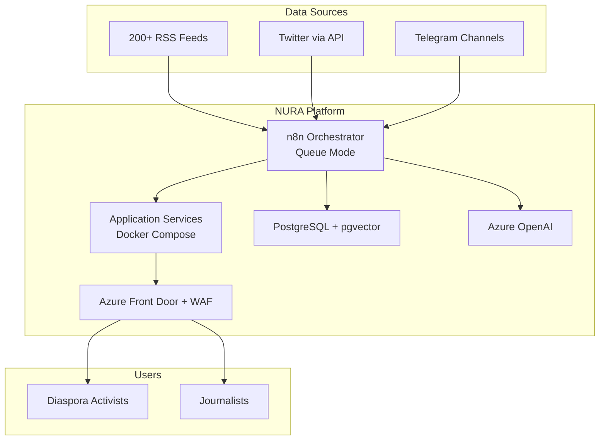
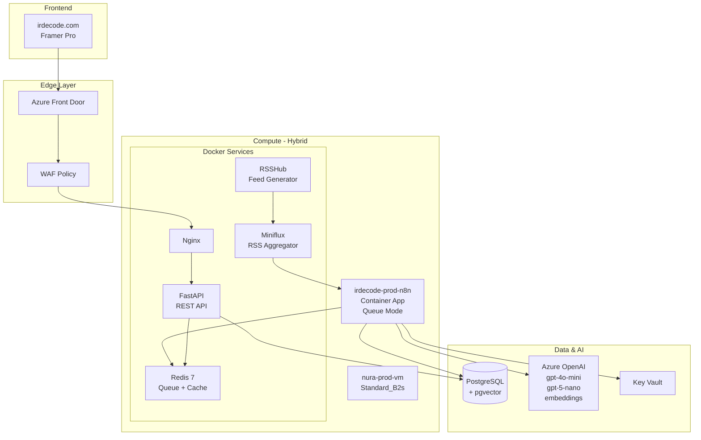
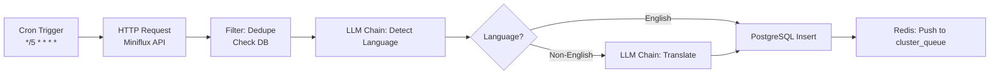
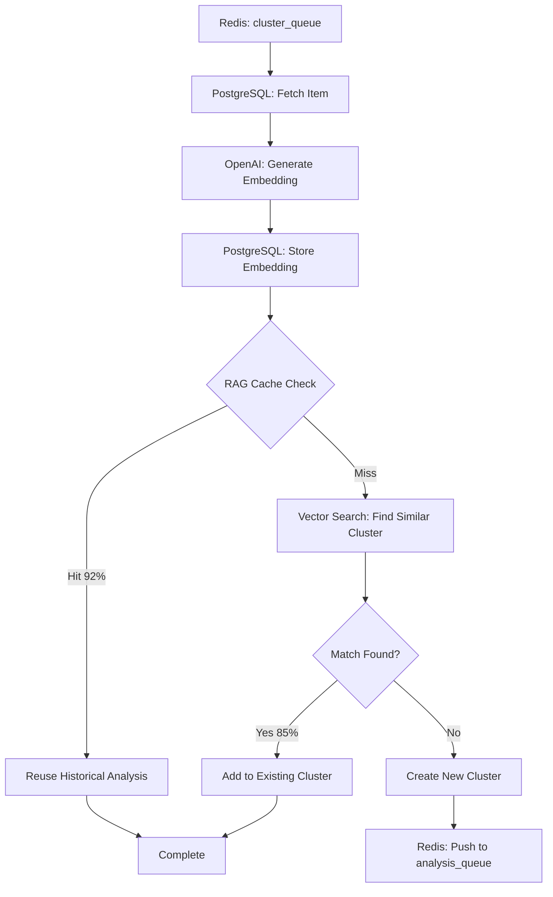
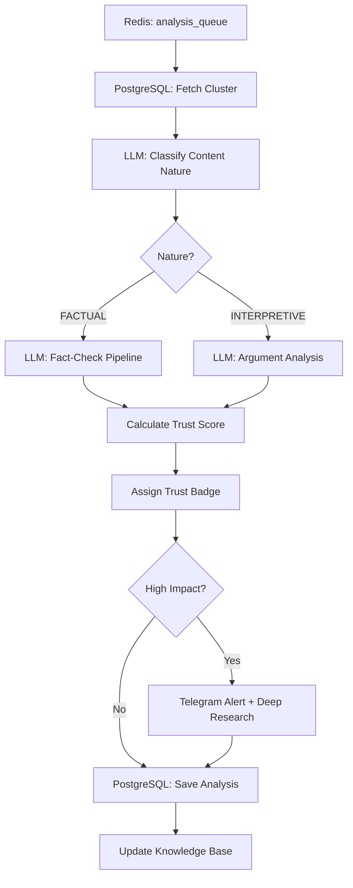

# NURA Platform - System Architecture Document v4.0 FINAL

**Document Type:** System Architecture Specification
**Version:** 4.0 Final Consolidated
**Date:** February 5, 2026, 7:22 PM NZDT
**Status:** ✅ APPROVED for Implementation
**Owner:** Architecture Team (Amir, Sina, Navid)
**Product Owner:** Omid

***

## Document Control

### Version History

| Version | Date | Focus | Key Changes |
| :-- | :-- | :-- | :-- |
| 1.0 | Feb 4 | Initial MVP | VM-based design, Framer frontend decision |
| 2.0 | Feb 5 AM | Infrastructure | Hybrid compute model, delete unused resources |
| 3.0 | Feb 5 PM | Logic hardening | RAG TTL, Gatekeeper formula, Translation dictionary |
| **4.0** | **Feb 5 PM** | **n8n workflows** | **Detailed workflow specs with Azure OpenAI node types, LLM Chain best practices, specific models per task** |

### Critical Architectural Decisions

| Decision | Rationale | Impact |
| :-- | :-- | :-- |
| **Use Azure OpenAI Chat Model (not Basic LLM)** | Chat Model supports JSON mode, better context handling | Reliable structured output |
| **Queue Mode for n8n** | Decouple orchestration from execution, prevent memory crashes | Scalability + reliability |
| **LLM Chain over AI Agent** | Agents are unpredictable for structured tasks | Deterministic workflows |
| **RAG Cache with TTL** | Prevent stale facts from propagating | Accuracy + cost savings |
| **Translation Dictionary (20→100 terms)** | Entity consistency across languages | Clustering accuracy |
| **Gatekeeper Formula** | Budget protection for Perplexity Pro | Cost control |
| **pgvector over Azure AI Search** | Equivalent performance at 1/10th cost | -\$250/month |
| **State machine for ContentItem** | Explicit lifecycle prevents race conditions | Data integrity |


***

## 1. Architecture Overview

### 1.1 System Context




### 1.2 Component Architecture




***

## 2. n8n Workflow Architecture

### 2.1 n8n Configuration \& Best Practices

#### Execution Mode: Queue Mode (CRITICAL)

**Configuration:**

```yaml
# n8n Container App Environment Variables
EXECUTIONS_MODE: queue
QUEUE_BULL_REDIS_HOST: redis  # VM internal network
QUEUE_BULL_REDIS_PORT: 6379
QUEUE_BULL_REDIS_DB: 0
QUEUE_HEALTH_CHECK_ACTIVE: true
QUEUE_RECOVERY_INTERVAL: 60
```

**Why Queue Mode:**

- **Prevents memory crashes:** Main n8n instance doesn't execute workflows
- **Horizontal scaling:** Can add worker replicas if needed
- **Reliability:** Failed jobs auto-retry from queue
- **Decoupling:** Orchestration logic separate from execution


#### Azure OpenAI Node Selection (CRITICAL)

**❌ DO NOT USE: AI Agent Node**

- Unpredictable for structured data
- Cannot guarantee JSON format
- Hallucinates fields not in schema

**✅ USE: Basic LLM Chain + Azure OpenAI Chat Model Sub-node**

**Node Structure:**

```
[Trigger] → [Basic LLM Chain] → [PostgreSQL]
              ↓
         [Azure OpenAI Chat Model]
         [Output Parser: JSON]
```

**Why Basic LLM Chain:**

- **Control:** You define exact prompt structure
- **JSON Mode:** `response_format: { type: "json_object" }` parameter support
- **Reliability:** Deterministic behavior for production
- **Cost tracking:** Tokens logged per execution


#### Error Handling Strategy (MANDATORY)

**Level 1: Node-Level Retry**

```yaml
# On every HTTP/OpenAI node
Error Workflow:
  Retry on Fail: true
  Max Tries: 3
  Wait Between Tries: 1000ms  # 1 second
  Retry on Status Codes: [429, 500, 502, 503, 504]
```

**Level 2: Workflow-Level Error Trigger**

```
Create a separate workflow: "WF04-Global-Error-Handler"
Trigger: Error Trigger node
Actions:
  1. Parse error (workflow name, node name, item ID)
  2. Log to PostgreSQL `processing_logs` table
  3. Send Telegram alert for CRITICAL errors
  4. Return graceful failure response
```

**Level 3: Graceful Degradation**

```javascript
// Example: Translation failure handling
if (translationResult.error) {
  // Don't block pipeline
  item.translated_text_en = item.original_text;  // Fallback
  item.processing_state = 'INGESTED';
  item.needs_translation = true;
  item.failure_reason = translationResult.error;
  
  // Continue to clustering anyway
  return item;
}
```


***

### 2.2 WF01: Ingestion \& Translation

**Purpose:** Fetch RSS items, detect language, translate to English
**Trigger:** Cron (every 5 minutes)
**Queue:** None (writes to `cluster_queue` at end)

#### Workflow Diagram




#### Node Specifications

**Node 1: Cron Trigger**

```yaml
name: "Every 5 Minutes"
type: Cron
parameters:
  mode: everyX
  value: 5
  unit: minutes
```

**Node 2: HTTP Request - Fetch Miniflux**

```yaml
name: "Fetch New RSS Items"
type: HTTP Request
parameters:
  method: GET
  url: "http://miniflux:8080/v1/entries"
  query_parameters:
    status: unread
    limit: 100
  authentication: Generic Credential Type
  credential: "{{ $credentials.miniflux_api }}"  # From Key Vault
retry_on_fail: true
max_tries: 3
```

**Node 3: Filter - Deduplicate**

```yaml
name: "Check If Already Ingested"
type: PostgreSQL
parameters:
  operation: executeQuery
  query: |
    SELECT id FROM content_items 
    WHERE external_id = '{{ $json.id }}'
  output: "firstRowOnly"

# Then use IF node
if: "{{ $json.id === undefined }}"  # If no match, proceed
```

**Node 4: LLM Chain - Language Detection**

**CRITICAL CONFIGURATION:**

```yaml
name: "Detect Language"
type: Basic LLM Chain
parameters:
  prompt: |
    Detect the language of this text and return ONLY the ISO 639-1 code.
    
    Valid codes: en, fa, ar, tr, ru
    
    Text: {{ $json.content }}
    
    Return only the 2-letter code, nothing else.
  
sub_nodes:
  - type: Azure OpenAI Chat Model
    name: "GPT-5-Nano"
    parameters:
      model: gpt-5-nano
      resource: "{{ $credentials.azure_openai_resource }}"
      api_key: "{{ $credentials.azure_openai_key }}"
      max_tokens: 10
      temperature: 0.0  # Deterministic
      timeout: 5000
      
output_parser:
  type: Simple Text Parser
```

**Why gpt-5-nano:**

- Ultra-fast (< 500ms latency)
- Ultra-cheap (\$0.05/1M tokens)
- Simple classification task
- No reasoning needed

**Node 5: Switch - Route by Language**

```yaml
name: "Is English?"
type: Switch
parameters:
  dataPropertyName: "language_code"
  rules:
    - value: "en"
      output: 0  # Skip translation
    - value: "*"  # Wildcard
      output: 1  # Go to translation
```

**Node 6: LLM Chain - Translation (MOST CRITICAL)**

**Configuration:**

```yaml
name: "Translate to English"
type: Basic LLM Chain
parameters:
  system_message: |
    You are a professional translator specializing in Iranian political content.
    
    CRITICAL: Preserve these proper nouns EXACTLY (do NOT translate):
    {{ $('Key Vault').item.json.translation_dictionary }}
    
    Rules:
    1. Maintain factual tone
    2. Do not editorialize or add interpretations
    3. Preserve technical terms as-is
    4. If uncertain about a phrase, translate literally
    
  prompt: |
    Translate the following {{ $json.detected_language }} text to English:
    
    Title: {{ $json.title }}
    Content: {{ $json.content }}
    
    Return JSON:
    {
      "title_en": "translated title",
      "content_en": "translated content"
    }

sub_nodes:
  - type: Azure OpenAI Chat Model
    name: "GPT-4o-Mini Translation"
    parameters:
      model: gpt-4o-mini
      resource: "{{ $credentials.azure_openai_resource }}"
      api_key: "{{ $credentials.azure_openai_key }}"
      max_tokens: 2000
      temperature: 0.3  # Slight creativity for natural phrasing
      response_format:
        type: json_object  # CRITICAL: Forces valid JSON
      timeout: 30000
      
  - type: Output Parser
    name: "Parse JSON Response"
    parameters:
      type: JSON Parser
      
retry_on_fail: true
max_tries: 3
continue_on_fail: true  # CRITICAL: Don't block pipeline
```

**Why gpt-4o-mini:**

- Best quality for Farsi/Arabic nuance
- Handles complex idioms
- Context-aware translation
- Cost: \$0.15 input / \$0.60 output per 1M tokens
- Acceptable for 4K items/day (~\$29/month)

**Translation Dictionary Structure (Stored in Key Vault):**

```json
{
  "proper_nouns": [
    {"fa": "سپاه پاسداران", "en": "IRGC", "category": "military"},
    {"fa": "بسیج", "en": "Basij", "category": "paramilitary"},
    {"fa": "مهسا امینی", "en": "Mahsa Amini", "category": "person"},
    {"fa": "ژینا امینی", "en": "Jina Amini", "category": "person"},
    {"fa": "علی خامنه‌ای", "en": "Ali Khamenei", "category": "leader"},
    {"fa": "زاهدان", "en": "Zahedan", "category": "city"},
    {"fa": "کرمانشاه", "en": "Kermanshah", "category": "city"},
    {"fa": "زندان اوین", "en": "Evin Prison", "category": "location"}
  ]
}
```

**Maintenance Plan:**

- **MVP:** Start with 20 terms
- **Week 1:** Review mistranslations, add 10 more
- **Ongoing:** Add 2-3 terms/week based on clustering errors

**Node 7: PostgreSQL Insert**

```sql
INSERT INTO content_items (
  source_id,
  external_id,
  content_nature,
  content_type,
  original_language,
  original_title,
  original_text,
  translated_title_en,
  translated_text_en,
  processing_state,
  published_at,
  ingested_at
) VALUES (
  '{{ $json.source_id }}',
  '{{ $json.external_id }}',
  'PENDING_CLASSIFICATION',  -- Will be classified in WF03
  '{{ $json.content_type }}',
  '{{ $json.detected_language }}',
  '{{ $json.original_title }}',
  '{{ $json.original_text }}',
  '{{ $json.title_en }}',
  '{{ $json.content_en }}',
  'INGESTED',
  '{{ $json.published_at }}',
  NOW()
)
ON CONFLICT (external_id) DO NOTHING
RETURNING id
```

**Node 8: Redis Queue Push**

```yaml
name: "Push to Cluster Queue"
type: Redis
parameters:
  operation: lpush
  key: "nura:cluster_queue"
  value: "{{ $json.id }}"
```

**Performance Targets:**

- **Throughput:** 100 items per 5-min cycle = 28,800/day (7x capacity)
- **Latency:** 3 seconds/item with translation
- **Cost:** ~\$0.002 per item

***

### 2.3 WF02: Clustering \& RAG Check

**Purpose:** Generate embeddings, check RAG cache, assign clusters
**Trigger:** Redis Queue Consumer (`nura:cluster_queue`)
**Queue:** Writes to `analysis_queue` for new clusters

#### Workflow Diagram




#### Node Specifications

**Node 1: Redis Queue Consumer**

```yaml
name: "Consume Cluster Queue"
type: Redis Trigger
parameters:
  operation: brpop  # Blocking pop
  key: "nura:cluster_queue"
  timeout: 5
```

**Node 2: PostgreSQL - Fetch Content Item**

```sql
SELECT 
  id,
  translated_text_en,
  source_id,
  published_at,
  processing_state
FROM content_items 
WHERE id = '{{ $json.item_id }}'
AND processing_state = 'INGESTED'
```

**Node 3: OpenAI - Generate Embedding**

**CRITICAL: Use direct HTTP Request, not LLM Chain**

```yaml
name: "Generate Embedding"
type: HTTP Request
parameters:
  method: POST
  url: "{{ $credentials.azure_openai_endpoint }}/openai/deployments/text-embedding-3-small/embeddings"
  query_parameters:
    api-version: "2024-10-01-preview"
  headers:
    api-key: "{{ $credentials.azure_openai_key }}"
    Content-Type: "application/json"
  body:
    input: "{{ $json.translated_text_en }}"
    encoding_format: "float"
  
retry_on_fail: true
max_tries: 3
```

**Why direct HTTP Request:**

- Embedding models don't need LLM Chain wrapper
- Faster (no chain overhead)
- Direct control over parameters
- Cost: \$0.02 per 1M tokens (~\$0.00002 per item)

**Node 4: PostgreSQL - Store Embedding**

```sql
UPDATE content_items
SET 
  embedding_vector = '{{ $json.data[^0].embedding }}',
  processing_state = 'EMBEDDED',
  processed_at = NOW()
WHERE id = '{{ $json.id }}'
```

**Node 5: PostgreSQL - RAG Cache Check (CRITICAL)**

```sql
SELECT 
  kb.id,
  kb.text_content,
  kb.related_cluster_id,
  kb.confidence_level,
  kb.verification_source,
  (1 - (kb.embedding_vector <=> '{{ $json.embedding }}'::vector)) as similarity
FROM knowledge_base kb
WHERE 
  kb.embedding_vector <=> '{{ $json.embedding }}'::vector <= 0.08  -- Cosine distance ≤ 0.08
  AND (kb.expires_at IS NULL OR kb.expires_at > NOW())  -- TTL check
  AND kb.invalidated = false  -- Manual override check
ORDER BY kb.embedding_vector <=> '{{ $json.embedding }}'::vector ASC
LIMIT 1
```

**RAG Cache TTL Policy (NEW):**


| Fact Type | TTL | Example |
| :-- | :-- | :-- |
| **Verified Historical Facts** | `NULL` (permanent) | "IRGC designated terrorist org by US in 2019" |
| **AI-Generated Patterns** | 90 days | "This dehumanization pattern matches propaganda technique X" |
| **Time-Sensitive Events** | 30 days | "Presidential election scheduled for June 2026" |
| **Expert-Verified Claims** | `NULL` (permanent) | "Death toll confirmed by HRANA: 96 in Zahedan" |

**Invalidation Mechanism:**

```sql
-- Admin Panel action
UPDATE knowledge_base
SET invalidated = true
WHERE id = '{{ cluster_id }}'
```

**Node 6: Switch - RAG Hit or Miss**

```yaml
name: "Cache Hit?"
type: IF
parameters:
  conditions:
    - field: "similarity"
      operation: "largerEqual"
      value: 0.92  # 92% similarity threshold
```

**Path A: RAG Hit (70% of items)**

```sql
-- Reuse historical analysis
UPDATE content_items
SET 
  cluster_id = '{{ $json.related_cluster_id }}',
  processing_state = 'ANALYZED',  -- Skip WF03
  processed_at = NOW()
WHERE id = '{{ $json.id }}';

-- Increment cluster item count
UPDATE clusters
SET 
  total_items_count = total_items_count + 1,
  last_updated_at = NOW()
WHERE id = '{{ $json.related_cluster_id }}';

-- Track cache usage
UPDATE knowledge_base
SET 
  reference_count = reference_count + 1,
  last_referenced_at = NOW()
WHERE id = '{{ $json.kb_id }}';
```

**Cost Savings:**

- RAG Hit: \$0 (no AI analysis needed)
- RAG Miss: \$0.005 (analysis cost)
- **Savings per hit:** \$0.005 × 2,800 hits/day = \$14/day = \$420/month

**Path B: RAG Miss - Find Similar Cluster**

**Node 7: PostgreSQL - Cluster Search**

```sql
SELECT 
  c.id,
  c.title_en,
  c.trust_badge,
  c.first_seen_at,
  c.final_trust_score,
  (1 - (c.embedding_vector <=> '{{ $json.embedding }}'::vector)) as similarity,
  COUNT(ci.id) as item_count,
  AVG(s.baseline_trust_score) as avg_source_score
FROM clusters c
LEFT JOIN content_items ci ON ci.cluster_id = c.id
LEFT JOIN sources s ON s.id = ci.source_id
WHERE 
  c.embedding_vector <=> '{{ $json.embedding }}'::vector <= 0.15  -- 85% similarity
  AND (NOW() - c.first_seen_at) < INTERVAL '72 hours'  -- Don't cluster old news
GROUP BY c.id
ORDER BY similarity DESC
LIMIT 1
```

**Node 8: Function - Cluster Decision Logic**

```javascript
// n8n Code Node
const item = $('PostgreSQL').item.json;
const cluster = $input.item.json;

// Calculate similarity
const similarity = cluster.similarity || 0;

// Time delta in hours
const timeDelta = (Date.now() - new Date(cluster.first_seen_at)) / (1000 * 60 * 60);

// Source score comparison
const itemSourceScore = item.source_baseline_trust_score;
const clusterAvgScore = cluster.avg_source_score;

// CRITICAL: Prevent mixing propaganda into trusted clusters
const shouldIsolate = (itemSourceScore < 30 && clusterAvgScore > 70);

// Decision logic
if (similarity >= 0.85 && timeDelta < 72 && !shouldIsolate) {
  return {
    action: 'MERGE',
    cluster_id: cluster.id,
    reason: `Similarity: ${similarity.toFixed(2)}, Age: ${timeDelta.toFixed(1)}h`
  };
} else {
  return {
    action: 'CREATE_NEW',
    reason: shouldIsolate 
      ? 'Isolating low-trust source from high-trust cluster'
      : 'No similar cluster found or too old'
  };
}
```

**Node 9: Switch - Merge or Create**

**Path A: Merge into Existing Cluster**

```sql
UPDATE content_items
SET 
  cluster_id = '{{ $json.cluster_id }}',
  processing_state = 'CLUSTERED'
WHERE id = '{{ $json.id }}';

UPDATE clusters
SET 
  total_items_count = total_items_count + 1,
  last_updated_at = NOW()
WHERE id = '{{ $json.cluster_id }}';
```

**Path B: Create New Cluster**

```sql
INSERT INTO clusters (
  title_en,
  summary_en,
  embedding_vector,
  processing_state,
  first_seen_at,
  last_updated_at
) VALUES (
  '{{ $json.translated_title_en }}',
  LEFT('{{ $json.translated_text_en }}', 280),  -- First 280 chars
  '{{ $json.embedding }}',
  'PENDING_ANALYSIS',
  NOW(),
  NOW()
)
RETURNING id;

-- Link content item to new cluster
UPDATE content_items
SET 
  cluster_id = '{{ $json.new_cluster_id }}',
  processing_state = 'CLUSTERED'
WHERE id = '{{ $json.id }}';

-- Push to analysis queue
```

**Node 10: Redis - Push to Analysis Queue**

```yaml
name: "Queue for Analysis"
type: Redis
parameters:
  operation: lpush
  key: "nura:analysis_queue"
  value: "{{ $json.cluster_id }}"
```

**Performance Targets:**

- **RAG Hit:** 0.1 second (vector search only)
- **RAG Miss + Clustering:** 3 seconds
- **Expected Distribution:** 70% hits, 30% misses

***

### 2.4 WF03: Intelligence Analysis \& Trust Scoring

**Purpose:** Classify content, detect propaganda, calculate trust scores
**Trigger:** Redis Queue Consumer (`nura:analysis_queue`)
**Queue:** None (final stage)

#### Workflow Diagram




#### Node Specifications

**Node 1: Redis Queue Consumer**

```yaml
name: "Consume Analysis Queue"
type: Redis Trigger
parameters:
  operation: brpop
  key: "nura:analysis_queue"
  timeout: 5
```

**Node 2: PostgreSQL - Fetch Cluster + Representative Item**

```sql
WITH representative AS (
  SELECT 
    ci.*,
    s.baseline_trust_score,
    s.imtt_scores,
    ROW_NUMBER() OVER (
      PARTITION BY ci.cluster_id 
      ORDER BY s.baseline_trust_score DESC, LENGTH(ci.translated_text_en) DESC
    ) as rn
  FROM content_items ci
  JOIN sources s ON s.id = ci.source_id
  WHERE ci.cluster_id = '{{ $json.cluster_id }}'
)
SELECT 
  c.*,
  r.translated_text_en,
  r.baseline_trust_score as source_score,
  r.imtt_scores
FROM clusters c
JOIN representative r ON r.cluster_id = c.id AND r.rn = 1
WHERE c.id = '{{ $json.cluster_id }}'
```

**Node 3: LLM Chain - Classify Content Nature**

```yaml
name: "Classify: Factual vs Opinion"
type: Basic LLM Chain
parameters:
  system_message: |
    You are a news classifier. Classify content into one category.
    
    Categories:
    - FACTUAL: Reports specific events, quotes, data, timestamps
    - INTERPRETIVE: Opinion, analysis, speculation, predictions
    - MIXED: Contains both factual reporting and opinion
    
    Return only ONE word: FACTUAL, INTERPRETIVE, or MIXED
    
  prompt: |
    Text: {{ $json.translated_text_en }}
    
    Classification:

sub_nodes:
  - type: Azure OpenAI Chat Model
    name: "GPT-5-Nano Classifier"
    parameters:
      model: gpt-5-nano
      max_tokens: 10
      temperature: 0.0
      timeout: 5000
```

**Why gpt-5-nano:**

- Simple binary classification
- Ultra-fast (< 500ms)
- Ultra-cheap (\$0.05/1M tokens)
- No reasoning needed

**Node 4: Switch - Route to Analysis Pipeline**

```yaml
name: "Route by Content Nature"
type: Switch
parameters:
  dataPropertyName: "content_nature"
  rules:
    - value: "FACTUAL"
      output: 0  # Fact-check pipeline
    - value: "INTERPRETIVE"
      output: 1  # Argument analysis
    - value: "MIXED"
      output: 0  # Default to fact-check
```

**Node 5A: LLM Chain - Fact-Check Pipeline (MOST CRITICAL)**

```yaml
name: "Propaganda & Sourcing Analysis"
type: Basic LLM Chain
parameters:
  system_message: |
    You are a propaganda detection AI analyzing Iranian news for manipulation techniques.
    
    Check for these specific issues:
    
    1. PROPAGANDA TECHNIQUES:
       - Dehumanization: Describing people/groups as animals, savages, threats
       - Loaded Language: "terrorist", "martyr", "savage", "brutal regime"
       - Fear-Mongering: Exaggerated threats, imminent danger without evidence
       - Glorification: Uncritical praise of leaders/institutions
    
    2. SOURCING ISSUES:
       - No Source: Critical claims without attribution
       - Anonymous Sources: "Sources say..." without verification
       - Circular Sourcing: State media quoting other state media
    
    3. TONE:
       - Inflammatory: Excessive emotional language
       - Partisan: One-sided framing without balance
    
    For each issue found, you MUST provide:
    - issue_type: "propaganda" | "sourcing" | "tone"
    - specific_technique: e.g., "Dehumanization", "No Source"
    - evidence: EXACT QUOTE from the text
    - penalty_amount: -5 to -15 (based on severity)
    - explanation: One sentence explaining the issue
    
    Return ONLY valid JSON matching this schema:
    {
      "propaganda_detected": boolean,
      "detected_techniques": string[],
      "penalty_breakdown": [
        {
          "issue_type": "propaganda" | "sourcing" | "tone",
          "specific_technique": string,
          "evidence": string (exact quote),
          "penalty_amount": number,
          "explanation": string
        }
      ],
      "total_penalty": number,
      "content_quality_score": number,
      "verdict_en": string,
      "confidence_score": number (0.0-1.0)
    }
    
  prompt: |
    Analyze this news content:
    
    {{ $json.translated_text_en }}
    
    Source: {{ $json.source_name }} (Trust Score: {{ $json.source_score }})

sub_nodes:
  - type: Azure OpenAI Chat Model
    name: "GPT-4o-Mini Analysis"
    parameters:
      model: gpt-4o-mini
      max_tokens: 1500
      temperature: 0.2  # Slight variability for nuance
      response_format:
        type: json_object  # CRITICAL: Enforce JSON output
      timeout: 30000
      
  - type: Output Parser
    name: "Parse Structured JSON"
    parameters:
      type: JSON Parser
      
retry_on_fail: true
max_tries: 2
continue_on_fail: false  # Analysis is critical
```

**Why gpt-4o-mini:**

- Complex reasoning required
- Context-aware propaganda detection
- Reliable JSON output with `json_object` mode
- Cost: \$0.15 input / \$0.60 output (~\$0.005 per analysis)
- Acceptable for 1,200 new clusters/day (30% no cache)

**CRITICAL: JSON Mode Requirement**

Without `response_format: { type: "json_object" }`:

- Model may return prose with JSON embedded
- Parsing errors break pipeline
- Unpredictable field names

With JSON Mode:

- Guaranteed valid JSON
- Fields match schema exactly
- No parsing errors

**Node 5B: LLM Chain - Argument Analysis (for INTERPRETIVE content)**

```yaml
name: "Logical Fallacy Detection"
type: Basic LLM Chain
parameters:
  system_message: |
    You are analyzing opinion/analysis pieces for logical fallacies and rhetorical manipulation.
    
    Check for:
    
    1. LOGICAL FALLACIES:
       - Strawman: Misrepresenting opponent's position
       - False Dilemma: "Either X or total disaster" (ignoring alternatives)
       - Ad Hominem: Attacking person instead of argument
       - Slippery Slope: Exaggerated chain of consequences
       - Appeal to Emotion: Manipulating feelings over facts
    
    2. RHETORICAL MANIPULATION:
       - Cherry-Picking: Selectively presenting only supporting evidence
       - False Equivalence: Comparing unequal things as equal
       - Whataboutism: Deflecting criticism by pointing elsewhere
    
    Return JSON matching the same schema as fact-check analysis.
    
  prompt: |
    Analyze this opinion piece:
    
    {{ $json.translated_text_en }}

sub_nodes:
  - type: Azure OpenAI Chat Model
    name: "GPT-4o-Mini Argument Analysis"
    parameters:
      model: gpt-4o-mini
      max_tokens: 1500
      temperature: 0.2
      response_format:
        type: json_object
```

**Node 6: Function - Calculate Final Trust Score**

```javascript
// n8n Code Node
const analysis = $input.item.json;
const source = $('PostgreSQL').item.json;

// Extract scores
const sourceBaseline = source.baseline_trust_score;  // 0-100
const contentQuality = analysis.content_quality_score;  // 0-100 (80 - penalties)
const propagandaDetected = analysis.propaganda_detected;

// Weighted formula: 40% source + 60% content
let finalScore = (sourceBaseline * 0.4) + (contentQuality * 0.6);

// Additional penalty for severe propaganda from low-trust sources
if (propagandaDetected && sourceBaseline < 30) {
  finalScore -= 20;  // Extra penalty
}

// Clamp to 0-100
finalScore = Math.max(0, Math.min(100, finalScore));

return {
  final_trust_score: Math.round(finalScore * 10) / 10,  // 1 decimal place
  source_weighted_score: sourceBaseline,
  content_quality_score: contentQuality,
  calculation_breakdown: {
    source_contribution: sourceBaseline * 0.4,
    content_contribution: contentQuality * 0.6,
    extra_penalty: (propagandaDetected && sourceBaseline < 30) ? -20 : 0
  }
};
```

**Node 7: Function - Assign Trust Badge**

```javascript
// n8n Code Node
const score = $input.item.json.final_trust_score;
const propagandaDetected = $('LLM Chain').item.json.propaganda_detected;
const sourceScore = $('PostgreSQL').item.json.baseline_trust_score;

let badge;

// Override rule: Propaganda from low-trust source
if (propagandaDetected && sourceScore < 30) {
  badge = 'PROPAGANDA_ALERT';
} else if (score >= 70) {
  badge = 'HIGH_TRUST';
} else if (score >= 40) {
  badge = 'MEDIUM_TRUST';
} else {
  badge = 'LOW_TRUST';
}

return { trust_badge: badge };
```

**Node 8: Function - Gatekeeper Logic (High Impact Check)**

```javascript
// n8n Code Node (CRITICAL FOR BUDGET CONTROL)
const cluster = $('PostgreSQL').item.json;
const analysis = $('LLM Chain').item.json;

// Fetch cluster metrics
const totalItems = cluster.total_items_count || 1;
const uniqueSources = cluster.unique_sources || 1;
const totalEngagement = cluster.total_engagement || 0;

// Fetch source scores
const itemScores = cluster.item_source_scores || [];
const maxSourceScore = Math.max(...itemScores, 0);
const minSourceScore = Math.min(...itemScores, 100);

// Count propaganda sources
const propagandaSources = itemScores.filter(s => s < 30).length;

// CONDITION 1: High Volume/Reach
const highVolume = (
  totalItems >= 50 ||
  uniqueSources >= 10 ||
  totalEngagement >= 10000
);

// CONDITION 2: Trust Score Contradiction
// Example: BBC (90) reports opposite of Fars (20)
const trustContradiction = (maxSourceScore - minSourceScore) >= 30;

// CONDITION 3: Coordinated Propaganda Pattern
const coordinated = (
  cluster.narrative_pattern === 'COORDINATED_PROPAGANDA' ||
  propagandaSources >= 3
);

// CONDITION 4: High-Trust Source in Low-Trust Cluster
const trustAnomaly = (
  maxSourceScore >= 80 &&
  cluster.average_trust_score < 40
);

// DECISION LOGIC
const requiresAudit = (
  (highVolume && trustContradiction) ||
  coordinated ||
  trustAnomaly
);

let reason = '';
if (highVolume && trustContradiction) {
  reason = 'High-impact disputed narrative';
} else if (coordinated) {
  reason = 'Coordinated propaganda campaign detected';
} else if (trustAnomaly) {
  reason = 'Trusted source contradicts low-trust cluster';
}

return {
  requires_human_audit: requiresAudit,
  reason: reason,
  metrics: {
    total_items: totalItems,
    unique_sources: uniqueSources,
    trust_range: `${minSourceScore}-${maxSourceScore}`
  }
};
```

**Budget Protection:**

- Only ~5% of clusters trigger Deep Research
- Daily limit: 50 Perplexity Pro calls = \$5/day
- Monthly: \$150 (well within budget)

**Node 9: Switch - Trigger Deep Research?**

```yaml
name: "Requires Human Audit?"
type: IF
parameters:
  conditions:
    - field: "requires_human_audit"
      operation: "equal"
      value: true
```

**Path A: Trigger Deep Research (Perplexity Pro)**

```yaml
name: "Perplexity Pro Deep Research"
type: HTTP Request
parameters:
  method: POST
  url: "https://api.perplexity.ai/chat/completions"
  headers:
    Authorization: "Bearer {{ $credentials.perplexity_api_key }}"
    Content-Type: "application/json"
  body:
    model: "sonar-pro"
    messages:
      - role: "system"
        content: |
          You are a fact-checking expert. Verify claims using only trusted sources.
          
          Trusted Sources: Reuters, BBC, AP, AFP, HRANA, Amnesty International
          
      - role: "user"
        content: |
          Verify this narrative:
          
          {{ $json.cluster_title_en }}
          
          Key Claims:
          {{ $json.cluster_summary_en }}
          
          Provide:
          1. Verification status (Verified / Unverified / Disputed)
          2. Evidence from trusted sources (with URLs)
          3. Recommended trust score (0-100)
    max_tokens: 2000
    temperature: 0.0
    return_citations: true

timeout: 120000  # 2 minutes
```

**Cost:** ~\$0.10 per Deep Research call

**Node 10: HTTP Request - Send Telegram Alert**

```yaml
name: "Alert Admin"
type: HTTP Request
parameters:
  method: POST
  url: "https://api.telegram.org/bot{{ $credentials.telegram_token }}/sendMessage"
  body:
    chat_id: "{{ $credentials.telegram_admin_chat_id }}"
    text: |
      🚨 EXPERT REVIEW REQUIRED
      
      Cluster: {{ $json.cluster_title_en }}
      Trust Badge: {{ $json.trust_badge }}
      Trust Score: {{ $json.final_trust_score }}
      
      Reason: {{ $json.audit_reason }}
      Items: {{ $json.total_items }}
      Sources: {{ $json.unique_sources }}
      
      View: https://api.irdecode.com/admin/research/{{ $json.cluster_id }}
    parse_mode: "Markdown"
```

**Node 11: PostgreSQL - Save Analysis**

```sql
-- Insert analysis
INSERT INTO content_analyses (
  content_item_id,
  analysis_type,
  propaganda_detected,
  detected_techniques,
  logical_fallacies,
  tone,
  penalty_breakdown,
  verdict_en,
  confidence_score,
  total_penalty_applied,
  ai_model_used,
  analyzed_at
) VALUES (
  '{{ $json.representative_item_id }}',
  '{{ $json.content_nature === "FACTUAL" ? "FACTCHECK" : "ARGUMENTANALYSIS" }}',
  {{ $json.propaganda_detected }},
  '{{ $json.detected_techniques }}',
  '{{ $json.logical_fallacies }}',
  '{{ $json.tone }}',
  '{{ $json.penalty_breakdown }}',
  '{{ $json.verdict_en }}',
  {{ $json.confidence_score }},
  {{ $json.total_penalty }},
  'gpt-4o-mini',
  NOW()
);

-- Update cluster
UPDATE clusters
SET 
  trust_badge = '{{ $json.trust_badge }}',
  final_trust_score = {{ $json.final_trust_score }},
  content_quality_score = {{ $json.content_quality_score }},
  source_weighted_score = {{ $json.source_weighted_score }},
  narrative_pattern = '{{ $json.narrative_pattern }}',
  processing_state = 'ANALYZED',
  last_updated_at = NOW()
WHERE id = '{{ $json.cluster_id }}';
```

**Node 12: PostgreSQL - Update Knowledge Base (for RAG)**

```sql
-- Only add high-confidence analyses to knowledge base
INSERT INTO knowledge_base (
  fact_type,
  text_content,
  embedding_vector,
  verification_source,
  confidence_level,
  expires_at,
  related_cluster_id,
  created_at
)
SELECT
  CASE
    WHEN '{{ $json.perplexity_verified }}' = 'true' THEN 'VERIFIED_CLAIM'
    ELSE 'NARRATIVE_PATTERN'
  END,
  '{{ $json.verdict_en }}',
  c.embedding_vector,
  CASE
    WHEN '{{ $json.perplexity_verified }}' = 'true' THEN 'PERPLEXITY_PRO'
    ELSE 'AI_ANALYSIS'
  END,
  {{ $json.confidence_score }},
  CASE
    WHEN '{{ $json.perplexity_verified }}' = 'true' THEN NULL  -- Never expires
    ELSE NOW() + INTERVAL '90 days'  -- AI patterns expire after 90 days
  END,
  '{{ $json.cluster_id }}',
  NOW()
FROM clusters c
WHERE 
  c.id = '{{ $json.cluster_id }}'
  AND {{ $json.confidence_score }} > 0.85  -- Only high-confidence
  AND {{ $json.final_trust_score }} > 60;  -- Only decent-quality content
```

**Performance Targets:**

- **Processing Time:** 8 seconds per cluster
- **Throughput:** 1,200 new clusters/day (30% of 4,000 items)
- **Cost:** ~\$0.005 per analysis

***

### 2.5 WF04: Global Error Handler

**Purpose:** Catch unhandled errors, log, alert admin
**Trigger:** Error Trigger (fires when any workflow fails)

#### Node Specifications

**Node 1: Error Trigger**

```yaml
name: "Global Error Trigger"
type: Error Trigger
```

**Node 2: Function - Parse Error**

```javascript
// n8n Code Node
const error = $input.item.json;

// Extract error details
const workflowName = error.workflow?.name || 'Unknown';
const nodeName = error.node?.name || 'Unknown';
const errorMessage = error.execution?.error?.message || 'Unknown error';
const stackTrace = error.execution?.error?.stack || '';
const itemId = error.item?.json?.id || 'N/A';

// Determine severity
let severity = 'WARNING';
if (errorMessage.includes('ECONNREFUSED') || errorMessage.includes('PostgreSQL')) {
  severity = 'CRITICAL';
} else if (errorMessage.includes('OpenAI') || errorMessage.includes('429')) {
  severity = 'WARNING';
}

return {
  severity: severity,
  workflow_name: workflowName,
  node_name: nodeName,
  error_message: errorMessage,
  stack_trace: stackTrace.substring(0, 500),  // Truncate
  item_id: itemId,
  timestamp: new Date().toISOString()
};
```

**Node 3: PostgreSQL - Log Error**

```sql
INSERT INTO processing_logs (
  workflow_name,
  node_name,
  content_item_id,
  status,
  error_message,
  error_details,
  severity,
  created_at
) VALUES (
  '{{ $json.workflow_name }}',
  '{{ $json.node_name }}',
  '{{ $json.item_id }}',
  'FAILED',
  '{{ $json.error_message }}',
  '{{ $json.stack_trace }}',
  '{{ $json.severity }}',
  NOW()
)
```

**Node 4: Switch - Alert for Critical Errors Only**

```yaml
name: "Is Critical?"
type: IF
parameters:
  conditions:
    - field: "severity"
      operation: "equal"
      value: "CRITICAL"
```

**Node 5: HTTP Request - Telegram Alert**

```yaml
name: "Send Telegram Alert"
type: HTTP Request
parameters:
  method: POST
  url: "https://api.telegram.org/bot{{ $credentials.telegram_token }}/sendMessage"
  body:
    chat_id: "{{ $credentials.telegram_admin_chat_id }}"
    text: |
      🚨 CRITICAL WORKFLOW ERROR
      
      Workflow: {{ $json.workflow_name }}
      Node: {{ $json.node_name }}
      Item ID: {{ $json.item_id }}
      
      Error: {{ $json.error_message }}
      
      Time: {{ $json.timestamp }}
      
      Action Required: Check logs immediately
    parse_mode: "Markdown"
```


***

## 3. Data Architecture

### 3.1 PostgreSQL Schema

#### Table: content_items (with State Machine)

```sql
CREATE TABLE content_items (
    id UUID PRIMARY KEY DEFAULT gen_random_uuid(),
    source_id UUID NOT NULL REFERENCES sources(id),
    external_id TEXT UNIQUE,
    
    -- Content Classification
    content_nature TEXT CHECK (content_nature IN ('FACTUAL', 'INTERPRETIVE', 'MIXED', 'PENDING_CLASSIFICATION')),
    content_type TEXT,
    
    -- Language & Translation
    original_language TEXT,
    original_title TEXT,
    original_text TEXT NOT NULL,
    translated_title_en TEXT,
    translated_text_en TEXT NOT NULL,
    
    -- Vector Embedding
    embedding_vector VECTOR(1536),
    
    -- Clustering
    cluster_id UUID REFERENCES clusters(id),
    
    -- Processing State Machine (NEW)
    processing_state TEXT NOT NULL DEFAULT 'PENDING' CHECK (
      processing_state IN (
        'PENDING',        -- Just ingested
        'INGESTED',       -- Translation complete
        'EMBEDDED',       -- Embedding generated
        'CLUSTERED',      -- Assigned to cluster
        'ANALYZED',       -- Analysis complete (via RAG or new)
        'FAILED'          -- Error occurred
      )
    ),
    processed_at TIMESTAMP,
    
    -- Error Handling (NEW)
    failed BOOLEAN DEFAULT false,
    failure_reason TEXT,
    needs_translation BOOLEAN DEFAULT false,
    retry_count INTEGER DEFAULT 0,
    
    -- Metadata
    platform_metadata JSONB,
    published_at TIMESTAMP NOT NULL,
    ingested_at TIMESTAMP DEFAULT NOW(),
    
    -- Indexes
    CONSTRAINT valid_state CHECK (
      (processing_state = 'FAILED' AND failure_reason IS NOT NULL) OR
      (processing_state != 'FAILED')
    )
) PARTITION BY RANGE (published_at);

-- HNSW index for vector similarity
CREATE INDEX idx_content_embedding ON content_items 
USING hnsw (embedding_vector vector_cosine_ops)
WITH (m = 16, ef_construction = 64);

-- Other indexes
CREATE INDEX idx_content_published ON content_items(published_at DESC);
CREATE INDEX idx_content_cluster ON content_items(cluster_id) WHERE cluster_id IS NOT NULL;
CREATE INDEX idx_content_state ON content_items(processing_state);
CREATE INDEX idx_content_failed ON content_items(failed) WHERE failed = true;

-- Weekly partitions (automation script creates these)
CREATE TABLE content_items_2026_w06 PARTITION OF content_items
    FOR VALUES FROM ('2026-02-03') TO ('2026-02-10');

CREATE TABLE content_items_2026_w07 PARTITION OF content_items
    FOR VALUES FROM ('2026-02-10') TO ('2026-02-17');
-- ... (repeat for 8-12 weeks ahead)
```


#### Table: knowledge_base (with TTL Strategy)

```sql
CREATE TABLE knowledge_base (
    id UUID PRIMARY KEY DEFAULT gen_random_uuid(),
    fact_type TEXT CHECK (fact_type IN ('HISTORICAL_FACT', 'NARRATIVE_PATTERN', 'VERIFIED_CLAIM')),
    text_content TEXT NOT NULL,
    embedding_vector VECTOR(1536),
    
    -- RAG Cache Control (NEW)
    expires_at TIMESTAMP,  -- NULL = never expires (verified facts only)
    invalidated BOOLEAN DEFAULT false,  -- Manual override for outdated info
    
    verification_source TEXT CHECK (verification_source IN ('EXPERT', 'PERPLEXITY_PRO', 'AI_ANALYSIS', 'HISTORICAL', 'ACADEMIC')),
    confidence_level NUMERIC(3,2) CHECK (confidence_level >= 0 AND confidence_level <= 1),
    related_entities TEXT[],
    metadata JSONB,
    
    -- Usage Tracking
    reference_count INTEGER DEFAULT 0,
    last_referenced_at TIMESTAMP,
    related_cluster_id UUID REFERENCES clusters(id),
    
    created_at TIMESTAMP DEFAULT NOW(),
    
    -- Indexes
    CONSTRAINT valid_ttl CHECK (
      (fact_type = 'HISTORICAL_FACT' AND expires_at IS NULL) OR
      (fact_type != 'HISTORICAL_FACT')
    )
);

-- Vector search index
CREATE INDEX idx_kb_embedding ON knowledge_base 
USING hnsw (embedding_vector vector_cosine_ops)
WITH (m = 16, ef_construction = 64);

-- TTL management
CREATE INDEX idx_kb_expires ON knowledge_base(expires_at) WHERE expires_at IS NOT NULL;
CREATE INDEX idx_kb_valid ON knowledge_base(invalidated, expires_at) WHERE invalidated = false;

-- Cleanup expired entries (run daily via cron)
CREATE OR REPLACE FUNCTION cleanup_expired_knowledge()
RETURNS void AS $$
BEGIN
  DELETE FROM knowledge_base
  WHERE expires_at IS NOT NULL 
    AND expires_at < NOW()
    AND reference_count < 10;  -- Keep frequently-used patterns even if expired
END;
$$ LANGUAGE plpgsql;
```

**TTL Policy Implementation:**


| Scenario | TTL Value | Rationale |
| :-- | :-- | :-- |
| Perplexity Pro verified fact | `NULL` | Expert-verified, permanent |
| Historical event (pre-2020) | `NULL` | Historical record, immutable |
| AI-detected propaganda pattern | 90 days | Propaganda tactics evolve |
| Current event (2026) | 30 days | Fast-changing situation |
| Expert-reviewed claim | `NULL` | Human verification, permanent |


***

## 4. Cost Analysis

### 4.1 Monthly Budget Breakdown

| Category | Resource | Monthly Cost |
| :-- | :-- | :-- |
| **Compute** | n8n Container App (0.5 vCPU, 1GB) | \$38.00 |
|  | Azure VM B2s (2 vCPU, 4GB) | \$30.00 |
| **Network** | Front Door + WAF | \$60.00 |
| **Data** | PostgreSQL B1ms (1 vCPU, 2GB) | \$25.00 |
| **Storage** | Blob + ACR + Logs | \$20.00 |
| **Security** | Key Vault | \$1.00 |
| **AI Services** | Azure OpenAI (usage-based) | \$48.00 |
| **External** | TwitterAPI.io | \$20.00 |
|  | Framer Pro | \$20.00 |
| **TOTAL** |  | **\$262.00/month** |

### 4.2 Azure OpenAI Cost Breakdown (4,000 items/day)

| Task | Model | Items/Day | Tokens/Item | Cost/Item | Daily Cost | Monthly Cost |
| :-- | :-- | :-- | :-- | :-- | :-- | :-- |
| Language Detection | gpt-5-nano | 4,000 | 100 | \$0.00001 | \$0.04 | \$1.20 |
| Translation | gpt-4o-mini | 4,000 | 400 | \$0.00024 | \$0.96 | \$28.80 |
| Classification | gpt-5-nano | 4,000 | 100 | \$0.00001 | \$0.04 | \$1.20 |
| Analysis (30% no cache) | gpt-4o-mini | 1,200 | 800 | \$0.00048 | \$0.58 | \$17.40 |
| Embeddings | text-embedding-3-small | 4,000 | 400 | \$0.000008 | \$0.03 | \$0.90 |
| **TOTAL** |  |  |  |  | **\$1.65/day** | **\$49.50/month** |

**Budget Status:**

- **Monthly Burn:** \$262
- **4-Month Total (Feb-June):** \$1,048
- **Remaining from \$5,000:** \$3,952
- **Safety Margin:** 79%

***

## 5. Sign-Off

| Role | Name | Status | Date |
| :-- | :-- | :-- | :-- |
| **Product Owner** | **Omid** | **✅ APPROVED** | **Feb 5, 2026** |
| System Architect | Amir | ✅ Approved | Feb 5, 2026 |
| DevOps Lead | Sina | 🔄 Ready for Implementation | Feb 5, 2026 |
| AI Engineer | Navid | 🔄 Ready for Implementation | Feb 5, 2026 |
| Automation Lead | Saman | 🔄 Ready for Implementation | Feb 5, 2026 |


***

**END OF ARCHITECTURE DOCUMENT**
**Next Phase:** Implementation (Handoff to development team)
<span style="display:none">[^1][^2][^3][^4][^5][^6]</span>

<div align="center">⁂</div>

[^1]: Product-Definition.md

[^2]: 0-Vision.md

[^3]: 1-Requirments.md

[^4]: plan.copilotmd

[^5]: Azureresources.csv

[^6]: ou-are-acting-as-a-Senior-Software-Architect-Prod.md

