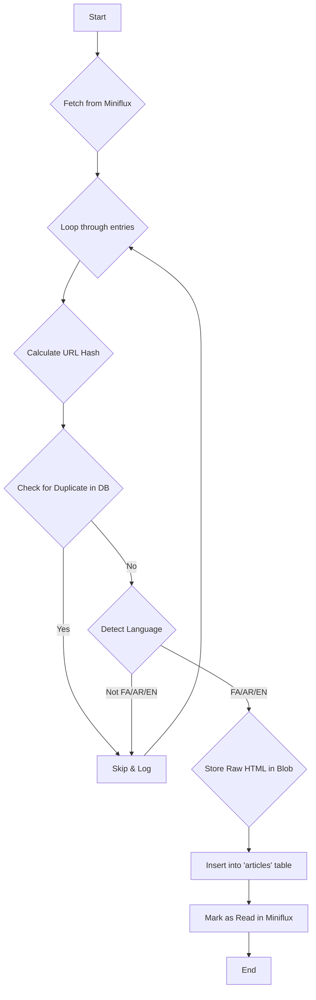

# Workflow: WF-01 - RSS Feed Ingestion

## 1. Overview

- **ID**: `WF-01`
- **Name**: RSS Feed Ingestion
- **Trigger**: Cron Job
- **Frequency**: Every 15 minutes
- **Priority**: High
- **Purpose**: To fetch new articles from configured RSS feeds (via Miniflux), perform initial validation, and store them in the database for processing.

## 2. Workflow Logic & Steps

1.  **Trigger**: The workflow is triggered by a cron job running every 15 minutes.
2.  **Fetch Entries**: It calls the Miniflux API (`GET /v1/entries?status=unread`) to get a list of all unread articles from ~500 sources.
3.  **Deduplication**: For each article, it calculates a `SHA-256` hash of the URL and checks if it already exists in the `articles` table to ensure idempotency.
4.  **Language Filter**: It performs a quick language detection. If the language is not Persian, Arabic, or English, the item is skipped to save resources.
5.  **Archive Raw HTML**: The raw HTML of the article is saved to Azure Blob Storage (`raw/{source_id}/{date}/{url_hash}.html`) for archival and future reprocessing.
6.  **Insert to Database**: A new record is inserted into the `articles` table with a `processing_status` of `pending`.
7.  **Mark as Read**: The item is marked as read in Miniflux to prevent it from being fetched again.

## 3. Error Handling & Reliability

- **Retries**: Network-related steps (fetching, DB insertion) will retry up to 3 times with a 2-second delay.
- **Dead-Letter Queue (DLQ)**: If an article consistently fails to process, its ID and the error message are stored in a Redis list (`dlq:wf01:failed`) for manual inspection.
- **Alerting**: A notification is sent to a designated Slack channel if the workflow's error rate exceeds 5% in an hour.

## 4. Dependencies

- **Upstream**: Miniflux container must be running and accessible.
- **Downstream**: The `WF-03 - Article Processing Pipeline` depends on this workflow to supply new articles.
- **Services**:
    - PostgreSQL Database
    - Azure Blob Storage

## 5. Performance & Cost

- **Expected Volume**: 50-100 articles per run.
- **P95 Duration**: 30-60 seconds.
- **Cost**: Minimal. Primarily consists of n8n execution time and a small number of blob storage transactions.
