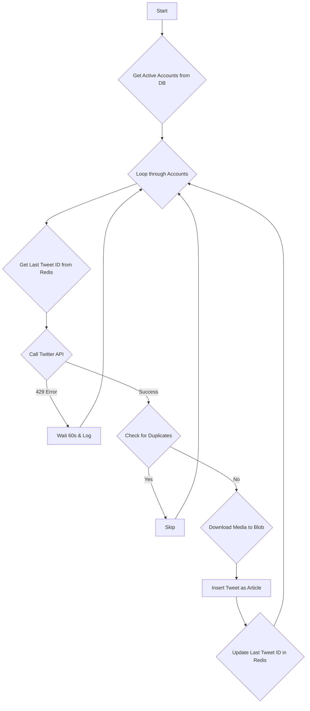

# Workflow: WF-02 - Twitter Data Collection

## 1. Overview

- **ID**: `WF-02`
- **Name**: Twitter Data Collection
- **Trigger**: Cron Job
- **Frequency**: Every 5 minutes
- **Priority**: High
- **Purpose**: To fetch new tweets from specific high-priority accounts and hashtags, handle rate limits gracefully, and store them as articles for processing.

## 2. Workflow Logic & Steps

1.  **Trigger**: The workflow runs every 5 minutes.
2.  **Fetch Accounts**: It queries the `sources` table for active Twitter accounts to monitor.
3.  **Rate Limit Control**: Before calling the API, it checks a Redis key (`twitter:quota:remaining`) to ensure it's within the rate limit. If a `429 Too Many Requests` error is received, it pauses for 60 seconds.
4.  **Fetch Tweets**: It calls the `twitterapi.io` service, using the `last_tweet_id` stored in Redis to only fetch new tweets.
5.  **Deduplication**: Checks the `tweet_id` against the database to prevent duplicates.
6.  **Media Archival**: If the tweet contains images or videos, they are downloaded and stored in Azure Blob Storage.
7.  **Insert to Database**: The tweet content is saved as a new record in the `articles` table with `platform` set to `twitter` and `processing_status` to `pending`.
8.  **Update State**: The `last_tweet_id` for the account is updated in Redis.

## 3. Error Handling & Reliability

- **Rate Limits**: The primary failure mode is hitting the Twitter API rate limit. The workflow is designed to wait and retry rather than failing completely.
- **Suspended Accounts**: If an account is suspended, it is marked as `is_active = false` in the database and will be skipped in future runs.
- **Network Timeouts**: Handled with an exponential backoff retry strategy (1s, 2s, 4s).

## 4. Dependencies

- **Services**:
    - `twitterapi.io` API Key
    - PostgreSQL Database
    - Azure Blob Storage
    - Redis (for state management)

## 5. Performance & Cost

- **Expected Volume**: 20-50 tweets per run.
- **P95 Duration**: 60-120 seconds (highly dependent on Twitter API latency).
- **Cost**: Primarily driven by the `twitterapi.io` subscription cost and a small number of database/blob transactions.
