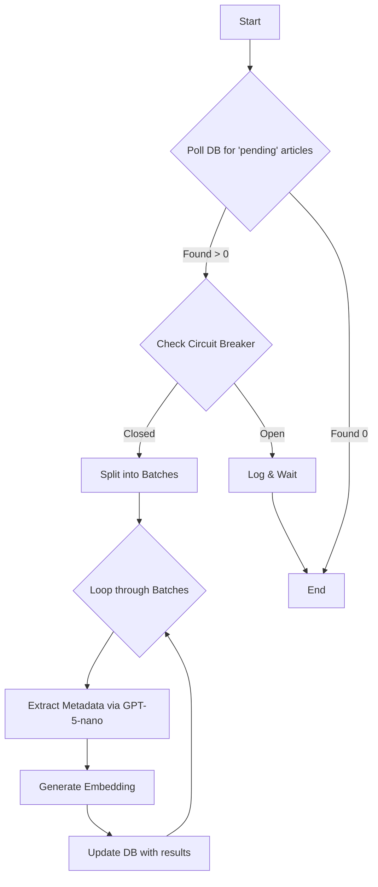

# Workflow: WF-03 - Article Processing Pipeline

## 1. Overview

- **ID**: `WF-03`
- **Name**: Article Processing Pipeline
- **Trigger**: Database Poll
- **Frequency**: Every 2 minutes
- **Priority**: **CRITICAL**
- **Purpose**: This is the core AI workflow. It enriches pending articles with AI-generated metadata (summary, entities) and vector embeddings, making them ready for analysis.

## 2. Workflow Logic & Steps

1.  **Trigger**: The workflow polls the `articles` table every 2 minutes for records with `processing_status = 'pending'`.
2.  **Circuit Breaker**: Before making any AI calls, it checks a Redis key (`circuit:openai`). If the circuit is "open" (meaning recent, repeated failures), the workflow logs an error and stops, preventing cascading failures and wasted API calls.
3.  **Batching**: It processes articles in batches of 20 to manage memory and improve throughput.
4.  **Metadata Extraction**: For each article, it calls the **Azure OpenAI GPT-5-nano** model with a specific prompt to extract the author, a summary, and key entities.
5.  **Embedding Generation**: It then calls the **Azure OpenAI text-embedding-3-small** model to generate a 512-dimension vector embedding from the article's title and summary.
6.  **Update Database**: The workflow updates the article record in PostgreSQL with the new `ai_metadata`, `embedding`, and sets the `processing_status` to `ai_processed`.

## 3. Error Handling & Reliability

- **Circuit Breaker**: This is the most critical reliability pattern. If the OpenAI API fails 5 times consecutively, the circuit "opens," and all subsequent calls are blocked for 5 minutes. This prevents the system from overwhelming a struggling downstream service.
- **Retries**: Individual API calls use an exponential backoff retry strategy.
- **DLQ**: Articles that fail processing after all retries are marked as `failed`, and their IDs are pushed to a Redis DLQ for manual review.

## 4. Dependencies

- **Upstream**: `WF-01` and `WF-02` must be supplying articles.
- **Services**:
    - **Azure OpenAI**: Requires deployments for both `GPT-5-nano` and `text-embedding-3-small`.
    - **PostgreSQL Database**
    - **Redis** (for the circuit breaker state).

## 5. Performance & Cost

- **Expected Volume**: ~100 articles per run.
- **P95 Duration**: 3-5 minutes.
- **Cost**: This is the most expensive workflow.
  - **Metadata**: ~$30/month
  - **Embeddings**: ~$2/month
  - **Total**: **~$32/month**
- **Criticality**: This workflow is the primary bottleneck. If it is down, no new information is analyzed or becomes available to users.
