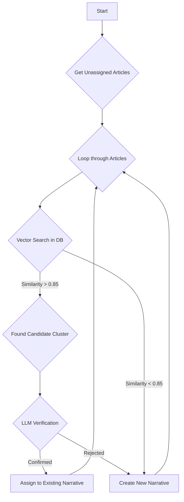

# Workflow: WF-04 - Narrative Clustering

## 1. Overview

- **ID**: `WF-04`
- **Name**: Narrative Clustering
- **Trigger**: Cron Job
- **Frequency**: Every 15 minutes
- **Priority**: Medium
- **Purpose**: To group semantically similar articles into "narratives," providing users with a thematic view of events instead of a simple chronological list.

## 2. Workflow Logic & Steps

1.  **Trigger**: A cron job runs every 15 minutes.
2.  **Fetch Articles**: The workflow queries the database for articles with `status = 'ai_processed'` that have not yet been assigned to a narrative.
3.  **Vector Search**: For each article, it uses the `pgvector` extension in PostgreSQL to find the top 5 most similar articles based on cosine distance of their embeddings.
4.  **Candidate Validation**:
    - If a candidate cluster is found with a similarity score `> 0.85`, it proceeds.
    - If no strong candidates are found, it moves to create a new narrative.
5.  **LLM Verification**: To avoid incorrect clustering, it performs a final check using `GPT-5-nano`, asking: "Does Article A discuss the same core event as Article B?" This prevents clustering articles that are semantically similar but contextually different.
6.  **Assign or Create**:
    - If a cluster is confirmed, the article is assigned to the existing narrative.
    - If not, a new narrative is created. The title for the new narrative (e.g., "Protests in Zahedan") is generated by `GPT-5-nano`.
7.  **Update Database**: The `article_narratives` and `narratives` tables are updated accordingly.

## 3. Error Handling & Reliability

- **GPT Failure**: If the `GPT-5-nano` call for title generation fails, a fallback title is created using a template (e.g., `"Narrative #uuid - {main_entity}"`).
- **Vector Search Failure**: If the `pgvector` search fails, the article is treated as a standalone narrative to prevent blocking the queue.

## 4. Dependencies

- **Upstream**: `WF-03` must have successfully processed articles.
- **Services**:
    - **PostgreSQL** with the `pgvector` extension enabled.
    - A valid **HNSW index** must exist on the `articles.embedding` column.
    - **Azure OpenAI** (`GPT-5-nano`) for title generation and verification.

## 5. Performance & Cost

- **Expected Volume**: 100-200 articles per run.
- **P95 Duration**: 2-4 minutes.
- **Vector Search Latency**: < 300ms per query due to the HNSW index.
- **Cost**: Low. Consists of a small number of `GPT-5-nano` calls.
