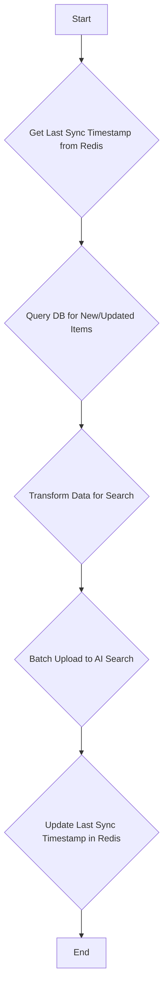

# Workflow: WF-05 - PostgreSQL to AI Search Sync

## 1. Overview

- **ID**: `WF-05`
- **Name**: PostgreSQL to AI Search Sync
- **Trigger**: Cron Job
- **Frequency**: Every 15 minutes
- **Priority**: Medium
- **Purpose**: To keep the Azure AI Search index (which serves the public API) up-to-date with the latest high-quality content from the PostgreSQL database. This workflow acts as a data pipeline between the source of truth and the read-optimized cache.

## 2. Workflow Logic & Steps

1.  **Get State**: The workflow retrieves the timestamp of its last successful run from a Redis key (`sync:ai_search:last_run`).
2.  **Delta Query**: It queries the PostgreSQL `articles` table for all items that have been created or updated since the last sync timestamp. This query includes crucial filters.
3.  **Filtering Logic**:
    - `trust_score >= 50`: Only items with medium or high trust are indexed.
    - `publish_date >= NOW() - INTERVAL '14 days'`: Enforces a 14-day retention policy to stay within the Azure AI Search Free Tier limits.
4.  **Transform**: The data is transformed for the search index. This includes removing the large `content` field to save space and adding an `indexed_at` timestamp.
5.  **Batch Upload**: The transformed documents are uploaded to the Azure AI Search index in batches of 100 (the service limit).
6.  **Set State**: Upon successful completion, the workflow updates the `sync:ai_search:last_run` timestamp in Redis.

## 3. Error Handling & Reliability

- **Failed Batches**: If a batch upload to AI Search fails, it is retried up to 3 times.
- **Service Unavailability**: If AI Search is down, the workflow will skip the current run and an alert will be sent to the operations team. The sync will resume on the next scheduled run.
- **DLQ**: The IDs of documents that consistently fail to index are stored in a Redis DLQ for investigation.

## 4. Dependencies

- **Upstream**: `WF-03` and `WF-04` must be running to provide processed articles.
- **Services**:
    - **PostgreSQL Database**
    - **Azure AI Search**
    - **Redis** (for state management)

## 5. Key Design Decision

**AI Search is a Cache, Not a Database**: This workflow embodies the principle that Azure AI Search is an ephemeral, read-optimized cache. The single source of truth is always PostgreSQL. The search index can be rebuilt from the database at any time.
