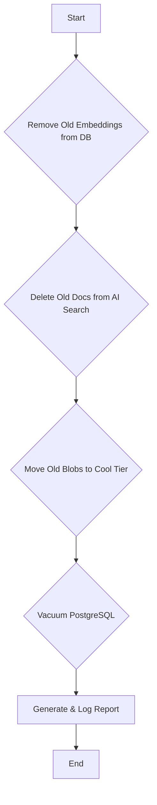

# Workflow: WF-06 - Daily Cleanup & Archival

## 1. Overview

- **ID**: `WF-06`
- **Name**: Daily Cleanup & Archival
- **Trigger**: Cron Job
- **Frequency**: Daily at 2:00 AM NZDT
- **Priority**: Low
- **Purpose**: To perform routine database and storage maintenance to control costs, optimize performance, and enforce data retention policies.

## 2. Workflow Logic & Steps



1.  **Remove Old Embeddings**: To save space in the primary database, the workflow removes vector embeddings from articles older than 30 days. The text content remains for historical reference, but the large vector data is purged.
    ```sql
    UPDATE articles SET embedding = NULL WHERE published_at < NOW() - INTERVAL '30 days';
    ```
2.  **Prune AI Search Index**: It deletes documents from the Azure AI Search index that are older than 14 days or have a `trust_score < 50`, ensuring the search cache remains small and relevant.
3.  **Archive Blobs**: It moves the raw HTML snapshots in Azure Blob Storage from the "Hot" tier to the cheaper "Cool" tier for files older than 30 days. This reduces storage costs significantly.
4.  **Vacuum Database**: It runs a `VACUUM` command on the PostgreSQL database to reclaim space freed by the deleted embeddings and optimize table performance.
5.  **Audit Log**: The workflow generates a report detailing how many records were affected in each step and logs it to an `audit_log` table for monitoring.

## 3. Error Handling & Reliability

- **Independent Steps**: Each step in the workflow is independent. A failure in one step (e.g., moving blobs) will be logged, but it will not prevent the subsequent steps (e.g., vacuuming the database) from running.
- **Alerting**: An alert is sent to the operations team if the cleanup job fails for 3 consecutive days.

## 4. Dependencies

- **Services**:
    - PostgreSQL Database
    - Azure Blob Storage
    - Azure AI Search

## 5. Performance & Cost

- **Schedule**: Runs at 2:00 AM NZDT, a low-traffic period, to minimize impact on performance.
- **P95 Duration**: 5-10 minutes.
- **Cost Impact**: This workflow is a net-positive for cost, actively reducing storage expenses in both PostgreSQL and Azure Blob Storage.
