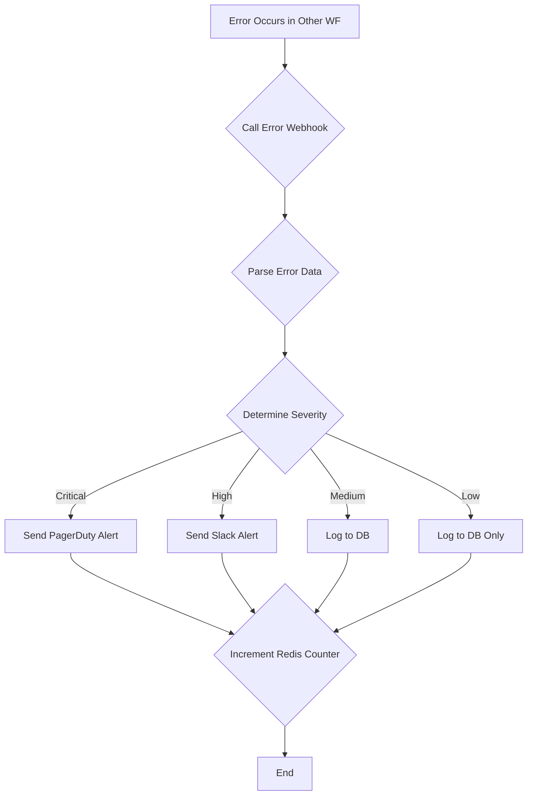

# Workflow: WF-ERROR - Central Error Handler

## 1. Overview

- **ID**: `WF-ERROR`
- **Name**: Central Error Handler
- **Trigger**: Webhook
- **Frequency**: On-demand (triggered by other workflows)
- **Priority**: **CRITICAL**
- **Purpose**: To act as a centralized sink for all errors generated by other n8n workflows. It standardizes error logging, classifies severity, and routes alerts to the appropriate channels.

## 2. Workflow Logic & Steps

1.  **Trigger**: This workflow is triggered when another workflow encounters an error and calls its unique webhook URL, passing a JSON payload with error details.
2.  **Parse Data**: It parses the incoming JSON to extract `workflow_name`, `node_name`, `error_message`, and `stack_trace`.
3.  **Classify Severity**: It uses a set of rules to classify the error's severity:
    - **Critical**: A system-wide failure (e.g., database down, OpenAI circuit breaker open).
    - **High**: A significant failure affecting a core workflow (e.g., `WF-03` failure rate > 10%).
    - **Medium**: A single, non-critical workflow execution failed.
    - **Low**: An expected, non-blocking issue (e.g., a duplicate article was skipped).
4.  **Log to Database**: All errors, regardless of severity, are inserted into the `workflow_errors` table in PostgreSQL for historical analysis.
5.  **Route Notifications**:
    - **Critical** errors trigger a **PagerDuty** alert to wake up the on-call engineer.
    - **High** and **Medium** errors send a notification to a **Slack** channel.
    - **Low** severity errors are only logged to the database.
6.  **Update Metrics**: It increments a counter in Redis (e.g., `metrics:errors:wf-01:2026-02-04`) to track error rates over time.

## 3. Reliability

- **Criticality**: This workflow is the most critical piece of the monitoring infrastructure. If the error handler itself fails, the team is "flying blind."
- **Simplicity**: The workflow is designed to be as simple and robust as possible, with minimal external dependencies to reduce its own risk of failure.

## 4. Dependencies

- **Services**:
    - **PostgreSQL Database**
    - **Redis**
    - **PagerDuty** API Key
    - **Slack** Webhook URL
